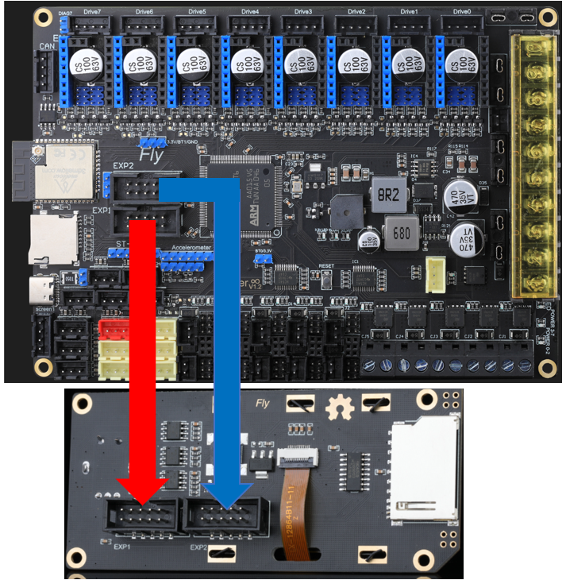

# Mini 12864 LCD

* 正确连接到EXP接口，将示例配置中的mini12864部分取消注释

下图为FLY的mini12864的接线方式，其他厂家的屏幕请咨询相应厂家。Mini12864屏幕接接反，接错可能会导致上位机连不上MCU。如果使用mini12864屏幕之前可以正常连上主板的MCU，而使用mini12864后就连不上MCU了，请尝试拔出mini12864的接线！！！




## Marlin 配置方法

只需要在配置里面添加即可使用

```
#if HAS_WIRED_LCD

  #define BEEPER_PIN                 EXP1_10_PIN
  #define BTN_ENC                    EXP1_09_PIN

  #if ENABLED(CR10_STOCKDISPLAY)

    #define LCD_PINS_RS              EXP1_07_PIN

    #define BTN_EN1                  EXP2_08_PIN
    #define BTN_EN2                  EXP2_06_PIN

    #define LCD_PINS_ENABLE          EXP1_08_PIN
    #define LCD_PINS_D4              EXP1_06_PIN

  #elif ENABLED(MKS_MINI_12864)

    #define DOGLCD_A0                EXP1_04_PIN
    #define DOGLCD_CS                EXP1_05_PIN
    #define BTN_EN1                  EXP2_08_PIN
    #define BTN_EN2                  EXP2_06_PIN

  #else

    #define LCD_PINS_RS              EXP1_07_PIN

    #define BTN_EN1                  EXP2_06_PIN
    #define BTN_EN2                  EXP2_08_PIN

    #define LCD_PINS_ENABLE          EXP1_08_PIN
    #define LCD_PINS_D4              EXP1_06_PIN

    #if ENABLED(FYSETC_MINI_12864)
      #define DOGLCD_CS              EXP1_08_PIN
      #define DOGLCD_A0              EXP1_07_PIN
      //#define LCD_BACKLIGHT_PIN           -1
      #define LCD_RESET_PIN          EXP1_06_PIN  // Must be high or open for LCD to operate normally.
      #if EITHER(FYSETC_MINI_12864_1_2, FYSETC_MINI_12864_2_0)
        #ifndef RGB_LED_R_PIN
          #define RGB_LED_R_PIN      EXP1_05_PIN
        #endif
        #ifndef RGB_LED_G_PIN
          #define RGB_LED_G_PIN      EXP1_04_PIN
        #endif
        #ifndef RGB_LED_B_PIN
          #define RGB_LED_B_PIN      EXP1_03_PIN
        #endif
      #elif ENABLED(FYSETC_MINI_12864_2_1)
        #define NEOPIXEL_PIN         EXP1_05_PIN
      #endif
    #endif // !FYSETC_MINI_12864

    #if IS_ULTIPANEL
      #define LCD_PINS_D5            EXP1_05_PIN
      #define LCD_PINS_D6            EXP1_04_PIN
      #define LCD_PINS_D7            EXP1_03_PIN

      #if ENABLED(REPRAP_DISCOUNT_FULL_GRAPHIC_SMART_CONTROLLER)
        #define BTN_ENC_EN           LCD_PINS_D7  // Detect the presence of the encoder
      #endif

    #endif

  #endif

#endif // HAS_WIRED_LCD
```

