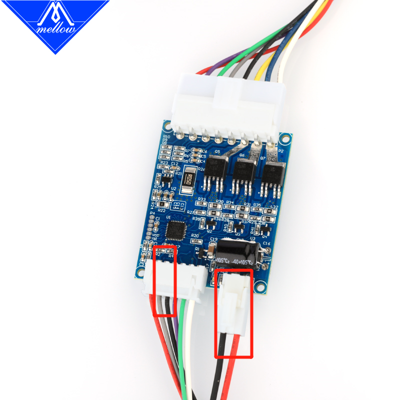

# WS7040鼓风机

## 描述

当您想使用电位计旋钮控制风扇速度时，只需将驱动板直接连接到24V DC电源即可。
当您需要使用主板或树莓派进行控制时，只需取出电位计，将驱动板的信号引脚连接到主板的5V或3.3V引脚，并将其连接到GND即可。


## 接线

需要将左边灰色线接到主板信号口，黑色地线接到主板GND。然后接上右边的电源接口才可以使用.



## 配置

```
[fan]                        # 模型冷却风扇 
pin: PA0                     # 信号接口
kick_start_time: 0.5         # 启动时间（勿动）
off_below: 0.10              # 勿动
```


