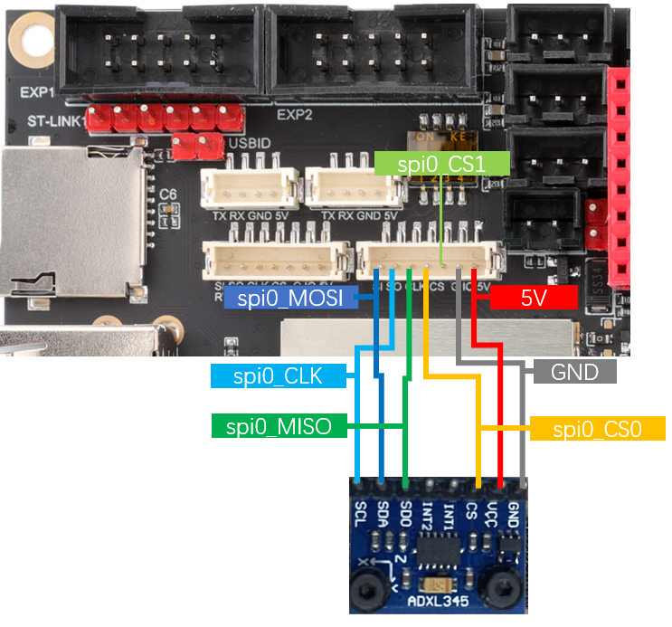

# 加速度计

> 购买ADXL345加速度计模块时请仔细辨别

?> 建议使用Mellow的ADXL345加速度计模块.
 可直接安装到36步进电机上，接口兼容Gemini主板

?> 可代替V0/V0.1的固定线管的打印件


* 接线线序简单，如下图
* 固定方便，免去改结构件的麻烦


----
----

* 如果是这种需要拆掉R4电阻才能正常使用


* 这种则可以直接使用，建议使用3.3v供电，而不是5v


## 准备

1. ADXL345加速度计模块
2. Gemini主板
3. 连接线

## 接线

> 系统已启用4个SPI端口，可以同时接两个加速度计来测试。比如I3可以在X和Y上装来实现同时测试
> 接线MOSI,MISO,CLK并联，CS分别接主板CS0与CS1。在配置中区分

* 如图接线



```
MOSI ----> SDI(SDA)
MISO ----> SDO
CLK  ----> CLK(SCK)
CS   ----> CS
```

## 测试

* 打开printer.cfg加入加速度计配置
* spi_bus必须配置，如果加速度计的cs引脚接到主板SPI0的cs1则spi_bus: spidev0.1

```ini
[mcu host]
serial: /tmp/klipper_host_mcu

[adxl345]
cs_pin: host:None
spi_bus: spidev0.0

#[adxl345 bed]
#cs_pin: host:None
#spi_bus: spidev0.1


[resonance_tester]
accel_chip: adxl345
#accel_chip_y: adxl345 bed
probe_points:
    100, 100, 20  # an example

```

* 修改配置后保存并重启
* 在控制台执行`ACCELEROMETER_QUERY`
* 多加速度计可指定测试某个`ACCELEROMETER_QUERY CHIP=bed`
* 如果出现报错请检查接线及配置
* 正常的输出如下图


* 这样就可以来测量共振了
* 记得全部归位
* 测试X轴`TEST_RESONANCES AXIS=X`,Y轴也一样改为Y即可

?> 注意！如果测试过程中打印机振动太剧烈请及时按紧急停止或发送`M112`来停止

* 过高的`accel_per_hz`会让振动变得剧烈，可以适当降低

```ini
[resonance_tester]
accel_chip: adxl345
accel_per_hz: 50  # 默认值为75
probe_points: ...
```

## 自动校准

* klipper支持自动校准
* 记得全部归位
* `SHAPER_CALIBRATE`执行这个命令后打印机将开始自动校准X,Y
* 在校准完成后执行`SAVE_CONFIG`来保存数据
* 也可以使用`SHAPER_CALIBRATE AXIS=X`来自动校准一个轴，
* 在每个轴校准结束后都要先保存数据在校准下一个


* 校准过程可能会比较长，请耐心等待