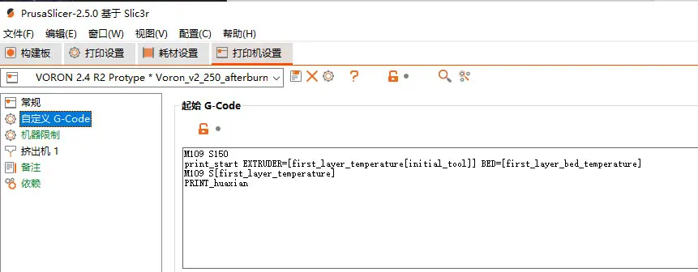
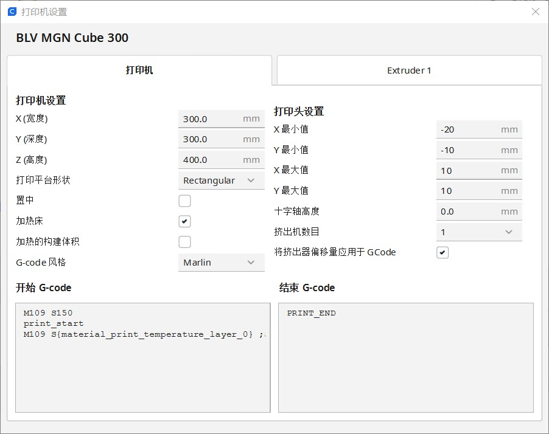
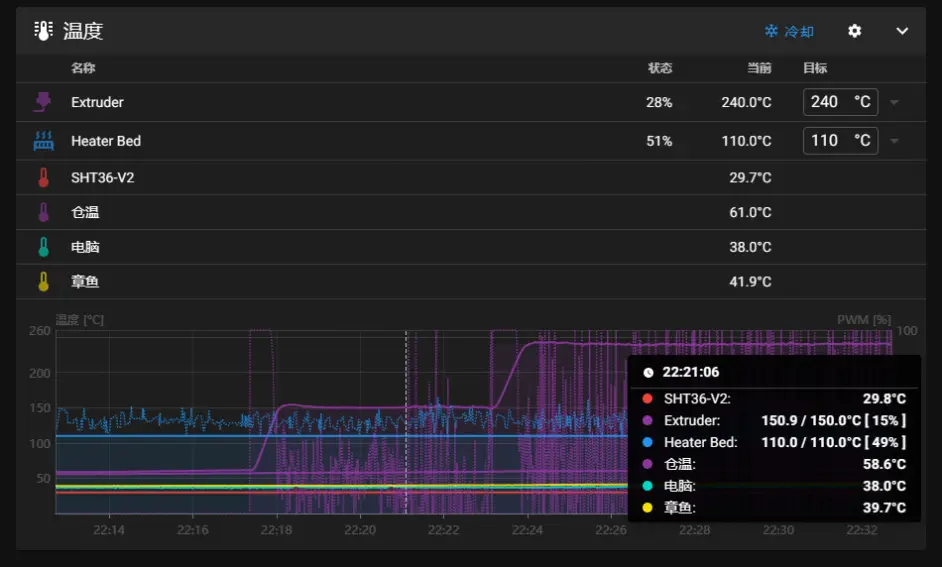

# TAP的配置教程

> [!TIP]
> **TAP配置修改printer.cfg**

> [!TIP]
> **因为tap是直接使用喷嘴当限位触发所以无任何XY偏移**

> [!TIP]
> **装好tap后需要手动触发限位查看是否工作正常！**

> [!TIP]
> **TAP修改的地方只有z限位与probe**

```
[stepper_z]
endstop_pin: probe:z_virtual_endstop             # 限位开关接口

[probe]
pin: ^sht36:PA1              # 信号接口
x_offset: 0                  # X轴-传感器相对喷嘴偏移量
y_offset: 0                  # Y轴-传感器相对喷嘴偏移量
#z_offset: 0                 # Z轴-传感器相对喷嘴偏移量
speed: 3.0                   # 调平速度
lift_speed: 5                # 抬起探头速度
samples: 3                   # 采样次数
samples_result: median       # 取值方式（默认median-中位数）
sample_retract_dist: 3.0     # 调平回缩距离
samples_tolerance: 0.075     # 采样公差（注意过小的值可能造成采样次数增加）
samples_tolerance_retries: 3 # 超公差重试次数
activate_gcode:
    
    
    
    

    
        { action_respond_info('Extruder temperature target of %.1fC is too high, lowering to %.1fC' % (TARGET_TEMP, PROBE_TEMP)) }
        M106 S255
        M109 S{ PROBE_TEMP }
        M106 S26
    
        # Temperature target is already low enough, but nozzle may still be too hot.
        
            { action_respond_info('Extruder temperature %.1fC is still too high, waiting until below %.1fC' % (ACTUAL_TEMP, MAX_TEMP)) }
            TEMPERATURE_WAIT SENSOR=extruder MAXIMUM={ MAX_TEMP }
        
    

```

到此打印机配置修改结束

* 这是提高打印前准备时间的方法之一

* PrusaSlicer启始宏修改 

```
M109 S150
print_start
M109 S[first_layer_temperature]
```




* CURA启始宏修改

```
M109 S150
print_start
M109 S{material_print_temperature_layer_0} ;Start heating extruder
```



* orca-slicer启始宏修改

```
M190 S[bed_temperature_initial_layer_single]
M109 S150
print_start  PRINT_MIN={first_layer_print_min[0]},{first_layer_print_min[1]} PRINT_MAX={first_layer_print_max[0]},{first_layer_print_max[1]}
M109 S[nozzle_temperature_initial_layer]
```


* 效果展示：


