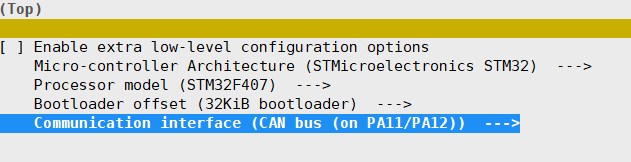
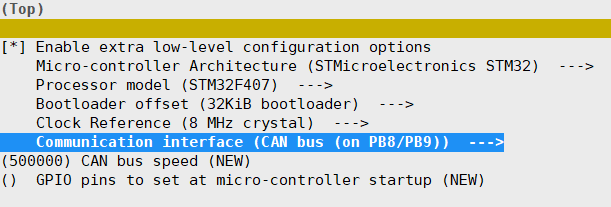
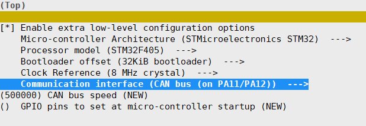
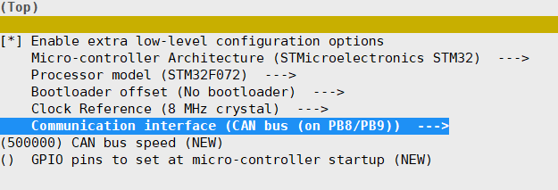
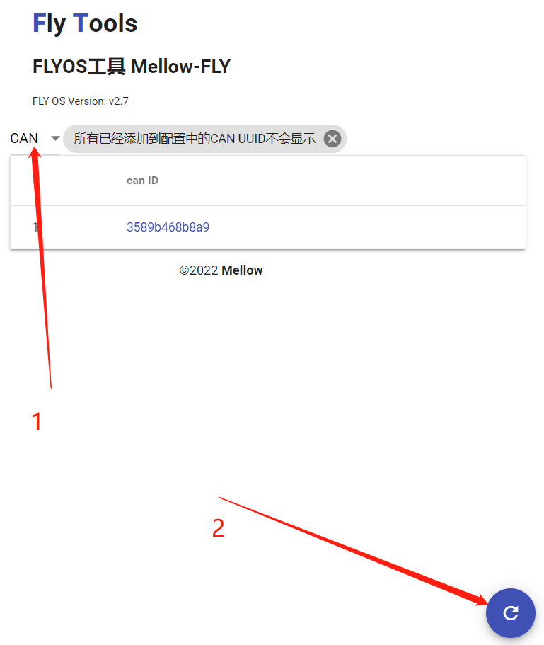

# CAN使用

?> 确保FLYOS系统版本≥2.9

## 注意事项

* Gemini-v1, v1.1版本不建议CANBUS和KlipperScreen同时启用，因为这两个进程的内存占用都比较大。Gemini-v2有1G内存可以正常启用
* 如遇到Klipper多MCU归位超时问题建议禁用HDMI输出，详情参考[issues 4861](https://github.com/Klipper3d/klipper/issues/4861),[RPI4-HDMI](https://hackaday.com/2019/11/28/raspberry-pi-4-hdmi-is-jamming-its-own-wifi/)

## **USB转CAN模块**介绍

* 型号：FLY-UTOC
* 以下所有文档中简称**UTOC**


* **USB-IN**: USB转CAN输入接口，连接到上位机
* **12-24v & GND**: 电源接口
* **CANBUS**: CAN接口，连接到扩展主板和工具板等(连接到有板载CAN收发芯片的设备)
* **CANBUS\***: CAN接口，连接到扩展主板和工具板等(仅限连接到STM32设备的USB接口[PA11,PA12],请注意购买相应版本的UTOC)

## 连接UTOC

* 使用USB-Type-c线将**UTOC**的**USB-IN**接口连接到Gemini系列主板USB接口
* 如果您的连接正确，此时**UTOC**的Type-c接口旁的LED会闪烁几次后常亮，如果没有常亮请检查系统版本

## 连接到主板

?> 如果您有fly-Gemini主板与工具板，建议将Gemini板载MCU使用USB连接，工具板使用CAN连接。

* `FLY-Super8_v1`,`FLY-Gemini_v1`,`FLY-CDY系列`,`FLY-E3系列`等无CAN功能的主板需要连接到**UTOC**的**CANBUS\***接口
* 除上述外的其他FLY主板和有CAN功能的主板均可直接连接到**UTOC**的**CANBUS**接口

* 部分主板连接的特殊配置


<!-- tabs:start -->

#### **FLY-Gemini v1/v1.1**

* 8P拨码开关设置

| PIN | 状态 |
| :----: | :----- |
| PIN1 | 关闭 |
| PIN2 | 关闭 |
| PIN3 | 关闭 |
| PIN4 | 关闭 |
| PIN5 | 关闭 |
| PIN6 | 关闭 |
| PIN7 | ***打开*** |
| PIN8 | ***打开*** |

* 将主板上的第二个(右侧)Type-c接口连接到**UTOC**的**CANBUS\***接口


#### **FLY-Gemini v2**

* 8P拨码开关设置

| PIN | 状态 |
| :----: | :----- |
| PIN1 | 关闭 |
| PIN2 | 关闭 |
| PIN3 | 关闭 |
| PIN4 | 关闭 |
| PIN5 | ***打开*** |
| PIN6 | ***打开*** |
| PIN7 | 关闭 |
| PIN8 | 关闭 |

* 将主板上的CAN接口(XH2.54-4P)连接到**UTOC**的**CANBUS**接口

#### **FLY-Super8 v1**

* 将主板上的Type-c接口连接到**UTOC**的**CANBUS\***接口

#### **FLY-Super8 v1.1**

* 将主板上的CAN接口(XH2.54-4P)连接到**UTOC**的**CANBUS**接口

<!-- tabs:end -->

## 固件编译

* 使用CANBUS必须为主板重新编译并烧写固件
* 固件编译部分文档见[固件烧录](/introduction/firmware.md)
* FLY主板Klipper固件配置截图

<!-- tabs:start -->

#### **FLY-E3/E3 Pro/CDY/CDY V2/CDY V3/9轴/Super8 V1**



#### **FLY-Super8_V1.1**



#### **FLY-Gemini V1/Gemini V1.1/Gemini V2**




#### **FLY-SHT36/SHT42**



<!-- tabs:end -->

* 按照上述配置并编译固件后记得烧录到主板


## 配置正确的CANBUS终端电阻

* CANBUS总线协议一条总线中必须且只能有两个120欧姆电阻
* 不管你连接几个USB设备，只要是在一条总线就只配置两个120欧姆电阻。不用为每个设备加一个电阻
* 使用万用表测量CAN H与CAN L之间的阻值应该为**≈60**欧姆


* SHT板载一个120欧姆电阻，通过两个跳线帽使其生效。
* 如果您使用UTOC连接到SHT，需要连接SHT的两个跳线帽。
* 注意：如果使用CAN连接到Gemini的板载MCU，不需要再配置额外的电阻。Gemini板载120欧姆电阻。

## 查看CAN UUID

?> 以下文档适用于Gemini系列主板，树莓派相关文档在[树莓派CAN使用](/advanced/can_rpi.md)

* 完成前面所有步骤后正常上电开机
* 打开`http://ip:9999`或者[打开FLY-Tools](http://flygemini.lan:9999/)
* 如下图选择CAN，并点击右下角刷新按钮(可以多点几次)



* 查找到ID后可以直接点击ID自动复制

?> 如果没有查找到ID请仔细检查接线及固件配置

## Klipper配置

* 比如原有配置是这样，只需修改一行即可

```ini
[mcu]
serial: /dev/serial/by-id/usb-Klipper_12345-if00
```

* 修改后

```ini
[mcu]
canbus_uuid: 3589b468b8a9
```

* UUID填写[查看CAN UUID](#查看can-uuid)文档中复制到的ID
* 保存并重启之后就可以连接到主板了