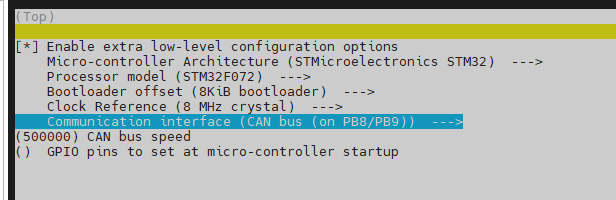
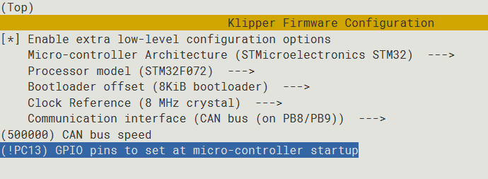

# CanBoot使用

什么是CanBoot？

CanBoot是一种为ARM Cortex-M mcu设计的引导加载程序。这个引导加载程序最初是为CAN节点设计的，以便与Klipper一起使用。引导加载程序本身利用了Klipper的硬件抽象层，将内存占用最小化。除了CAN, CanBoot现在还支持USB和UART接口。目前支持lpc176x、stm32和rp2040三种mcu。CAN支持目前仅限于stm32 f系列和rp2040设备。

Klipper已支持CanBoot，通过CANBUS直接烧录固件。使用CanBoot后为SHT36/42板更新klipper固件无需再连接USB线，保持现有的CAN连接的情况下可直接烧录固件，能够更便捷、高效的更新CAN工具板的固件。

## 1. 编译CanBoot引导固件

1. 进入SSH终端
2. 执行以下命令

```bash
git clone https://github.com/Arksine/CanBoot
cd CanBoot
```


```bash
make menuconfig
```

* 请注意自己使用的主板型号

<!-- tabs:start -->

#### **FLY-SHT36**


配置完成后按“Q”键，然后再按“Y”键即可退出并保存。执行下面的命令编译固件

```bash
make
```


* 像上图一样出现``Creating hex file out/canboot.bin`` 即为编译成功

#### **SB2040 & ERCF**

> [!TIP]
> 如果您的CanBoot选项中没有RP2040请拉取最新的CanBoot


配置完成后按“Q”键，然后再按“Y”键即可退出并保存。执行下面的命令编译固件

```bash
make
```


* 像上图一样出现``Creating hex file out/canboot.bin`` 或 ``Creating uf2 file out/canboot.uf2`` 即为编译成功

#### **FLY-SHT36 v2**

> [!TIP]
> SHT36 v2出厂已刷好CanBoot，无需执行这一步！！！


配置完成后按“Q”键，然后再按“Y”键即可退出并保存。执行下面的命令编译固件

```bash
make
```


* 像上图一样出现``Creating hex file out/canboot.bin`` 即为编译成功

<!-- tabs:end -->


## 2. 烧录CanBoot引导固件


<!-- tabs:start -->

#### **FLY-SHT**

> [!TIP]
> SHT板连接到电脑或者上位机之前必须安装下面图中的短接跳线帽，否则SHT板无法进入USB烧录模式

1. 进入SHT36,SHT42的USB烧录模式


2. 安装烧录工具

```bash
sudo apt install dfu-util -y
```

3. 使用Type-C数据线将SHT板连接到Linux设备，请确保连接前已安装**短接跳线**

4. 执行下面的命令查看是否连接成功,复制蓝色框中的USB ID

```bash
lsusb
```


5. 烧录固件(烧录前确保已经编译过固件),将下面命令中的**0483:df11**替换为前面复制的USB ID

```bash
dfu-util -a 0 -d 0483:df11 --dfuse-address 0x08000000 -D ~/CanBoot/out/canboot.bin
```

6. 没有报错则烧录成功,如果出现报错请重新检查每个步骤操作


7. 出现上图内容则烧录成功

> [!TIP]
> 注意：烧录成功后一定记得拔下来跳线帽

#### **SB2040 & ERCF**

> [!TIP]
> 如果您的CanBoot选项中没有RP2040请拉取最新的CanBoot（在CanBoot目录下输入 `git pull` 即可拉取最新的CanBoot）

1. 查看是否连接到SB2040的BOOT烧录模式

   按住SB2040板的BOOT键，然后将usb连接到上位机

   

   ```bash
   lsusb
   ```

   执行上面的命令查看是否有 ``ID 2e8a:0003 Raspberry Pi RP2 Boot``这行，如没有请检查USB线(连接前记得按住BOOT键)


2. 烧录

   ```bash
   cd ~/CanBoot/
   make flash FLASH_DEVICE=2e8a:0003
   ```

   执行上面的命令可能会提示输入密码，输入当前用户的密码就好，输密码的时候是不可见的。输完之接按回车

   出现下图则烧录成功


3. 检查

如果正确配置编译并烧录成功，则SB2040板的这个灯会以一定的频率闪烁！！！


#### **SHT36 v2**

> [!TIP]
> SHT36 v2出厂已刷好CanBoot，无需执行这一步！！！

1. 进入SHT36 V2的USB烧录模式


2. 安装烧录工具

```bash
sudo apt install dfu-util -y
```

3. 使用Type-C数据线将SHT板连接到Linux设备，请确保连接前已安装**短接跳线**

4. 执行下面的命令查看是否连接成功,复制蓝色框中的USB ID

```bash
lsusb
```


5. 烧录固件(烧录前确保已经编译过固件),将下面命令中的**0483:df11**替换为前面复制的USB ID

```bash
dfu-util -a 0 -d 0483:df11 --dfuse-address 0x08000000 -D ~/CanBoot/out/canboot.bin
```

6. 没有报错则烧录成功,如果出现报错请重新检查每个步骤操作


7. 出现上图内容则烧录成功

> [!TIP]
> 注意：烧录成功后一定记得拔下来跳线帽

<!-- tabs:end -->


## 3. 第一次烧录带有CanBoot的Klipper固件

* 确保你的SHT36/42已正确连接到UTOC或其他CAN设备

1. 拉取最新的klipper

```bash
cd ~/klipper
git pull
```


2. 配置最新的klipper固件

```bash
make menuconfig
```

* 请注意自己使用的主板型号

<!-- tabs:start -->

#### **FLY-SHT36**

1. 首先编译Klipper固件，配置如下图



* 配置成上图那样后按“Q”键，然后再按“Y”键即可退出并保存

2. 编译klipper固件

```bash
make
```


* 像上图一样出现``Creating hex file out/klipper.bin``即为编译成功

3. 接下来连接SHT36的boot跳线帽，并使用USB线连接到klipper上位机

```bash
lsusb | grep 0483:df11
```

4. 出现``Bus 007 Device 002: ID 0483:df11 STMicroelectronics STM Device in DFU Mode``内容则表示SHT已进入DFU模式

5. USB烧录Klipper固件

```bash
cd ~/klipper/
sudo dfu-util -a 0 -d 0483:df11 --dfuse-address 0x08002000 -D out/klipper.bin
```

6. 出现下图中``File downloaded successfully``则表示烧录成功


7. 取下SHT36/42的boot跳线帽，并断开USB连接

---

---


8. 将板连接到UTOC或MCP2125等CAN设备

9. 查看SHT板的UUID

* 必须使用python3

```bash
python3 lib/canboot/flash_can.py -q
```

* 如下图中出现 ``Detected UUID: fea6a45462e9, Application: Klipper`` 则正常，(每一块SHT36/42的UUID都不相同)
* 如果没有出现UUID，请检查CAN接线及前面相关步骤是否成功


#### **SB2040 & ERCF**

1. 首先编译Klipper固件，配置如下图


* 配置成上图那样后按“Q”键，然后再按“Y”键即可退出并保存

2. 编译klipper固件

```bash
make
```


* 像上图一样出现``Creating hex file out/klipper.bin``即为编译成功

3. 接好线后，建议整机断电重新上电开机一次。接着便可以使用CanBoot烧写固件。首先输入以下命令

   > [!TIP]
> 通电后，此状态灯应该会以一定频率闪烁!!! 如果没有闪烁，请重新烧录CanBoot引导固件！！

   

```bash
python3 ~/klipper/lib/canboot/flash_can.py -q
```

下图中高亮部分``365f54003b9d``就是这块SHT的uuid，这个uuid每块板子都不一样。同一块SB2040板烧录固件后uuid是不会变的


> [!TIP]
> 如果找不到CAN ID，请检查：

* 接线是否正确，例如CANH 和 CANL是否接反或者接触不良
* SB2040板上的120Ω跳线帽是否插上
* 您的镜像内核是否支持CAN
* 检查CanBoot编译是否正确，如果没有错误，可以尝试再次刷写CanBoot，刷写步骤请参考：[SB2040固件刷写](/advanced/canboot?id=_2-烧录canboot引导固件 "点击即可跳转")
* 如果还是不能找到ID，可以使用上位机再次烧写固件

4.通过CANBUS烧录Klipper固件

* 下面命令中的``fea6a45462e9``需要替换为你上一步中得到的UUID

```bash
python3 lib/canboot/flash_can.py -i can0 -f ./out/klipper.bin -u fea6a45462e9
```


* 像上图中出现``CAN Flash Success``则表示烧录成功

> [!TIP]
> 如果烧录了多次的CanBoot还是找不到CanBoot的ID，可以使用如下方法烧写固件：

1. 查看是否连接到SB2040的BOOT烧录模式

   按住SB2040板的BOOT键，然后将usb连接到上位机

   

   ```bash
   lsusb
   ```

   执行上面的命令查看是否有 ``ID 2e8a:0003 Raspberry Pi RP2 Boot``这行，如没有请检查USB线(连接前记得按住BOOT键)


2. 烧录

   ```bash
   cd ~/klipper/
   make flash FLASH_DEVICE=2e8a:0003
   ```

   执行上面的命令可能会提示输入密码，输入当前用户的密码就好，输密码的时候是不可见的。输完之接按回车

   出现下图则烧录成功


3. 检查

如果正确配置编译并烧录成功，则SB2040板的这个灯会常亮！！！


#### **FLY-SHT36 V2**

1. 首先编译Klipper固件

> [!TIP]
> 注意，在2022-10-18 **前** 购买的主控芯片为GD32F103；在2022-10-18 **后** 购买的主控芯片为APM32F072；

* GD32F103版本配置如下图


* APM32F072版本配置如下图



* 配置成上图那样后按“Q”键，然后再按“Y”键即可退出并保存

2. 编译klipper固件

```bash
make
```


* 像上图一样出现``Creating hex file out/klipper.bin``即为编译成功

3. 接好线后，建议整机断电重新上电开机一次。接着便可以使用CanBoot烧写固件。首先输入以下命令

```bash
python3 ~/klipper/lib/canboot/flash_can.py -q
```

下图中高亮部分``365f54003b9d``就是这块SHT的uuid，这个uuid每块板子都不一样。同一块SHT板烧录固件后uuid是不会变的


> [!TIP]
> 如果找不到CAN ID，请检查：

* 接线是否正确，例如CANH 和 CANL是否接反或者接触不良
* SHT36 v2板上的120Ω跳线帽是否插上
* 您的镜像内核是否支持CAN

4.通过CANBUS烧录Klipper固件

* 下面命令中的``fea6a45462e9``需要替换为你上一步中得到的UUID

```bash
python3 lib/canboot/flash_can.py -i can0 -f ./out/klipper.bin -u fea6a45462e9
```


* 像上图中出现``CAN Flash Success``则表示烧录成功

<!-- tabs:end -->

## 4. 已经烧录过带CanBoot的固件

> 如果已经烧录过**Canboot引导固件**和**带Canboot的固件**，以后需要更新klipper固件看下面操作即可

* 拉取最新的klipper

```bash
cd ~/klipper
git pull
```

* 编译最新的klipper

```bash
make menuconfig
make
```

* 为SHT36/42烧录klipper
* 下面命令中的``fea6a45462e9``需要替换为你查询到的UUID

```bash
python3 ~/klipper/lib/canboot/flash_can.py -i can0 -q
```

```bash
python3  ~/klipper/lib/canboot/flash_can.py -i can0 -f ./out/klipper.bin -u fea6a45462e9
```

