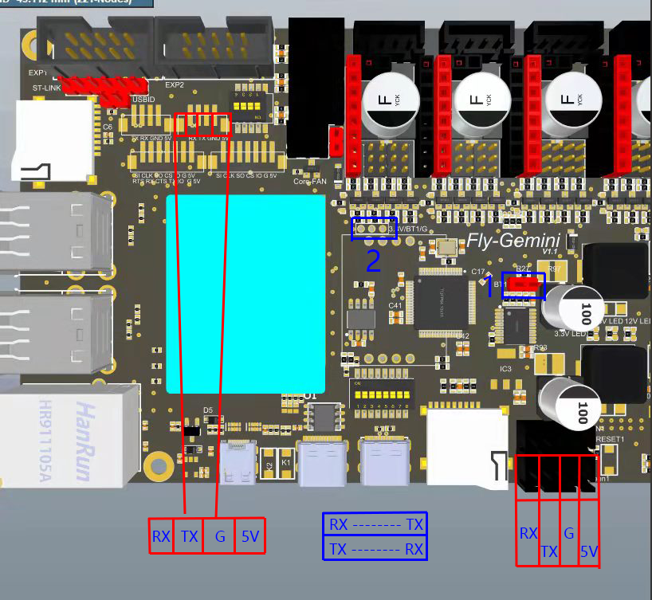
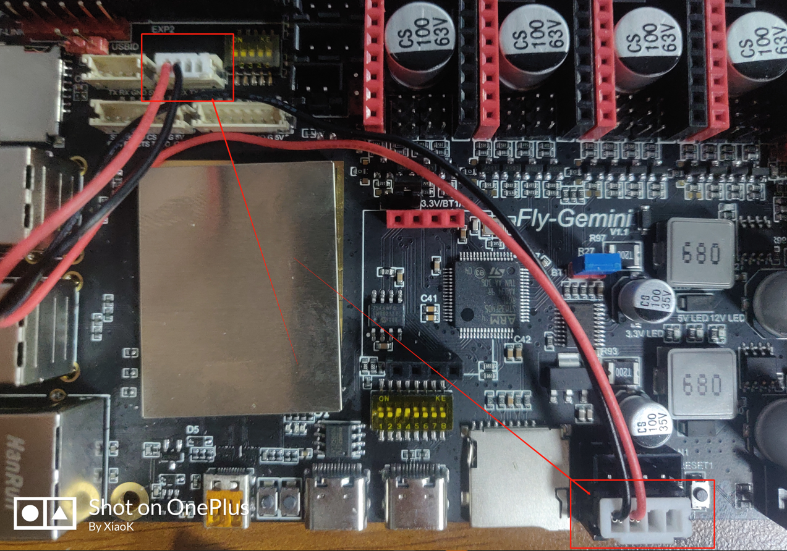
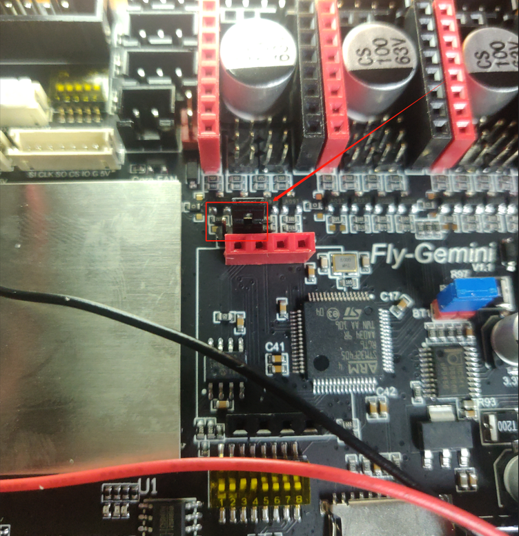
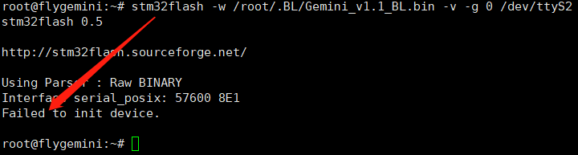
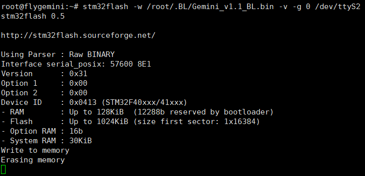
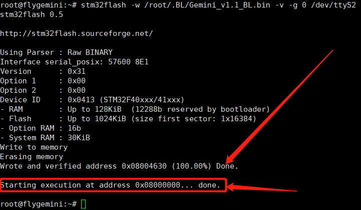

# 烧录BL

* 为主板MCU烧录BL(启动引导)

## 准备

* 连接线两根
* 烧录好系统镜像的SD卡(v2.2及以上版本系统)
* Gemini主板

## 开始

1. 连接串口

* 按照下图将主板Core UART2与MCU的串口连接
* 注意，RX与TX交叉连接



* 连接实物图



2. 连接跳线帽

* 按照下图插入两个跳线帽
* 第一个，只有两个排针，直接插入即可


* 第二个，有3个排针
* 此处需要注意，如果主板版本是第一版，跳线帽将左侧排针与中间排针连接
* Gemini v1.1版本和v2，跳线帽将右侧排针与中间排针连接
* 下图为V1.1版本



3. 进入系统并连接到ssh

* 启动及连接文档请前往相应文档页面
* 请使用root登录
* root默认密码为mellow

4. 开始烧录BL

* 在SSH终端一次输入下面的命令，每行回车
* 在执行前请按一次主板MCU的重置按键，在连接串口端子的右侧，丝印RESET1
* ```stm32flash -w /root/.BL/Gemini_v1.1_BL.bin -v -g 0 /dev/ttyS2```
* 上面这句适用于v1.1和v2主板，如果是v1请执行下面的
* ```stm32flash -w /root/.BL/Gemini_v1_BL.bin -v -g 0 /dev/ttyS2```
* 如果出现下图情况，则连接失败



* 请再次确认接线，跳线帽是否正确，并且按一次重置按键
* 再次执行上面的命令
* 出现下图情况则连接成功，等待片刻会出现进度



* 等待100%完成后即烧录BL完成



## 启动

* 烧录完BL后记得拔掉两个跳线帽，否则是没法启动的
* 取掉两个跳线帽后再按重启键

## 烧录固件

* BL烧录完成后就可以通过SD卡来烧录固件了
* [烧录固件](/introduction/firmware.md)