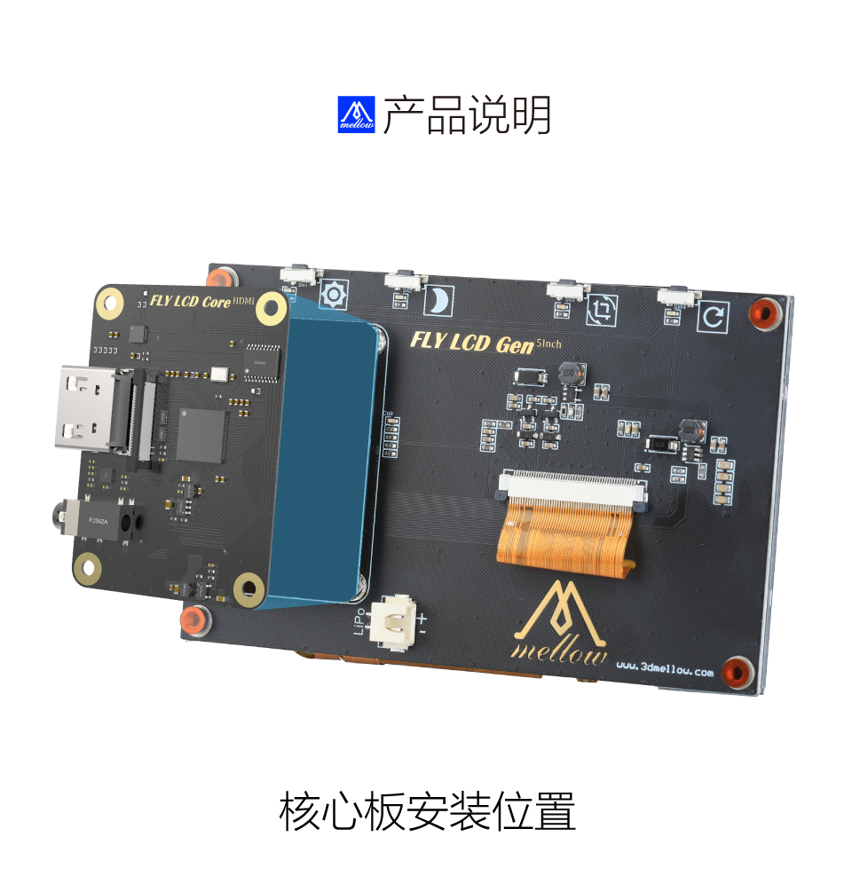
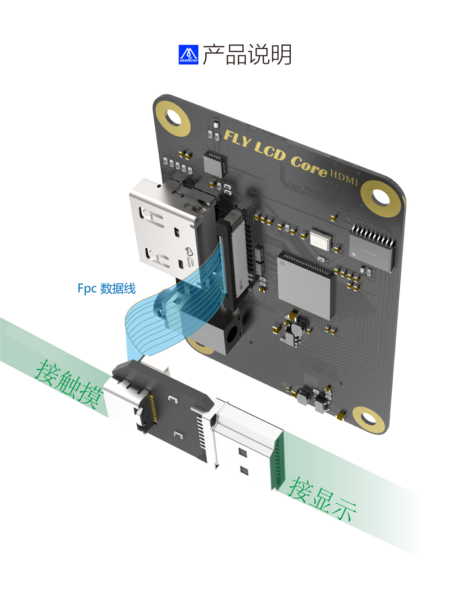
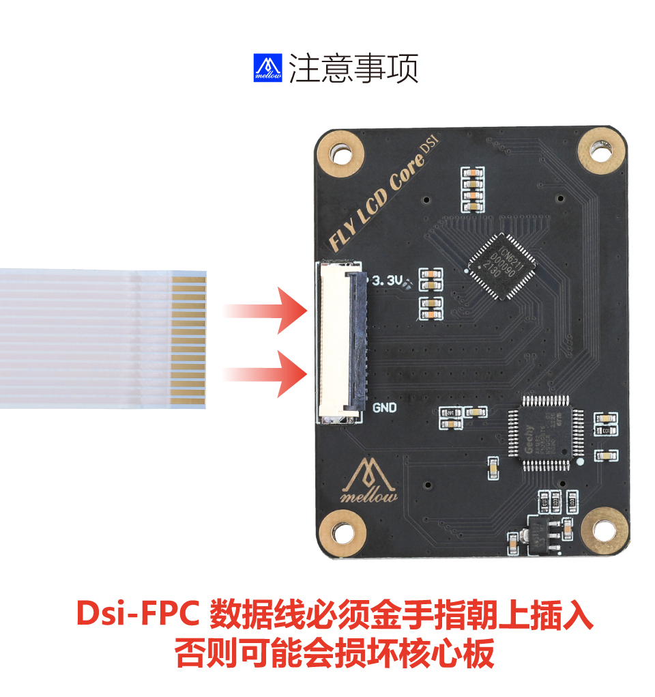

>[!WARNING]
>通电前请注意屏线方向是否正确

>[!WARNING]
>如果搭配CAN工具板则有可能导致归位超时，只需执行下方命令即可

>[!WARNING]
>此操作可以解决归位超时，但是会修改Klipper源码，请慎重选择

```bash
sed -i 's/TRSYNC_TIMEOUT = 0.025/TRSYNC_TIMEOUT = 0.05/g' /home/fly/klipper/klippy/mcu.py 
sudo systemctl restart klipper
```

> [!WARNING]
> 如果更新了Klipper则可能会将源码修改回去

# FLY LCD43/50/70 

* 开始使用LCD屏幕前确认已阅读并完成[系统镜像](../introduction/system.md)部分文档

* LCD屏幕分HDMI和DSI两个版本

* HDMI是可以给其他设备使用，DSI是给树莓派使用

   

# 核心板安装方法




# LCD HDMI

1. 烧录完成后会出现 BOOT 盘（如果未出现，请重新拔下 sd 卡，再插入电脑）


2. 打开BOOT盘下的**FLY-Config.conf**


3. 启用 klipperscreen
   将`KlipperScreen=false`修改为`KlipperScreen=true`


4. 更改默认显示方式
   将`Display=NONE`修改为`Display=HDMI


保存配置文件后弹出SD卡插到主板


## 屏幕接线

> [!NOTE]
> 请注意这需要占用上位机一个HDMI与USB

   type-c是触摸与供电请与HDMI接到上位机，购买FLY-LCD-HDMI时候会赠送一个HDMI转MINIHDMI

   

   

   


### LCD HDMI直连FLY PI V2方法


   

# LCD DSI

> [!NOTE]
> 请注意金手指方向


> [!NOTE]
> 请注意这是给树莓派用的




## 树莓派配置

用于树莓派的Raspberry Pi OS / Ubuntu / Kali 和 Retropie系统。

1. 请在[树莓派官网](https://www.raspberrypi.com/software/operating-systems/)下载最新版本的镜像。将压缩文件下载到PC上，并解压得到.img文件。
2. TF卡连接到PC，使用[SDFormatter](https://www.waveshare.net/w/upload/d/d7/Panasonic_SDFormatter.zip)软件格式化TF卡。
3. 打开[Win32DiskImager](https://www.waveshare.net/w/upload/7/76/Win32DiskImager.zip)软件，选择第1步准备的系统镜像，点击write烧写系统镜像。
4. 烧写完成后，打开TF卡根目录的config.txt文件，在config.txt最后加入以下代码，保存并安全弹出TF卡。

```
dtoverlay=vc4-kms-v3d
dtoverlay=vc4-kms-dsi-7inch
```

5. 将TF卡插入树莓派，给树莓派上电，正常等待几秒后可以进入显示，系统启动后可以正常触摸。


> [!NOTE]
> 树莓派无法使用触摸时候可以按此方法修改配置

树莓派使用FLY LCD-DSI时需要使用**SSH连接树莓派**修改以下配置，否则可能无法使用触摸。


```bash
sudo nano /boot/config.txt
```


找到

```bash
dtoverlay=vc4-kms-v3d
```

修改

```bash
dtoverlay=vc4-fkms-v3d,f
```

保存并且退出

```bash
CTRL+S
CTRL+X
```


