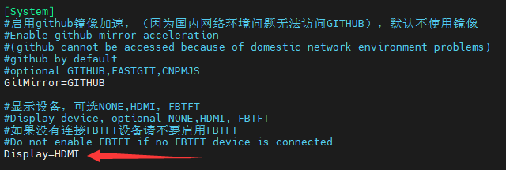
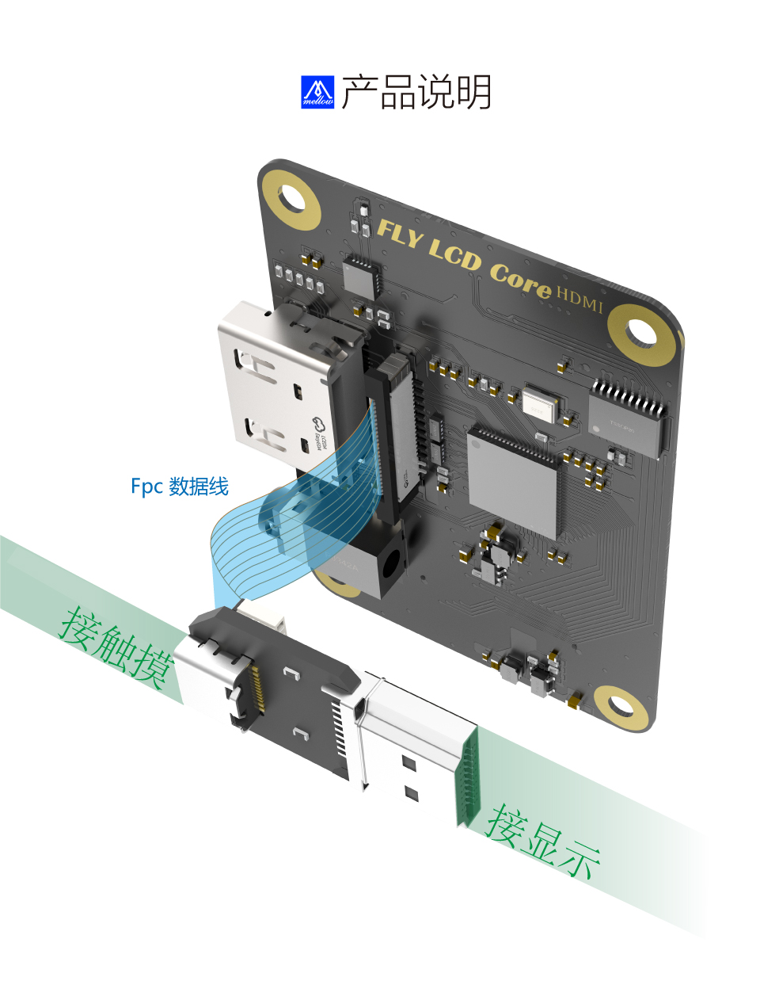
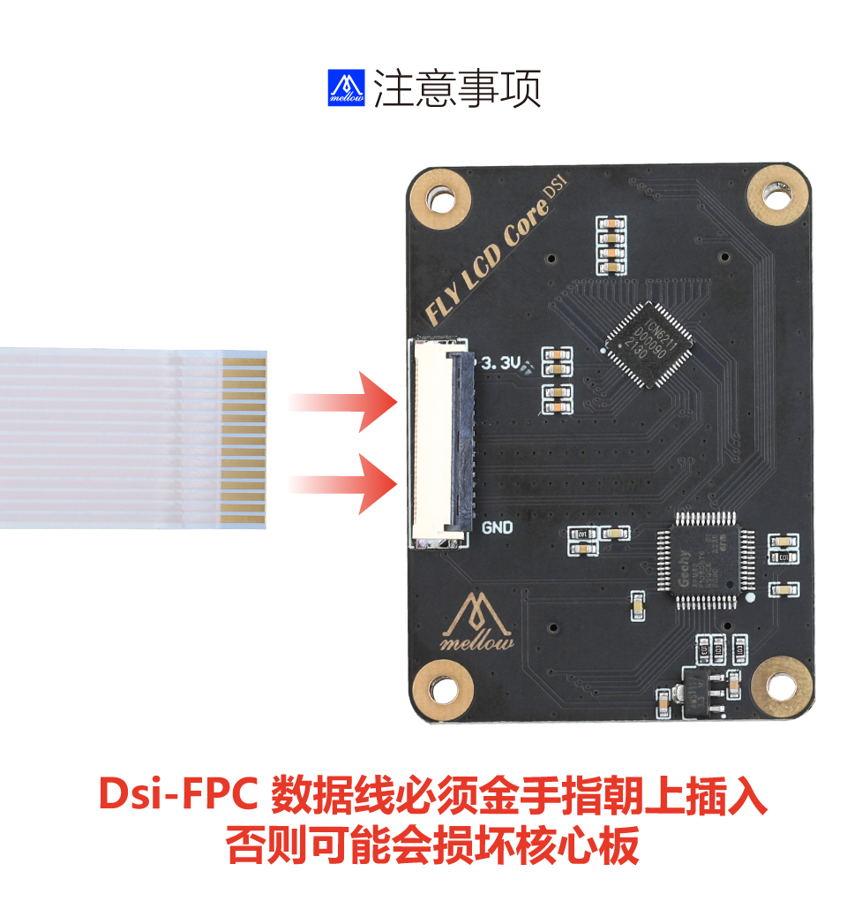
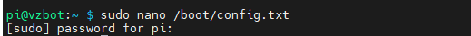
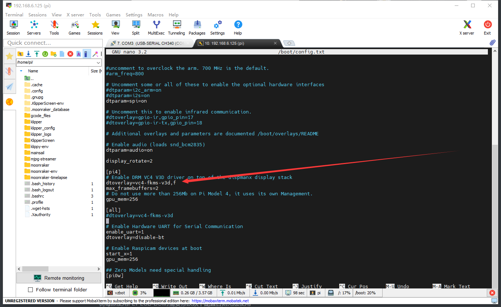
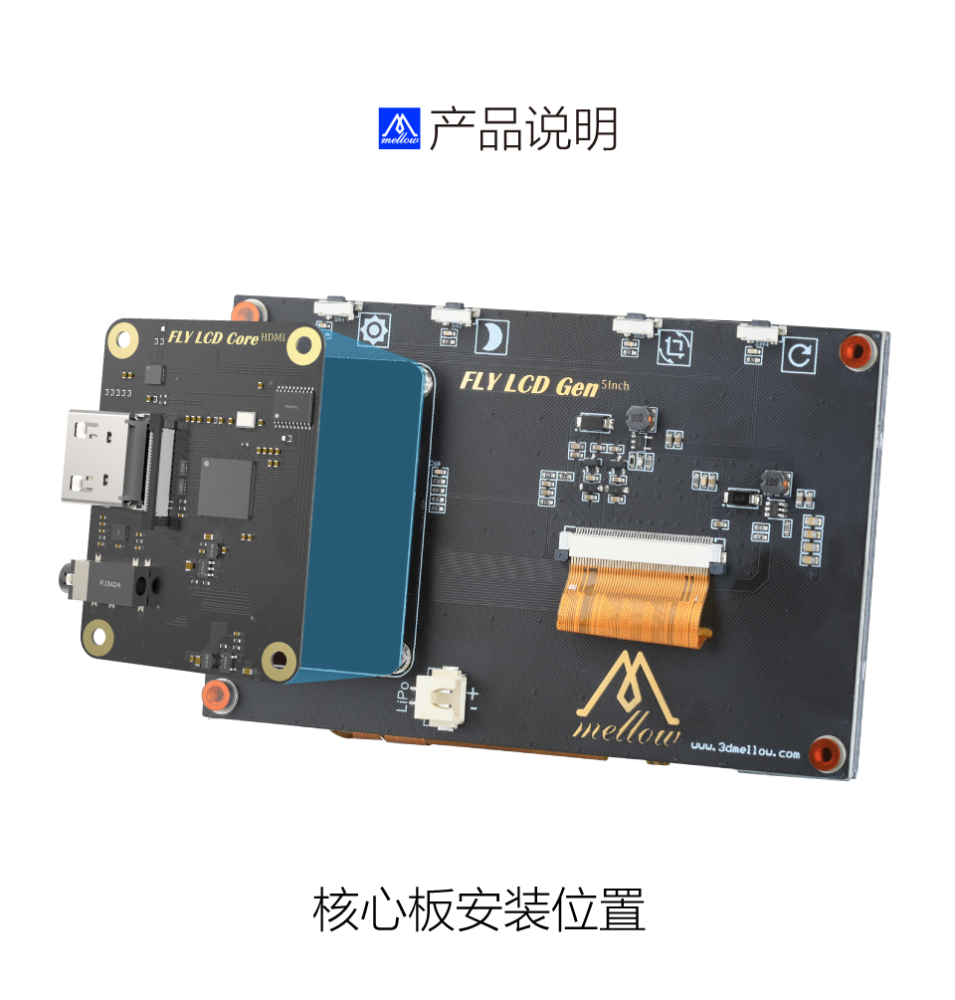
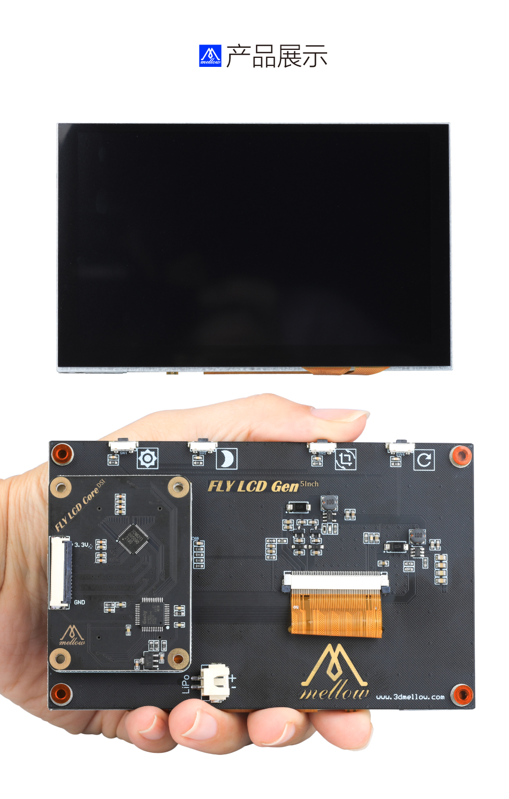

# 屏幕使用

## Mini 12864 LCD

* 正确连接到EXP接口，将示例配置中的mini12864部分取消注释

## FLY TFT V1

* 开始使用tft前确认已阅读并完成[系统镜像](../introduction/system.md)部分文档

1. 烧录完成后会出现 BOOT 盘（如果未出现，请重新拔下 sd 卡，再插入电脑）


2. 打开BOOT盘下的**FLY-Config.conf**


3. 启用 klipperscreen
将`KlipperScreen=false`修改为`KlipperScreen=true`


4. 更改默认显示方式
将`Display=NONE`修改为`Display=FBTFT`


保存配置文件后弹出SD卡插到主板

5. 屏幕线需要自己接端子

* Gemini-v1接线图


* Gemini-v1.1接线图


* Gemini-v2和Fly-Pi接线图


6. 连接主板与屏幕

* FLY-Gemini


* FLY-Pi


1. 主板上电开机

?> 修改Display后首次开机时间较长，请耐心等待几分钟！


## FLY LCD43/50/70 

* 开始使用LCD屏幕前确认已阅读并完成[系统镜像](../introduction/system.md)部分文档

* LCD屏幕分HDMI和DSI两个版本

* HDMI是可以给其他设备使用，DSI是给树莓派使用

   

### LCD HDMI

1. 烧录完成后会出现 BOOT 盘（如果未出现，请重新拔下 sd 卡，再插入电脑）


2. 打开BOOT盘下的**FLY-Config.conf**


3. 启用 klipperscreen
   将`KlipperScreen=false`修改为`KlipperScreen=true`


4. 更改默认显示方式
   将`Display=NONE`修改为`Display=HDMI



保存配置文件后弹出SD卡插到主板


5. 屏幕接线

   type-c是触摸与供电请与HDMI接到上位机，购买FLY-LCD-HDMI时候会赠送一个HDMI转MINIHDMI

   

   

   

### LCD DSI

> 请注意金手指方向




#### 树莓派配置

> 树莓派无法使用触摸时候可以按此方法修改配置

树莓派使用FLY LCD-DSI时需要使用**SSH连接树莓派**修改以下配置，否则可能无法使用触摸。



```
sudo nano /boot/config.txt
```





找到

```
dtoverlay=vc4-kms-v3d
```

修改

```
dtoverlay=vc4-kms-v3d,f
```

保存并且退出

```
CTRL+S
CTRL+X
```


### 安装核心板





