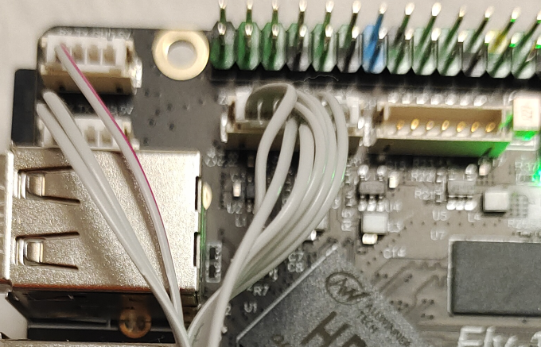

>[!WARNING]
>通电前请注意屏线方向是否正确

>[!WARNING]
>如果搭配CAN工具板则有可能导致归位超时，只需执行下方命令即可

>[!WARNING]
>此操作可以解决归位超时，但是会修改Klipper源码，请慎重选择

```bash
sed -i 's/TRSYNC_TIMEOUT = 0.025/TRSYNC_TIMEOUT = 0.05/g' /home/fly/klipper/klippy/mcu.py 
sudo systemctl restart klipper
```

> [!WARNING]
> 如果更新了Klipper则可能会将源码修改回去

# FLY TFT屏幕配置

* 开始使用tft前确认已阅读并完成[系统镜像](../introduction/system.md)部分文档

1. 烧录完成后会出现 BOOT 盘（如果未出现，请重新拔下 sd 卡，再插入电脑）


2. 打开BOOT盘下的**FLY-Config.conf**


3. 启用 klipperscreen
将`KlipperScreen=false`修改为`KlipperScreen=true`


4. 更改默认显示方式
将`Display=NONE`修改为`Display=FBTFT`


保存配置文件后弹出SD卡插到主板

## FLY-TFT-V1屏幕接线

* Gemini-v1接线图


* Gemini-v1.1接线图


* Gemini-v2和Fly-Pi接线图


6. 连接主板与屏幕

* FLY-Gemini


* FLY-Pi



1. 主板上电开机

> [!TIP]
> 修改Display后首次开机时间较长，请耐心等待几分钟！


# FLY TFT V1 FPC一线通版


