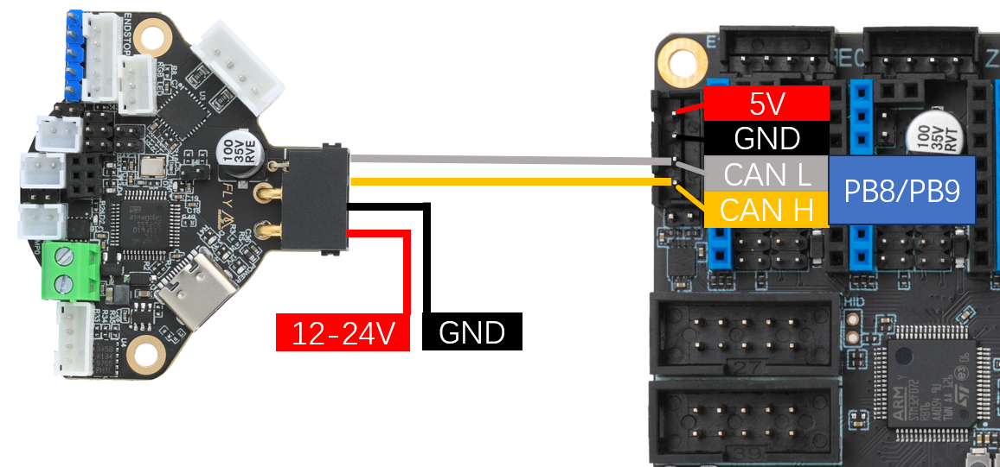
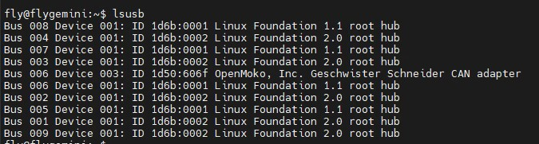
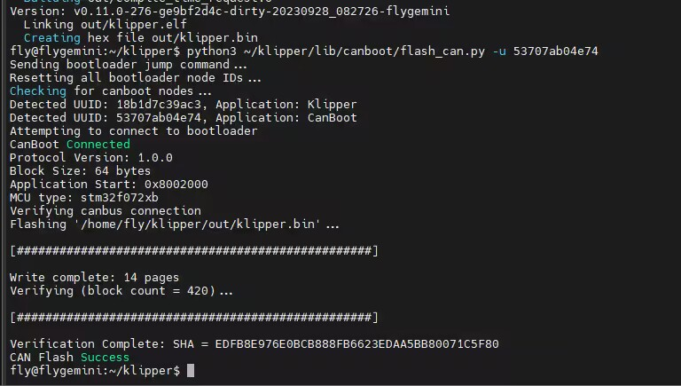
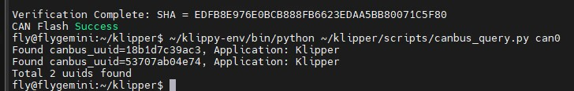

# Klipper的USB桥接CAN

> [!TIP]
> 此教程使用Fly主板进行演示

* 本教程中将使用到**FLY的上位机**，一张**需要刷桥接固件的D5主板**，与**刷了1M速率的SHT36-072版本**

## 为D5编译USB桥接CAN固件

* 其他主板请看官方对应的**USB桥接CAN固件**
* 请注意固件必须与参考官方提供的配置，请不要随意修改参数

1. 将SHT36-V2接到D5主板，**请注意CAN线需要接上12V或者24V电压**，另外一端无需接电源！！！



2. 先给D5主板刷桥接固件

```
cd klipper
make menuconfig
```


编译，烧录请看[D5固件烧录](http://mellow.klipper.cn/#/board/fly_d5/flash?id=_2-boot按键)

```
make clean
make -j4
```

3. 主板刷完固件后建议断开电源在插上电源连接
4. 上位机连接ss后输入**lsusb**，可以看到上位机



5. 查找CANid

```
~/klippy-env/bin/python ~/klipper/scripts/canbus_query.py can0
```


出现`Found canbus_uuid=18b1d7c39ac3`则查找到CANID。其中`18b1d7c39ac3`为D5主板uuid，可直接填入klipper配置文件。

* 请注意如果有两个ID并且无法判断哪个是工具id，可以断电拆了工具板来判断！
* 请确保上位机CAN速率与固件的CAN速率完全一致！！！[参考文档](http://mellow.klipper.cn/#/guide/klippererro/problem?id=确认can速率)

## 为SHT36编译USB桥接CAN固件

1. 编译SHT36固件

* 请确保接线正确!!!
* 请按提供的配置来选择

```
cd klipper
make menuconfig
```


```
make clean
make -j4
```

烧录固件

```bash
python3 ~/klipper/lib/canboot/flash_can.py -q
```

请注意，搜索到id后是显示``Application: Canboot``前面id才是工具板id

下图中高亮部分``53707ab04e74``就是这块SHTv2板的uuid，这个uuid每块板子都不一样。同一块SHTv2板烧录固件后uuid是不会变的


* 接线是否正确，例如CANH 和 CANL是否接反或者接触不良
* SHT36 V2板上的120Ω跳线帽是否插上
* 您的镜像内核是否支持CAN

如果确认没有上述问题，则可以尝试在**通电状态**下强制进入CanBoot来解决。此方法也可以在刷错固件连不上工具板之后尝试。进入CanBoot的方法如下，请小心使用！！！以免损坏SHT工具板！！！

如果成功进入Canboot，下图中的LED灯会以一定的频率闪烁


### 烧录固件

将下面命令中的``53707ab04e74``替换为[查找uuid](#_2-查找uuid "点击即可跳转")中查找到的uuid

```bash
python3 ~/klipper/lib/canboot/flash_can.py -u 53707ab04e74
```

如下图，出现``CAN Flash Success``则烧录成功



3. 检查

   如果正确配置编译并烧录成功，则SHTv2板的这个灯会常亮


## 重新查询CANID

烧录完成后需要重新查询CANid确保烧录无误

```
python3 ~/klipper/lib/canboot/flash_can.py -q
```




## Klipper的mcu配置

* 请确保CANid没有搞混
* 其他配置请自行添加，这边只做简单简介

```cfg
[mcu]
canbus_uuid: 18b1d7c39ac3
### 查询can固件id是：~/klippy-env/bin/python ~/klipper/scripts/canbus_query.py can0
### can的id需要把serial替换成canbus_uuid: 后面添加id 

[mcu SHT36]
canbus_uuid: 53707ab04e74
```

