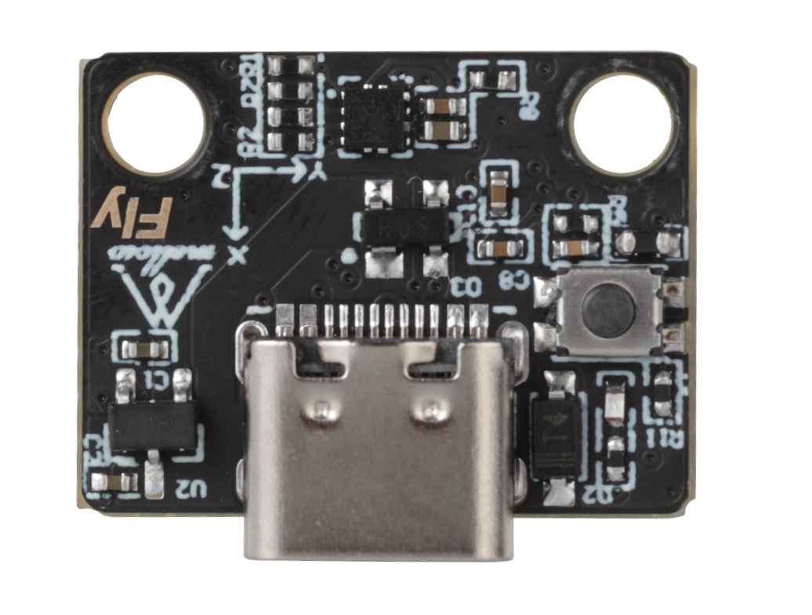
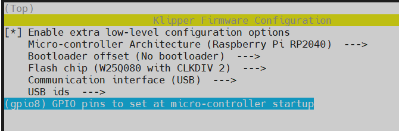
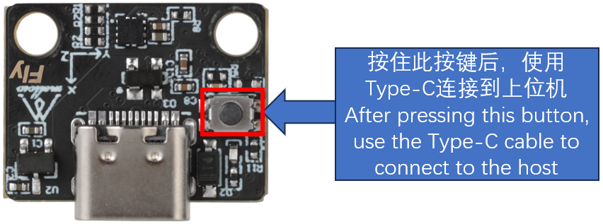
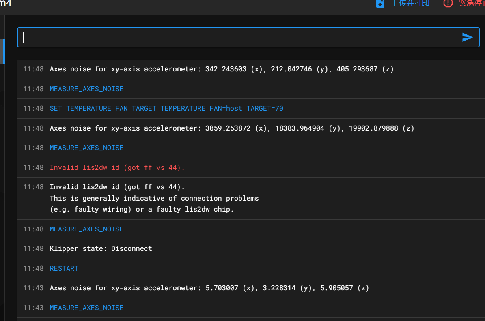
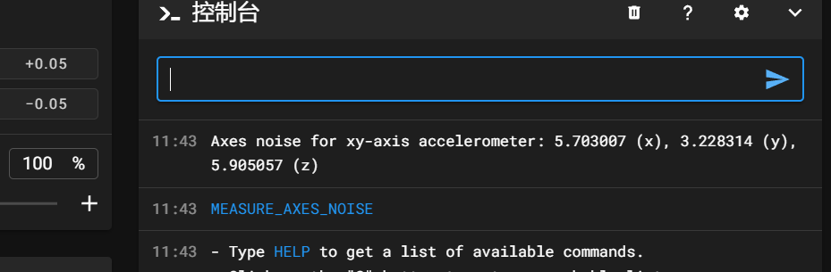

# 加速度计

> [!TIP]
> 建议使用Mellow的USB加速度计模块




* 接线线序简单，直接type-c接到上位机
* 固定方便，免去改结构件的麻烦

## 1. 准备

1. LISD2W加速度计模块
2. 打印机
3. 连接线

## 2. 固件编译

> [!WARNING]
> 出厂不带固件，请**编译并烧录固件**后再使用

### 2.1 更新klipper固件

> [!WARNING]
>
> 编译固件前请更新klipper固件，否则可能无法正常使用

使用ssh软件，输入以下更新命令：

```
cd ~./klipper && git pull
```

> [!TIPS]
>
> 如果更新不成功，也可尝试直接编译烧录，如果您的klipper版本过低则无法使用！！！

### 2.2 固件编译

**固件编译如下图配置**




## 3. 固件烧录

1. 按住USB加速度计的BOOT键，然后将usb连接到上位机

   

   ```bash
   lsusb
   ```
   
   执行上面的命令查看是否有 ``ID 2e8a:0003 Raspberry Pi RP2 Boot``这行，如没有请检查USB线(连接前记得按住BOOT键)


2. 烧录

   ```bash
   cd ~/klipper/
   make flash FLASH_DEVICE=2e8a:0003
   ```

   执行上面的命令可能会提示输入密码，输入当前用户的密码就好，输密码的时候是不可见的。输完之接按回车

   出现下图则烧录成功


## 4. 配置和测试

> [!TIP]
> 装加速度计依赖包安装方法如下

> [!TIP]
> 建议使用**MobaXterm_Personal**等**SSH**工具操作

> [!TIP]
> 此步骤使用于 `非FLY上位机`，如果您为`Fly-π`或者`Gemini`系列则无需执行！！！

依次执行以下三条命令以安装加速度计依赖包。

```bash
sudo apt update
```

```bash
sudo apt install python3-numpy python3-matplotlib libatlas-base-dev
```

```bash
~/klippy-env/bin/pip install matplotlib numpy
```

请注意，根据 CPU 的性能，可能需要*很多*时间，最多 10-20 分钟。请耐心等待完成 安装。在某些情况下，如果主板的 RAM 太少 安装可能会失败。
* 打开printer.cfg加入加速度计配置

```ini
[mcu LIS]
serial: /dev/serial/by-id/usb-Klipper_rp2040_XXXXXXXXXXXXXXXXXXXXX
### 查询usb固件id是：ls -l /dev/serial/by-id/
### 把/dev/serial/by-id/usb-Klipper_rp2040_XXXXXXXXXXXXXXXXXXXXX替换查询到的id

##ADXL345加速度计
[lis2dw]
cs_pin: LIS:gpio9
spi_software_sclk_pin: LIS:gpio10
spi_software_mosi_pin: LIS:gpio11
spi_software_miso_pin: LIS:gpio12

[resonance_tester]
accel_chip: lis2dw
probe_points: 150, 150, 20        # 共振测试的坐标点
min_freq: 5                       # 共振测试的最小频率
max_freq: 133                     # 共振测试的最大频率
accel_per_hz: 75                  # 每赫兹加速度(mm/sec)，加速度=每赫兹加速度*频率，如果共振过于强烈，可以减少该值。默认75
hz_per_sec: 1                     # 测试的速度，较小的值会加长测试时间，较大的值会降低测试精度，(Hz/sec == sec^-2)，默认1

```

* 修改配置后保存并重启
* 在控制台执行`ACCELEROMETER_QUERY`
* 多加速度计可指定测试某个`ACCELEROMETER_QUERY CHIP=bed`
* 如果出现报错请检查接线及配置
* 正常的输出如下图


* 这样就可以来测量共振了
* 记得全部归位
* 测试X轴`TEST_RESONANCES AXIS=X`,Y轴也一样改为Y即可

> [!TIP]
> 注意！如果测试过程中打印机振动太剧烈请及时按紧急停止或发送`M112`来停止

* 过高的`accel_per_hz`会让振动变得剧烈，可以适当降低

```ini
[resonance_tester]
accel_chip: adxl345
accel_per_hz: 50  # 默认值为75
probe_points: ...
```

## 5. 自动校准

* klipper支持自动校准
* 记得全部归位
* `SHAPER_CALIBRATE`执行这个命令后打印机将开始自动校准X,Y
* 在校准完成后执行`SAVE_CONFIG`来保存数据
* 也可以使用`SHAPER_CALIBRATE AXIS=X`来自动校准一个轴，
* 在每个轴校准结束后都要先保存数据在校准下一个


* 校准过程可能会比较长，请耐心等待

## 6. USBadxl 3d模型

>[!WARNING]
>
>本地浏览器渲染模型较慢，建议将模型下载到本地计算机查看

```3dmodel
https://cdn.mellow.klipper.cn/STEP/Fly-usb_adxl.step
```

## 7. 噪音问题

>[!Warning]
>
>klipper版本从v0.12.0-47-g3f845019开始，2d加速度计噪声测量值变大

* 修改前



* 修改后



* 可以修改Klipper版本解决此问题，请注意执行后需要等5分钟后重启Klipper
* 因为版本差异过大需要重新主板固件

```
git checkout 43ce7c0b9ad4f30277c10b086b86a0937dbfebbc
```

* 测试完成后可以则可以将Klipper改回去
* 因版本差异过大，更改完klipper后需要重新编译并且烧录固件
* 可以使用下方命令在将版本改回去

```
git checkout master
```
