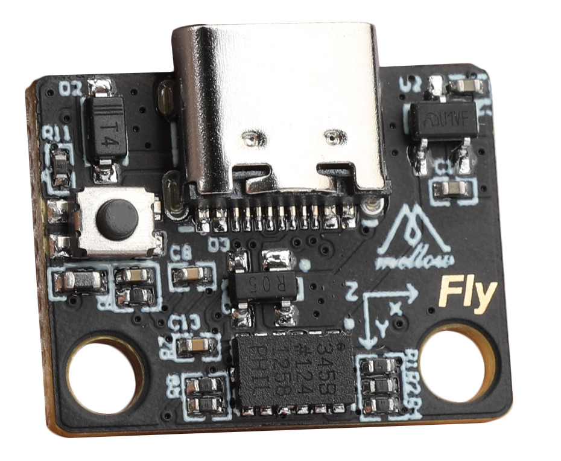
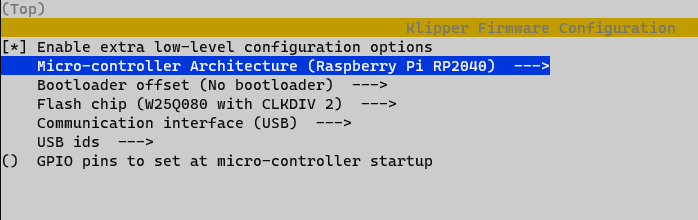

# 加速度计

> 购买ADXL345加速度计模块时请仔细辨别

?> 建议使用Mellow的ADXL345加速度计模块.
?> 可代替V0/V0.1的固定线管的打印件




* 接线线序简单，直接type-c接到上位机
* 固定方便，免去改结构件的麻烦

## 准备

1. ADXL345加速度计模块
2. 打印机
3. 连接线

## 固件烧录

* USB连接如下图配置



* 如何编译固件参考[固件烧录](/introduction/firmware)

## 测试

* 打开printer.cfg加入加速度计配置

```ini
[mcu adxl]
serial: /tmp/klipper_host_mcu

##ADXL345加速度计
[adxl345]
cs_pin: adxl:gpio13
spi_software_sclk_pin: adxl:gpio10
spi_software_mosi_pin: adxl:gpio11
spi_software_miso_pin: adxl:gpio12

[resonance_tester]
accel_chip: adxl345
probe_points:
    100, 100, 20  # 此坐标为你需要测量的位置，一般为热床中间

```

* 修改配置后保存并重启
* 在控制台执行`ACCELEROMETER_QUERY`
* 多加速度计可指定测试某个`ACCELEROMETER_QUERY CHIP=bed`
* 如果出现报错请检查接线及配置
* 正常的输出如下图


* 这样就可以来测量共振了
* 记得全部归位
* 测试X轴`TEST_RESONANCES AXIS=X`,Y轴也一样改为Y即可

?> 注意！如果测试过程中打印机振动太剧烈请及时按紧急停止或发送`M112`来停止

* 过高的`accel_per_hz`会让振动变得剧烈，可以适当降低

```ini
[resonance_tester]
accel_chip: adxl345
accel_per_hz: 50  # 默认值为75
probe_points: ...
```

## 自动校准

* klipper支持自动校准
* 记得全部归位
* `SHAPER_CALIBRATE`执行这个命令后打印机将开始自动校准X,Y
* 在校准完成后执行`SAVE_CONFIG`来保存数据
* 也可以使用`SHAPER_CALIBRATE AXIS=X`来自动校准一个轴，
* 在每个轴校准结束后都要先保存数据在校准下一个


* 校准过程可能会比较长，请耐心等待