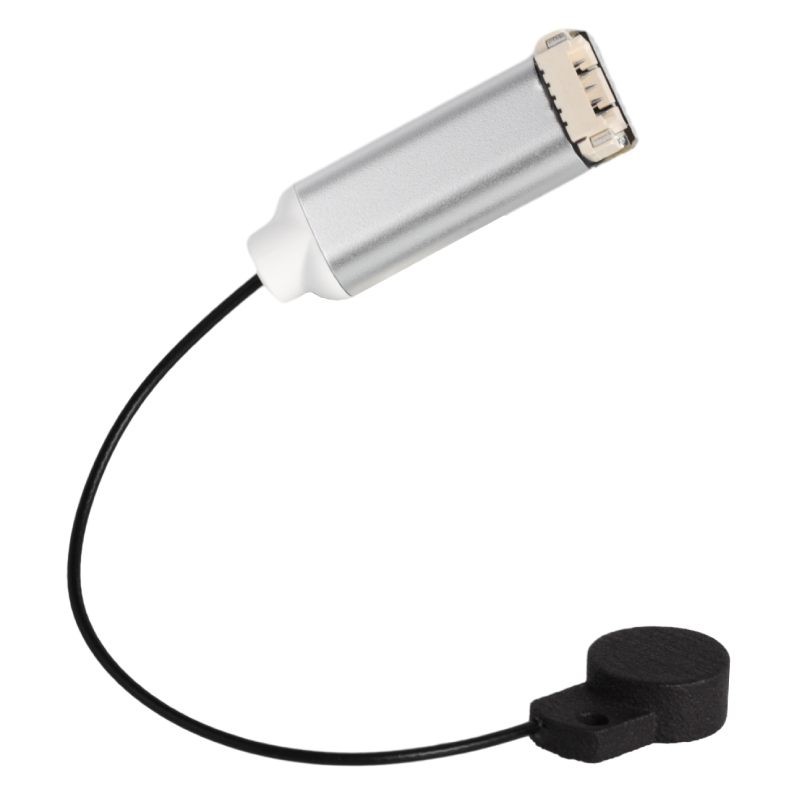
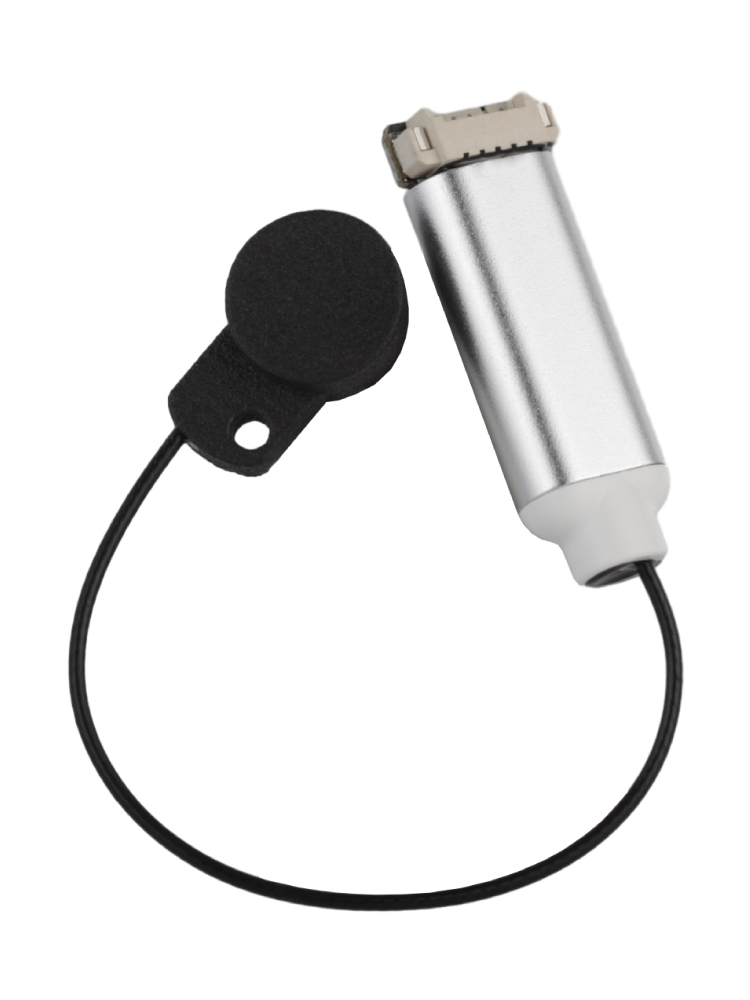

# BDsensor

BD传感器是一个可以与3D打印机配合使用的距离传感器，可以实时进行快速床调平和调整z轴。

功能

* 代替z轴限位
* 扫描时无需升降z轴，提高打印速度
* XY移动扫描,可进行密集网床探测

----

连接

* 电源：5V
* 固件： Klipper/Marlin
* 连接：工具板/主板（BDsensor将使用一个舵机口与限位口）
* 热床：普通PEI，铝板热床等金属表面热床，不支持磁铁打孔热床与非金属表面热床

----

