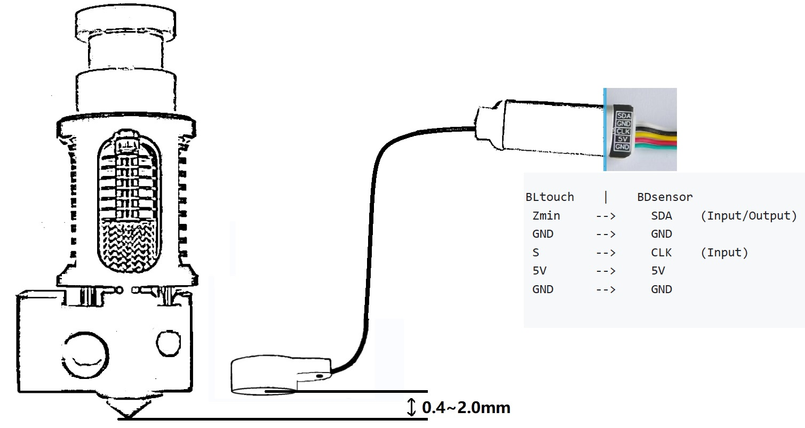

# 安装  **BDsensor**

## 将传感器电缆连接到主板或CAN总线工具头板。

请注意SB240无法使用BDsensor

请注意SHT36需要将BDsensor的CLK/SCL    (Input)接到高压输入口，并且将跳线接上

BDsensor的CKL和SDA线可以连接到电路板的任何GPIO引脚。您也可以将BD传感器电缆直接连接到Bltouch端口，例如：

```
BLtouch    |    BDsensor
 5V       -->     5V
 GND      -->     GND
 S        -->     CLK/SCL    (Input)
 GND      -->     GND
 Zmin     -->     SDA    (Input/Output) 
```

由于主板连接器中的某些引脚可能没有直接连接到MCU的gpios（例如，它们上可能有滤波电容器或通过MOSFET，二极管或光耦合器隔离，但如果它们通过电阻或电阻上拉/下拉隔离也可以），因此它们不能与BDsensor一起使用。并且固件将报告连接错误。例如

- 风扇和加热器的连接器通过 MOSFET 隔离，
- 某些电路板中用于温度热敏电阻和端挡/探头的连接器通常通过滤波电容器连接到 GND，

1. 如下图所示，将BD传感器安装在靠近热端的位置。 [STL of mount](https://www.thingiverse.com/thing:6098131),  [STL_mount_VzBot_Goliath short](https://discord.com/channels/829828765512106054/1163237892957671424)



## 将补丁安装到 klipper 固件中

- 放弃之前修改的klipper文件并且更新klipper

```
cd
cd ~/klipper
git checkout .
git pull
```

- 克隆BD传感器的最新代码

```
cd && git clone https://github.com/markniu/Bed_Distance_sensor.git
```

- 安装

```
cd  ~/Bed_Distance_sensor/klipper/
./install_BDsensor.sh
```

- 编译固件

```
cd ~/klipper/
make menuconfig
make clean
make
```

- 将固件烧录到BD传感器连接的MCU或CANbus工具头板上

如果您的打印机运行的是Moonraker，请将以下部分添加到moonraker.conf，然后您可以通过网页或klipperscreen单击一下即可更新BDsensor。

```
[update_manager BDsensor]
type: git_repo
primary_branch: new
channel: dev
path: ~/Bed_Distance_sensor
origin: https://github.com/markniu/Bed_Distance_sensor.git
install_script: ./klipper/install_BDsensor.sh
is_system_service: False
managed_services: klipper
info_tags:
  desc=Bed Distance Sensor
```

## 编辑 printer.cfg

- 将该部分复制到到您的**printer.cfg**并编辑`[BDsensor]` `sda_pin`  `scl_pin`，也不要忘记禁用其他探针部分，如 **BLtouch**。您可以连接主板或工具头CAN模块上的BD传感器， 
- 在`[BDsensor]`中将`speed`修改为 0.8。这仅适用于 z 倾斜和PROBE_ACCURACY命令.值越小，探测时的精度越高，因为 MCU 在归位时读取主回路中的 BD传感器不像正常的止动器那样实时。 `[BDsensor]`
- 将BD传感器在Z轴回原点时作为限位开关需要将`[stepper_z]` 中的`endstop_pin`改为`endstop_pin: probe:z_virtual_endstop`
- 请确保**printer.cfg**中有`[safe_z_home]` 
- 将`[bed_mesh]`和`[z_tilt]`或者`[quad_gantry_level]`中的`[quad_gantry_level]`值改为1（建议0.7-1.0mm）在klipper的默认值为5mm，否则容易超出传感器范围
- **喷嘴高度只适合在`z_adjust:`设置，正数是贴近热床，负数是远离热床，其它调喷嘴高度的设置都会有bug**
- 打开快速扫床需要将`no_stop_probe:true`前面的#删除

下面是一个配置示例。

```
[BDsensor] 
scl_pin:PC6  # 舵机信号口
sda_pin:PC3  # 限位信号口
delay: 20 # 20us per pulse, this value should be >=20 but must be below 50
z_offset:0 # this `z_offset` must be set to 0. 
z_adjust:0.0 # z axis adjustment, replace the z_offset function. within -0.3 to 0.3mm
x_offset: -34
y_offset: 0
#no_stop_probe:true # enable this for fast probe, the toolhead will not stop at the probe point.
position_endstop: 0.8 # the Z axis will stop at this position (mm) while homing z, recommend value is 0.4~1.0
#speed:0.8 # this speed only works for the z tilt and PROBE_ACCURACY command.

[stepper_z]
endstop_pin: probe:z_virtual_endstop 
#position_endstop: 0.5
homing_speed: 5
second_homing_speed: 0.8

[bed_mesh]
speed: 200
horizontal_move_z:1
algorithm: bicubic

[quad_gantry_level]
horizontal_move_z:1

```

## 安装后，请通过发送以下gcode命令进行检查

```
M102   S-1     # 读取传感器信息
M102   S-2     # 读取一个距离值
```

## 检查连接

通过**控制台**发送`M102 S-1`这是返回消息的示例，如果返回返回空白或其他字符串请检查连接和电线顺序

```
Send: M102 S-1
Recv: V1.0 pandapi3d.com
```

## 校准

- 清洁喷嘴，然后控通过控制台移动Z轴，直到喷嘴刚好接触床板（BDsensor将使用此位置作为零位置，因此不需要`z_offset`，这就是[BDsensor]部分中值为0的原因）
- **控制台**发送gcode命令`M102 S-6`，打印机每次将Z轴缓慢向上移动0.1mm，直到达到4mm。请勿在安装传感器之前运行M102 S-6，也不要在校准时关闭打印机电源，否则旧的校准数据将被删除。如果在这种情况下，只需再次校准
- 之后，您可以检查BD传感器是否已通过`M102 S-5`成功校准，这将返回存储在BD传感器中的原始校准数据。

**注意事项**:

- 归位Z轴速度最好是5

- 如果M102 S-5返回的第一个原始校准数据大于400，则意味着传感器安装得太高，需要重新安装到更靠近床的位置，则第一个数据的推荐值为100。还要确保第二个数据的值比第一个数据大 10 个以上

  - FAQ: 如果校准数据以1开始，第二个值为9，第三个值为24，这意味着什么？

  - 这意味着在0-0.1毫米之间的分辨率只有9，而0.1-0.2毫米的分辨率是15。因此建议再次校准，让第一个分辨率0-0.1毫米大于10。

- 请不要忘记在运行G28之后或为这些命令 `Z_tilt`与 `quad_gantry_level`调整Z轴高度

- 必须正确大写和小写部分名称，否则 klipper 将报告`Unknown pin chip name 'probe'`
