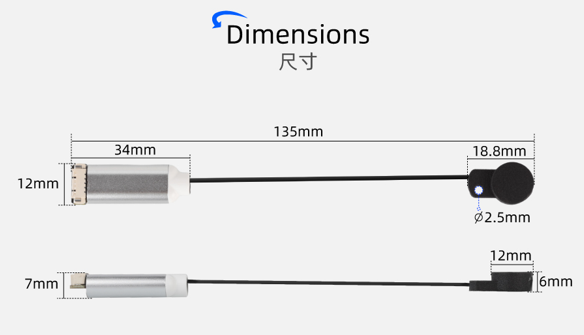
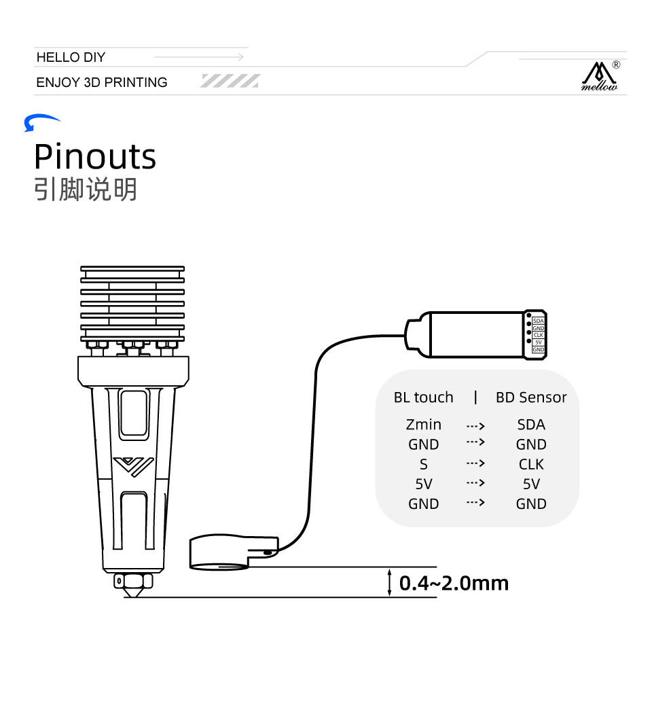

> [!TIP]
> **BDsensor**可以直接使用主板和工具板的**BL-TOUCH**接口

> [!Warning]
> **请注意线序是否正确否则会损坏设备**

## 1. BD sensor尺寸

## 2. 线序分布

|      BD sensor    |  BL-TOUCH  |  功能介绍 |
| :---------------: | :--------- |:--------- |
|    ***SDA***    | ***Zmin*** | ***限位***  |
|    ***GND***    | ***GND***  | ***GND*** |
|    ***S***      | ***CLK***  | ***舵机***  |
|    ***5V***     | ***5V***   | ***5V电源***  |
|    ***GND***    | ***GND***  | ***GND***  |

