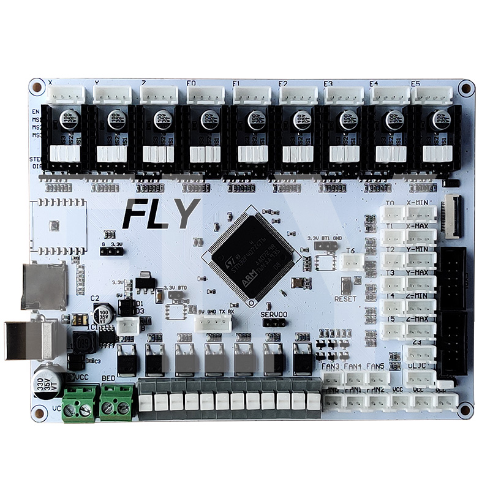

# 1. 产品简介

Mellow Fly-9轴是广州镁伦电子科技有限公司Fly3D主板研发团队推出的一款可以最多支持8路步进电机的3D打印机主板。

* 32位ARM Cortex-M4系列168 MHz，STM32F407ZGT6芯片
* 固件：Marlin 2.0/Reprap/Klipper
* 驱动支持：A4988、LV8729、DRV8225、TMC2208/2209/5160等
* 驱动模式支持：TMC：UART/SPI
* 支持9个独立的电动机驱动器，6个挤出机，6个可控制的风扇，3个不可控制的风扇插槽。
* 预留一个FPC驱动扩展插槽，还可以扩展3个其他步进电机
* 显示：串行触摸屏、mini12864 LCD、12864 LCD、2004 LCD、FLY 4.3/7.0 
* 1个高压IN口，支持自动平床传感器：BLTouch、PL08N等接近传感器、Klicky、Voron Tap等
* 6个ADC接口，最多支持六路热敏
* 8个IO接口，可以用于调平和限位
* 6个加热棒接口，最多支持六路加热棒
* 6个可控风扇接口

## 1.1产品详情

淘宝：[FLY3D 9轴3d打印机主板，支持marlin/duet/klipper固件，支持4Z轴)]([FLY3D 9轴3d打印机主板，支持marlin/duet/klipper固件，支持4Z轴-淘宝网 (taobao.com)](https://item.taobao.com/item.htm?spm=a1z10.5-c-s.w4002-23066022675.10.5b5b3903h4laKt&id=607560586615)"点击即可跳转")

