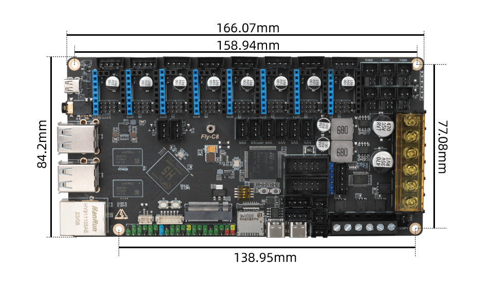

# 1. 产品简介

Mellow Fly-D5是广州镁伦电子科技有限公司Fly3D主板研发团队推出的一款高性能3D打印机主板，最多支持5路步进电机。

## **1.1 产品特点**

* 采用 32 位主频 168MHz 的 ARM Cortex-M0+系列 STM32F407VGT6 主控芯片
* 板载 TMC 驱动的 SPI 和 UART 工作模式
* 板载 DIAG 功能引脚，只需通过简单的拔插跳线帽即可使用无限位归位
* 数控风扇 24V、12V、5V 电压可选，省去购买降压模块麻烦。

[Fly-D5-淘宝网还没上架 需要替换 (taobao.com)](https://item.taobao.com/item.htm?spm=a230r.1.14.1.1a4840a8a8t04w&id=661670024975&ns=1&abbucket=16#detail "点击即可跳转")

## 1.2 产品参数

* MCU: STM32F407VGT6
* 固件:  KLIPPER/RRF/
* 支持12-24V直流供电，供电更稳定，省去降压模块
* 1个高压IN口，支持自动平床传感器：BLTouch、PL08N等接近传感器、Klicky、Voron Tap等
* 驱动工作模式支持：SPI、UART、STEP/DIR
* 支持驱动：支持TMC5160Pro、TMC5160、TMC2209、TMC2225、TMC2226、TMC2208、TMC2130、A4988等
* 拓展接口：BLTouch（Servos、Probe）、RGB X2、UART X1、12864 X1
* 风扇: 两线数控风扇 X6 (支持24V、12V、5V)可选
* 温度传感器：3路 NTC 100K
* 支持机器结构：Cartesian、Delta、Kossel、Ultimaker、CoreXY

## 1.2 C8尺寸

 

