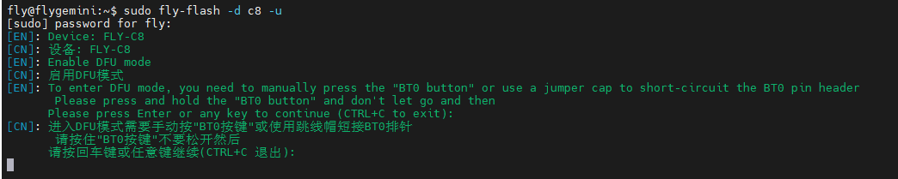
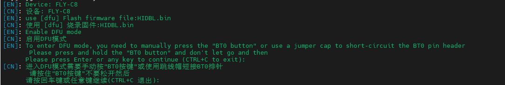
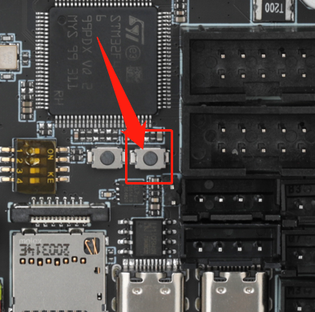
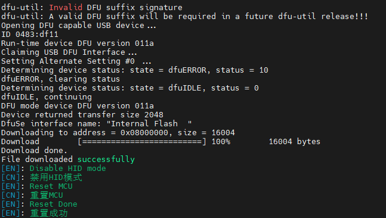
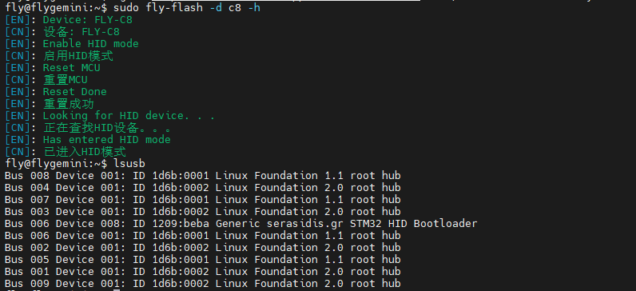

# BootLoader烧录方法

>[!Warning]
>
>请注意此方法是固件烧录失败时候才需要的步骤，如果可以正常烧录固件请不要进行此步骤

>[!Warning]
>
>请注意此方法是固件烧录失败时候才需要的步骤，如果可以正常烧录固件请不要进行此步骤


>[!Warning]
>
>请注意此方法是固件烧录失败时候才需要的步骤，如果可以正常烧录固件请不要进行此步骤


上位机需要使用**SSH**软件控制

* 进入DFU

```bash
sudo fly-flash -d c8 -u
```



* 下载BL并且烧录

```
sudo wget https://cdn.mellow.klipper.cn/BL/HIDBL.bin -O ~/HIDBL.bin && sudo fly-flash -d c8 -u -f ~/HIDBL.bin
```

* 当出现下图时候需要长按下位机的BOOT键



* 需要长按C8主板下位机的BOOT键

、、

* 当出现下图时候则证明烧录成功并且可以将BOOT键松开



* 验证方法，

```
sudo fly-flash -d c8 -h && lsusb
```


