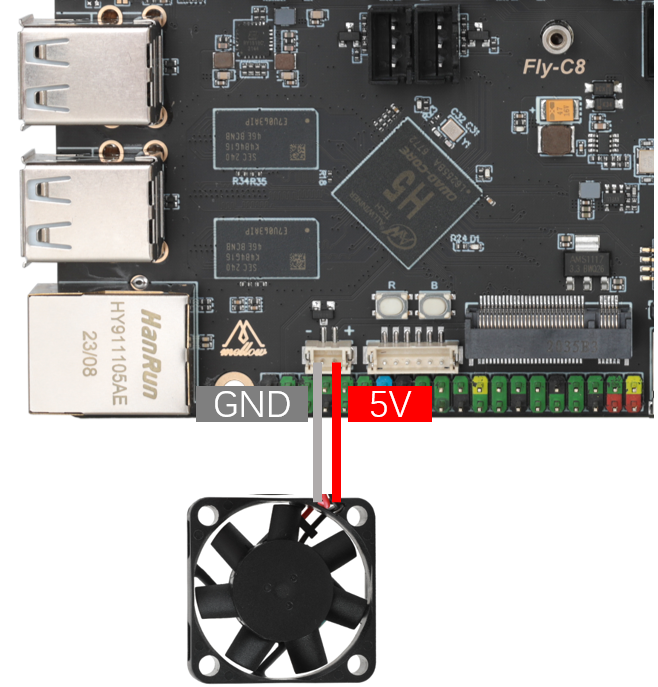

# 15. FLY C8 CPU散热风扇的使用

* FLY C8 板载了ZH1.5-2pin的可控5V风扇接口，用于CPU散热，接线方法如下图

  

* 配置如下：

  ```
  [mcu host]                     # FlyOS已默认为您生成linux MCU，定义即可使用           
  serial: /tmp/klipper_host_mcu 
  
  [temperature_sensor Gemini-v3]  # 上位机温度
  sensor_type: temperature_host
  
  [temperature_fan core_fan]      # 上位机散热风扇
  pin: host:gpiochip1/gpio3       # 上位机风扇pin脚
  max_power: 1.0
  sensor_type: temperature_host   # 设置为上位机主控温度
  control:watermark               # 控制方式
  target_temp: 48                 # 上位机散热风扇启动温度
  min_temp: 0                     # 最低温度，低于此温度将会报错
  max_temp: 90                    # 最高温度，高于此温度将会报错
  off_below: 0.10
  kick_start_time: 0.50
  max_speed: 0.8                  # 最大转速，为满功率运转时的80%
  min_speed: 0.3                  # 最小转速，为满功率运转时的30%
  
  ```
  
  
