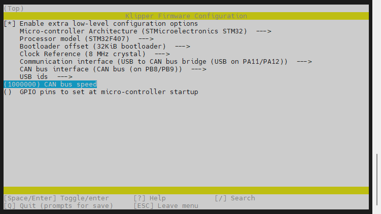

# 固件编译烧录

> [!TIP]
> FLY-C8 无需使用任何跳线即可烧录固件


## 1. 拨码开关设置

> [!Warning]
> 请注意拨码开关不是跳线，如果想正常使用还是需要拨动拨码
* 拨码开关``1``,``2``打开将下位机与上位机通过内置USB连接

  

  > [!TIP]
  > 在这个模式下，图中所示的USB口会被占用，不能再插入其他USB设备

  

* 拨码``3``,``4``打开将下位机USB连接到板载Type-C端口

  

* ``1``,``2``为一组，``3``,``4``为一组。两组不可同时打开

## 2. 固件编译

编译固件前请确保 [连接到SSH](/board/fly_gemini/host/FLY_π_ssh.md "点击即可跳转")

> [!TIP]
> 固件配置方法请按主板提供的来配置

**固件配置方法**


```
cd klipper
make menuconfig
```

<!-- tabs:start -->

### **USB固件配置**


### **CAN桥接固件配置**

* FLY-C8建议使用Klipper的USB桥接CAN固件，可以省去一个UTOC来通过CAN连接工具板
* 此方法是通过主板桥接CAN设备，请确保上位机的can0、桥接主板的CAN速率、CAN工具板的速率完全一致



<!-- tabs:end -->

* 编译固件

```
make clean
make -j4
```


## 3. 固件烧录

* 执行下面的命令来添加一键烧录工具，这个命令只执行一次，后续烧录不用

```
curl -kfsSL https://cdn.mellow.klipper.cn/Utils/fly-flash/fly-flash_install.sh | sudo bash -s -- "c8"
```

  > [!TIP]
> 执行下面的命令来自动烧录固件

```bash
sudo fly-flash -d c8 -h -f ~/klipper/out/klipper.bin
```

* 注意：以上命令烧录固件会将``~/klipper/out/klipper.bin``烧录到下位机，请在烧录前编译好固件


* 正常启动MCU

```bash
sudo fly-flash -d c8 -s
```

> [!TIP]
> 烧录完成后无需将插入任何跳线

> [!warning]
> 如果需要读取CAN工具板ID时，请使用12/24V供电，否则会导致读不到ID！！！

