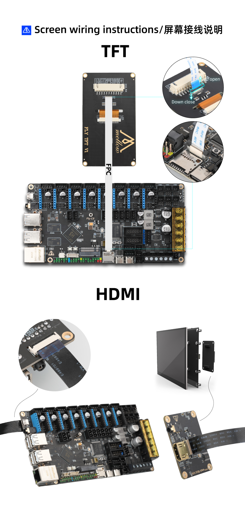

>[!WARNING]
>通电前请注意屏线方向是否正确

>[!WARNING]
>如果搭配CAN工具板则有可能导致归位超时，只需执行下方命令即可

>[!WARNING]
>此操作可以解决归位超时，但是会修改Klipper源码，请慎重选择

```bash
sed -i 's/TRSYNC_TIMEOUT = 0.025/TRSYNC_TIMEOUT = 0.05/g' /home/fly/klipper/klippy/mcu.py 
sudo systemctl restart klipper
```

> [!WARNING]
> 如果更新了Klipper则可能会将源码修改回去

## HDMI与TFT屏幕接线


