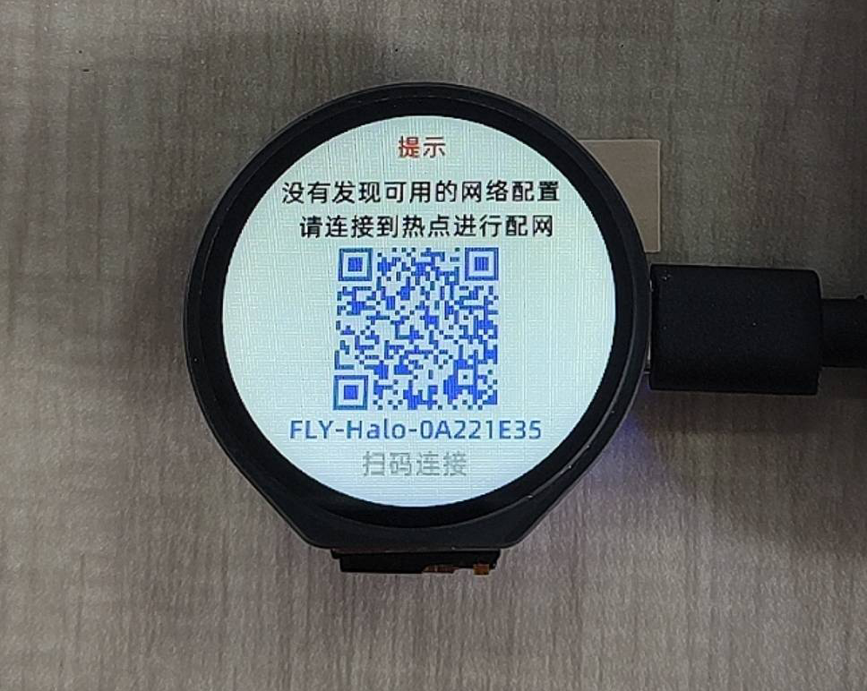
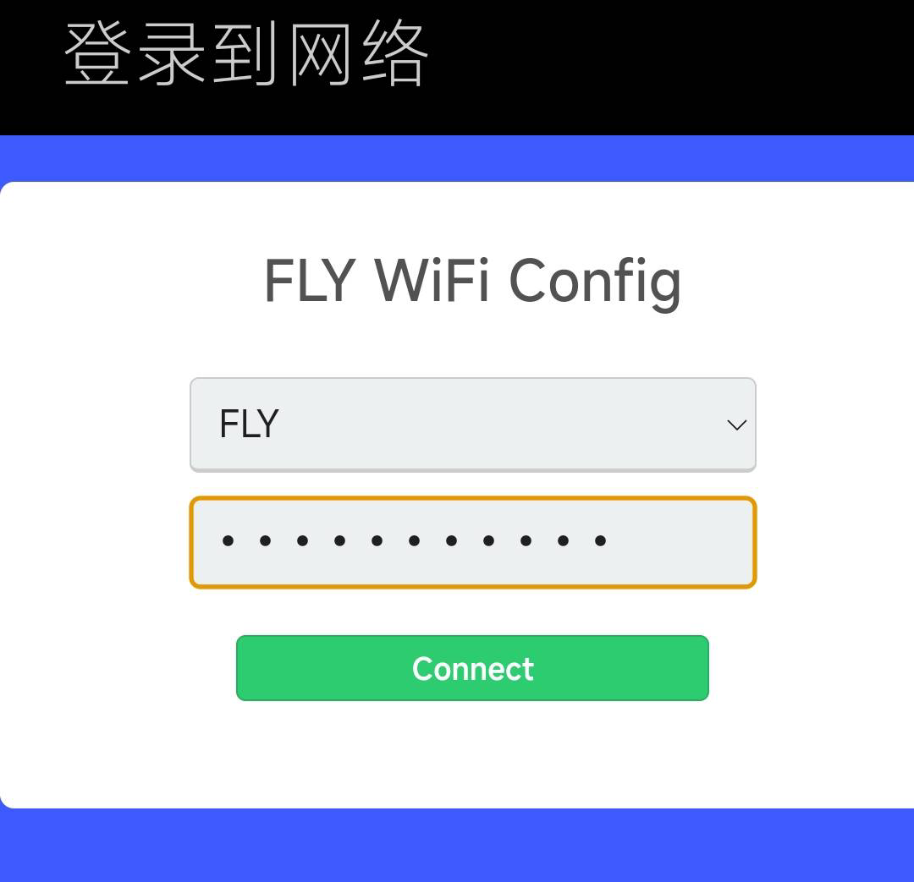
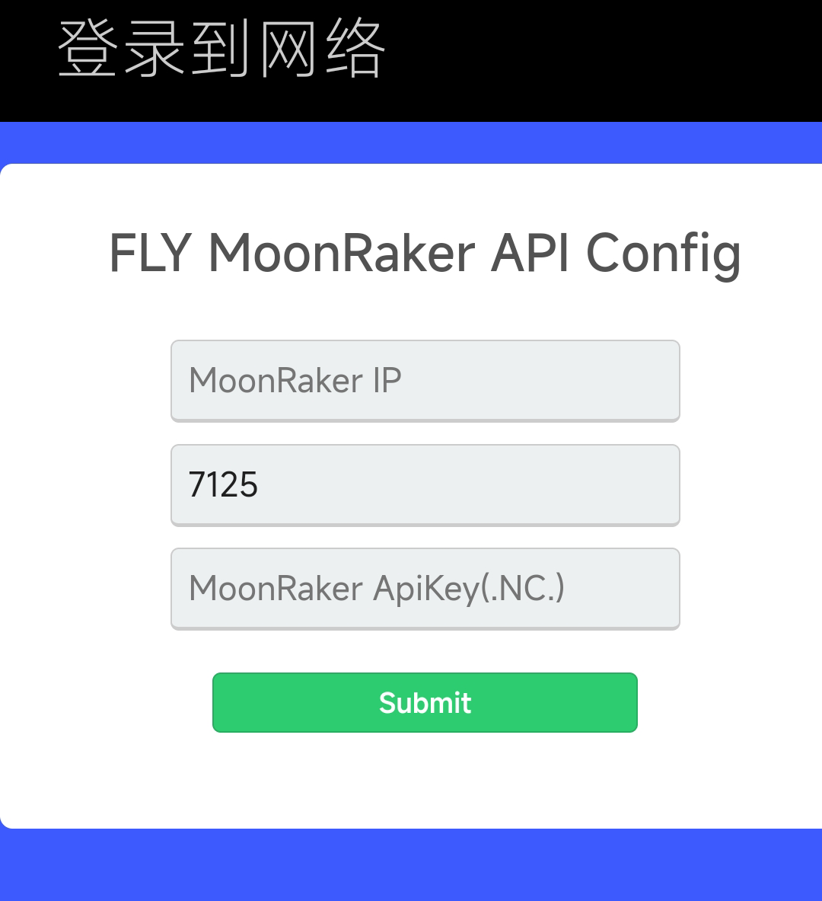

# 配置

## 1. 语言选择


## 2 .使用手机扫码并且配置WIFI

> **如果扫码失败可以在手机WIFI连接界面寻找HALO的WIFI**
>
> **如果没有弹出网页需要手动去浏览器搜索**

```
http://192.168.4.1/
```



### 2.1 选择需要连接的WIFI

选择需要连接的WIFI



### 2.2 输入连接KLIPPER的IP

在MoonRaker IP处输入KLIPPER的ip



### 2.3 保存并且退出

HALO会自动重启并且连接KLIPPER，HALO自带的热点会自动关闭


