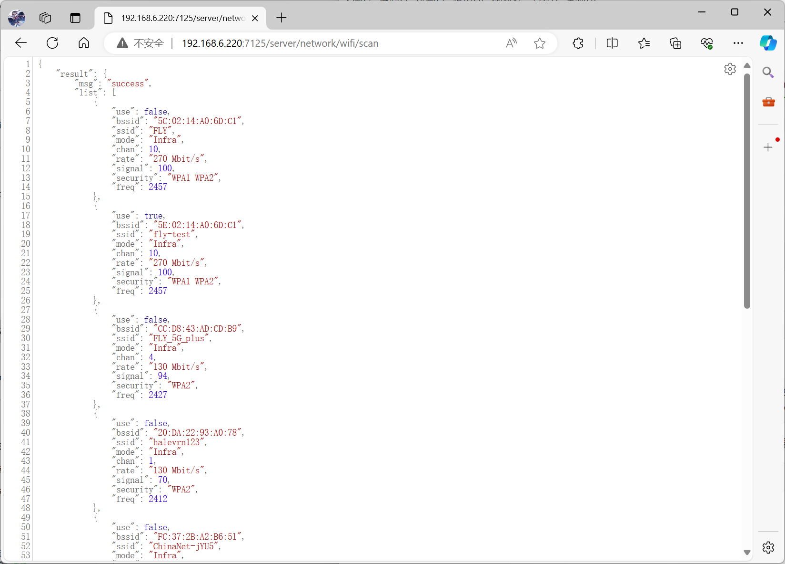
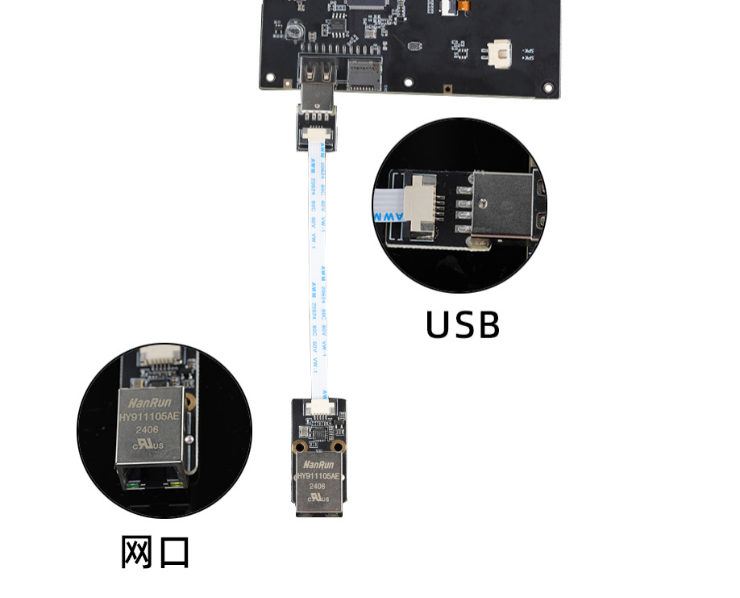

# 树莓派系统使用网线连接WiScreen

安装服务

```bash
sudo apt install isc-dhcp-server
```

添加网络配置，让eth0为静态IP

修改`/etc/network/interfaces.d/eth0`

```bash
auto eth0
iface eth0 inet static
address 192.168.251.100
netmask 255.255.255.0
broadcast 192.168.251.255
network 192.168.251.0
gateway 192.168.251.1
```

修改`/etc/default/isc-dhcp-server`

```bash
# Defaults for isc-dhcp-server (sourced by /etc/init.d/isc-dhcp-server)

# Path to dhcpd's config file (default: /etc/dhcp/dhcpd.conf).
#DHCPDv4_CONF=/etc/dhcp/dhcpd.conf
#DHCPDv6_CONF=/etc/dhcp/dhcpd6.conf

# Path to dhcpd's PID file (default: /var/run/dhcpd.pid).
#DHCPDv4_PID=/var/run/dhcpd.pid
#DHCPDv6_PID=/var/run/dhcpd6.pid

# Additional options to start dhcpd with.
#       Don't use options -cf or -pf here; use DHCPD_CONF/ DHCPD_PID instead
#OPTIONS=""

# On what interfaces should the DHCP server (dhcpd) serve DHCP requests?
#       Separate multiple interfaces with spaces, e.g. "eth0 eth1".
INTERFACESv4="eth0"
#INTERFACESv4="eth0"
INTERFACESv6=""
#INTERFACES="eth0"

INTERFACES="eth0"
```

修改`/etc/dhcp/dhcpd.conf`，尾部新增下面的内容

```bash
# ddns-update-style none;
subnet 192.168.251.0 netmask 255.255.255.0 {
    range 192.168.251.100 192.168.251.200;
    option routers 192.168.251.1;
    option domain-name-servers 8.8.8.8, 8.8.4.4; # Google Public DNS as an example
    default-lease-time 600; # Default lease time in seconds
    max-lease-time 7200;    # Maximum lease time in seconds
}
```

先重启系统，再执行下面的重启服务

或者重启网络服务

```bash
sudo systemctl restart NetworkManager
```

此操作会断网重连

重启服务

```bash
sudo systemctl restart isc-dhcp-server
```

本机IP地址应为`192.168.251.100`

树莓派中执行下面的命令确保系统网络优先通过wifi连接

已连接wifi的情况下再执行

```bash
sudo ip route del default && sudo ip route add default via $(ip route show dev wlan0 | grep 'default via' | awk 'NR==1 {print $3}') dev wlan0
```

# 替换moonraker文件

* 请先连接SSH，并且保证可以正常上网

1. 备份moonraker文件

```
mv ~/moonraker ~/moonraker-bak
```

2. 停止moonraker服务

```
sudo systemctl restart moonraker
```

3. 拉取moonraker

```
git clone https://e.coding.net/g-ofpa1390/3D-Printers/moonraker-dev.git -b flylcd-dev moonraker
```

4. 在浏览器访问上位机找到`moonraker.conf`添加，然后重启系统

```
[network]
```

5. 然后在浏览器输入下方地址，其中IP需要替换成上位机的IP

```
http://ip:7125/server/network/wifi/scan
```

* 出现这步代表操作完成



# 接线


