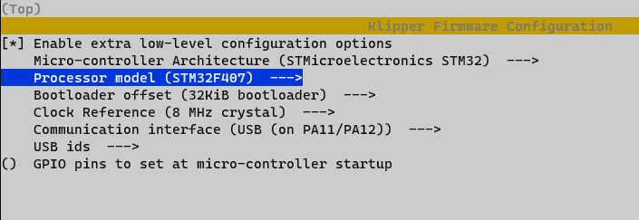
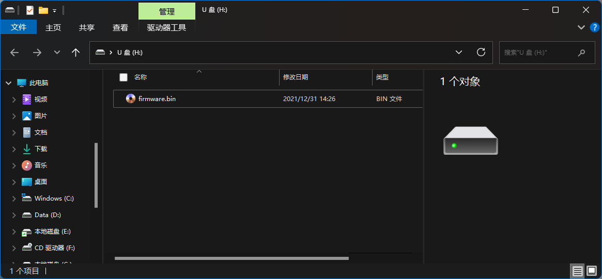
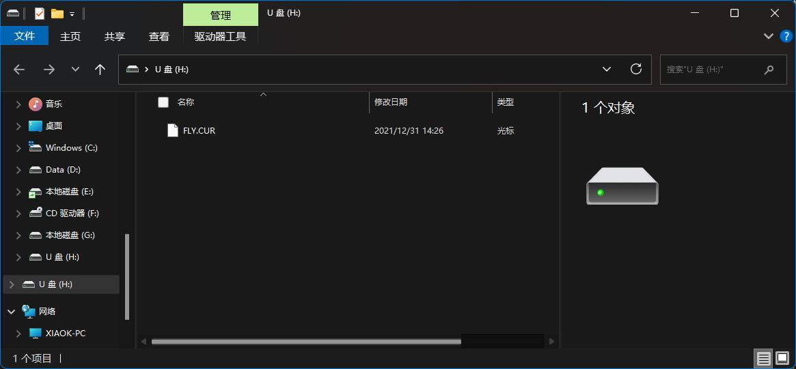

# 固件烧录

## 1. 编译固件

CDY-V2/3的Klipper固件配置



* 如何编译固件参考[固件烧录](/introduction/firmware)

## 2. 烧录固件

1. 准备一张SD卡(<32GB)，并且格式化成 **FAT32** 格式
2. 将klipper.bin复制到SD卡，并且重命名为```firmware.bin```



3. 主板断电，将SD卡插入主板
4. 给主板上电，等待10秒左右
5. 取下SD卡，插入电脑。如果SD卡中的看``firmware.bin``消失，出现```FLY.CUR```就是烧录成功了

