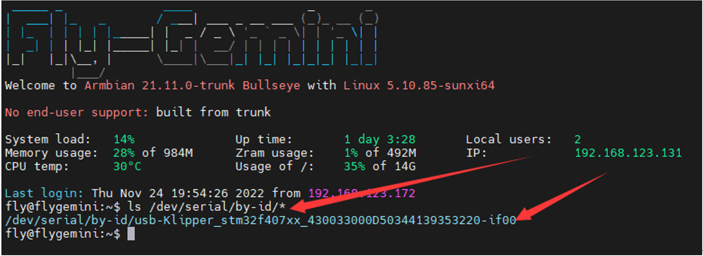

# 4. 读取主板ID

1.[连接到SSH](/board/fly_pi/FLY_π_ssh "点击即可跳转")，然后输入 ``ls /dev/serial/by-id/*`` 回车。如果一切正常，则会出现下面一行蓝色的ID。

2.在左侧边栏的配置选项里找到：fluidd为：``{…}`` ；mainsail为：``机器``，点击进去，即可找到``printer.cfg``

3.将蓝色的ID复制，填写到``printer.cfg``里。保存重启后即可连上主板。若Klipper提示 ``ADC out of range``为正常现象，将热床和热敏连接好，配置好喷头、热床的热敏引脚和输出引脚，再保存重启即可。

