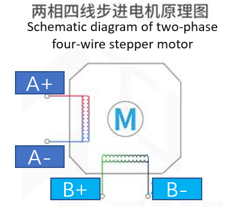

# 3. FLY-CDY v3接线

> [!TIP]
> 此教程以Voron Trident 三叉戟为例介绍接线方法，请结合自己的实际使用情况接线

## 3.1 接口图

## 3.2 电源接线

> [!WARNING]
>
> 请安装好保险丝，需要用力才能安装进去！！！

## 3.3  步进电机接线

### 3.3.1 主板驱动跳线

**STEP/DIR模式。**在这个模式下，通过使用跳线帽来设置细分，通过调节电位器来调整电流。最常见的是A4988驱动，使用这类驱动需要查询厂家提供的细分配置表，然后通过跳线帽来设置细分。

**UART模式。**最常见的使用这种模式的驱动有：TMC2208、TMC2209、TMC2226等。这类驱动芯片可以与主控进行UART异步串行通信，可以通过修改配置文件来设置驱动的细分、运行电流、静音模式等。

**SPI模式。**最常见的使用这种模式的驱动有：TMC5160、TMC2230等。这类驱动芯片通过spi与主控同步串行通信，同样的也可以通过修改配置文件来设置驱动的细分、运行电流、静音模式等。

### 3.3.2 驱动的安装

驱动在安装前需要进行相应的检查，以免对驱动或主板造成损坏。

**FLY驱动：**如果不使用无限位归零功能，请将拨码开关拨到1的位置；相反如果要使用无限位归零功能，请将拨码开关拨到ON的位置。

**注意！！！ 安装驱动模块时，一定要保证插入的方向正确，即EN引脚在左上角，否则会损坏驱动甚至主板！！！注意给驱动贴好散热片！！！**

### 3.3.3 步进电机接线

在3D打印机中，最常用的是两相四线步进电机，其原理如图所示。鉴别步进电机线序有两种方法：

1. 短接步进电机四根线中任意两根线，用手转动电机轴，如果转动阻力很大，则这两根线为同一组线圈，即1A和1B或者2A和2B。如果和没有短接一样转起来很轻松，说明这两根线不是同一组线圈。

2. 使用万用表的蜂鸣器档，测量四根线中任意两根，如果蜂鸣器响，则说明这两根线为同一组。反之，则不是同一组，需要更换其中一根线再次测量。

## 3.4  加热棒接线

## 3.5  热床接线

**交流热床：**固态继电器在接线时，请注意输入和输出别接错了。

**直流热床：**板载MOS接直流热床时请注意使用功率，直流热床最大电流不能超过10A。如果超过10A，建议使用外接MOS模块来使用热床，否则可能会对主板造成不可逆的损伤。

## 3.6  热敏电阻接线

Super8提供了六路ADC接口，即可以接入六路热敏。热敏的接线方法如下图。热敏电阻的类型请咨询购买商家。

如果为fly购买的（如下图所示），请将sensor_type 配置为：**ATC Semitec 104GT-2**。

如果为常规的NTC 100K（如下图所示），请将sensor_type 配置为：**Generic 3950**

**喷头热敏、热床热敏：**

****

## 3.7 风扇接线

**风扇接线。**

> [!WARNING]
>
> 请安装好风扇mos，否则风扇将不会工作！！！

> [!WARNING]
>
> 请使用跳线帽短接下图所示排针，选择风扇工作电压，否则风扇将不会工作！！！

## 3.8  限位开关接线

限位开关有常开（NO）和常闭（NC）两种。一般在3D打印机上，建议使用**常闭（NC）**，这样在限位开关线路出现问题时，系统会及时报错，可以避免一些不必要的撞车，避免损坏打印机。

## 3.9 调平传感器接线

### 3.9.1 接近开关接线

VORON官方建议是使用欧姆龙Omron TL-Q5MC（之前官方推荐的是PL08N，两者原理一样，只是探测距离不一样）传感器来进行热床调平。接线方式如下图所示。

### 3.9.2 BL-Touch接线

BL-touch一共有五根线，三根为第一组，负责传感器的供电和探针的收放，第二组为地线和信号线，输出限位信号。BL-touch接线时请仔细核对线序，错误的接线可能会永久性损坏传感器和主板！！！接线方法如下图所示。

**图片正在制作中**

### 3.9.3 Klicky接线

Klicky为第三方的调平传感器，能够用极低的成本自己在家制作，且性能稳定，性价比高，推荐使用。接线方法如下图所示。

项目地址：[jlas1/Klicky-Probe: ](https://github.com/jlas1/Klicky-Probe "项目地址，点击即可跳转")

### 3.9.4 Voron Tap接线

Tap是一种基于喷嘴的z探针，适用于V2和Trident打印机设计。整个工具头移动以触发光开关，精度比常规限位开关更好，可以使用几乎市面上所有的打印平台。

> [!TIP]
> Voron Tap不建议接 **24V** ，某些版本使用 **24V** 有一定概率会导致Tap传感器烧坏，这并非Fly产品的问题，是Voron Tap的设计缺陷，请悉知！！！

**注意！！！5V和GND不能接反，否则会损坏Tap传感器甚至主板！！！**

## 3.10 FLY-Mini12864接线

下图为FLY的mini12864的接线方式，其他厂家的屏幕请咨询相应厂家。Mini12864屏幕接接反，接错可能会导致上位机连不上MCU。如果使用mini12864屏幕之前可以正常连上主板的MCU，而使用mini12864后就连不上MCU了，请尝试拔出mini12864的接线！！！

## 3.11 连接到上位机

主板通过TypeC接口连接到上位机的USB口，也可以用过串口连接到上位机。这里只对前者做介绍。

