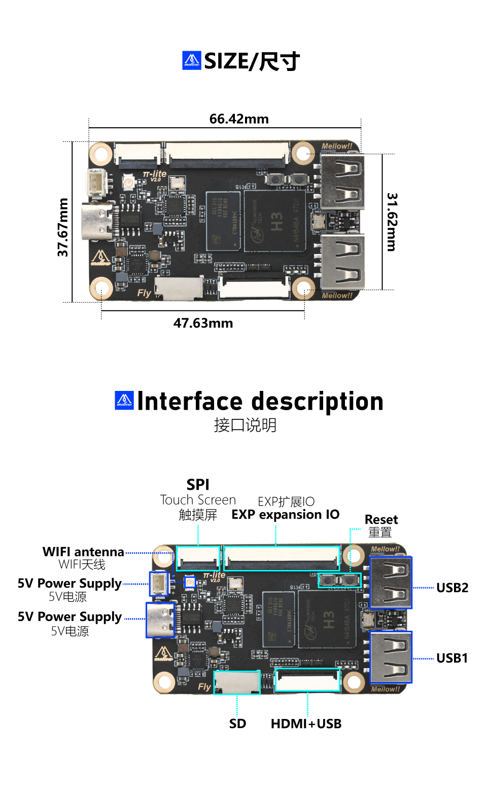

# 产品简介

Fly-Pi-lite2是一款入门级Klipper上位机

**特点**

* CPU：高性能全志H3芯片，4核64位Cortex-A7
* GPU：Mali-400 MP2
* RAM：512MB DDR3
* ROM：支持最大128GB SDCARD
* WIFI :  板载2.4G WiFi
* 外设：Spi x1，URAT x2, USB x2，HDMI x1
* 接口：预留FPC，HDMI + USB FPC一线通
* 为Klipper定制的系统，无需安装系统等复杂的操作，小白更容易上手

## 产品详情

[Fly3D Fly-π Lite2入门级上位机主板替代树莓派运行3D打印机Klipper固件-淘宝网 (taobao.com)](https://item.taobao.com/item.htm?id=696987160553 "点击即可跳转")

## FLY-π lite2

----

> [!TIP]
> 重要

* 非FLY上位机请按[CAN使用](/advanced/can_rpi.md)文档配置好CAN
* 使用CanBoot请查看[CanBoot使用](/advanced/canboot.md)

