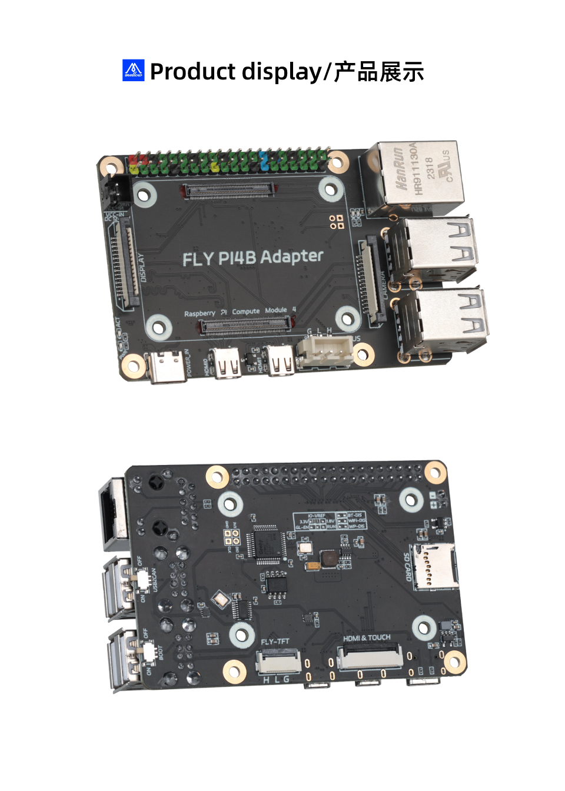

# 产品简介

Fly-CM4与树莓派3B和4B完全兼容，并特别针对树莓派CM4拓展改进，这款拓展板提供了一整套专为3D打印机优化的功能。12-24V直流供电确保了供电的稳定性，对3D打印机的精确控制和连续运行至关重要。支持FLY-TFT和Fly-HDMI屏幕FPC连线功能，提供了更方便的走线方式。提供Can端口可以上位机直接Can连接下位机是目前比较流行方式。

**特点**

* 支持树莓派CM4核心板
* 支持12V-24V直流供电
* 板载UTOC模块
* 支持TFT与HDMI一线通
* 支持DSI/spi屏幕接口
* 支持CSI/USB摄像头接口
* 40PIN扩展接口，兼容树莓派

## 产品详情

淘宝链接: [FLY PI4B CM4拓展板](https://item.taobao.com/item.htm?spm=a1z10.3-c-s.w4002-23066022670.11.474e4dc3lfVaeO&id=734844931293)

## FLY-CM4

