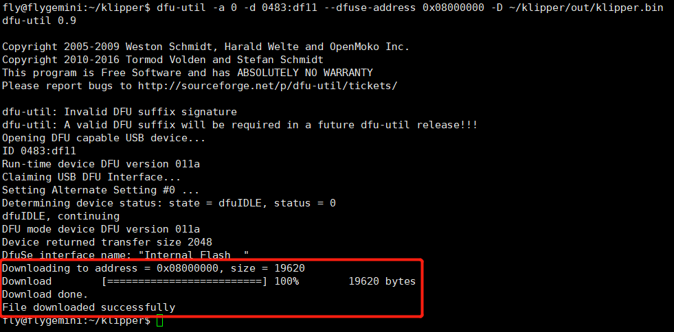

> [!TIP]
> FLY-D5 需在断电状态下按住 **BOOT键** 后，使用Type-C数据线连接上位机，才能烧录固件

# 1. 固件编译

编译固件前请确保 [连接到SSH](/board/fly_gemini/host/FLY_π_ssh.md "点击即可跳转")

> [!TIP]
> 固件配置方法请按主板提供的来配置

**固件配置方法**


<!-- tabs:start -->

### **USB固件配置**


### **USB桥接CAN固件配置**

* 此方法是桥接工具板的配置，请确保工具板CAN速率与上位机的CAN配置


<!-- tabs:end -->

* 执行命令```make -j4```来编译固件


# 2. BOOT按键

>[!TIP]
>
>方法一：按住boot，给D5主板供电，然后松开BOOT
>
>方法二：按住boot，再按下reset按键，松开reset按键，最后松开boot按键


# 3. Klipper上位机烧录

1. 安装烧录工具

```bash
sudo apt install dfu-util -y
```

2. 使用Type-C数据线将D5主板连接到Linux设备
3. 执行下面的命令查看是否连接成功。

```bash
lsusb
```


4. 烧录固件(烧录前确保已经编译过固件)

```bash
dfu-util -a 0 -d 0483:df11 --dfuse-address 0x08000000 -D ~/klipper/out/klipper.bin
```

5. 没有报错则烧录成功,如果出现报错请重新检查每个步骤操作



6. 出现上图内容则烧录成功
