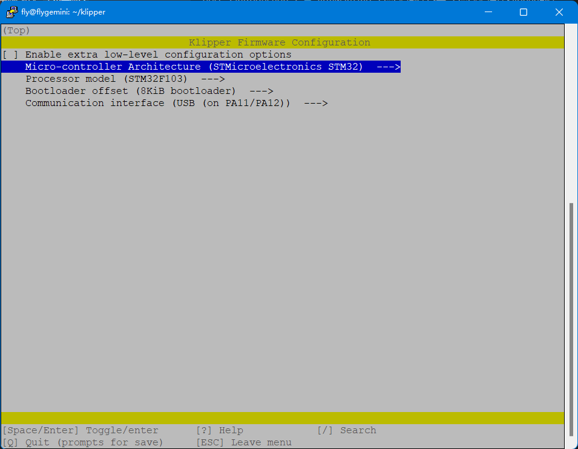
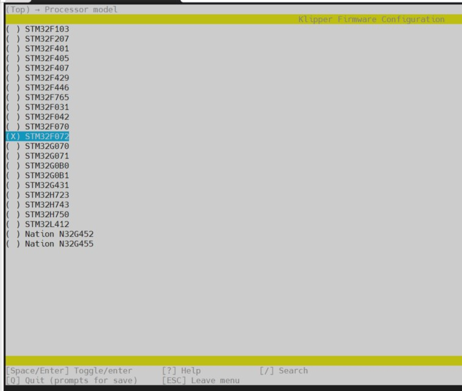
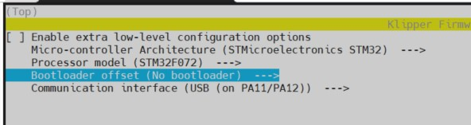
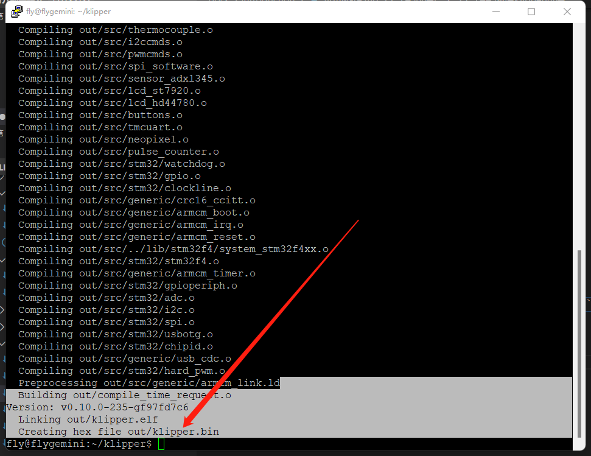
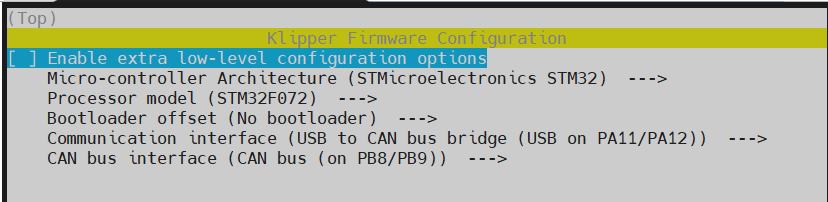
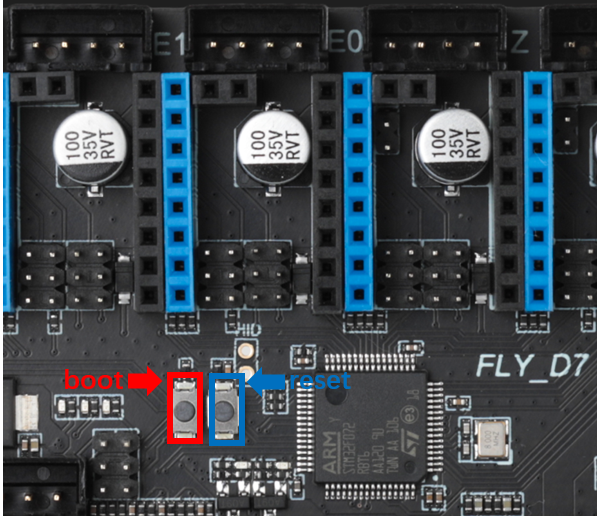

> [!TIP]
> FLY-D5 需在断电状态下按住 **BOOT键** 后，使用Type-C数据线连接上位机，才能烧录固件

请使用**MobaXterm_Personal**等**SSH工具**连接通过**WIFI**到您的上位机，并且需要确定以下几点

1. **请确保上位机安装好了Klipper服务**
2. **请确保登录的用户必须是安装好Klipper的用户**
3. **请确保你的输入法是英文**
4. **请确保你的上位机可以正常搜索到设备**
5. **请确保以上注意事项都做到，否则无法进行下一步**

## 1. 编译Klipper固件

**固件配置参数**

<!-- tabs:start -->

### ****USB固件配置****


下面介绍如何编译固件：

1. 请先阅读[连接到SSH](/introduction/conntossh "点击即可跳转")文档

2. 连接到SSH后输入下面的命令并回车：

   ```
   cd ~/klipper && rm -rf .config && make menuconfig
   ```

3. 现在应该出现了Klipper编译配置界面，**↑ ↓ 键**选择菜单，**回车键**确认或进入菜单

4. 选择**Enable extra low-level configuration options**并且回车

5. 进入菜单**Micro-controller Architecture**


9. 选择**STMicroelectronics STM32**回车



9. 进入菜单**Processor model**，选择**STM32F072**回车



9. **Bootloader offset** 设置为：**No bootloader**
10. **Communication interface**是**USB (on PA11/PA12)**

* 配置好后是这样的



12. 按```Q```键，出现**Save configuration**，这时再按```Y```键

* 现在应该保存了配置并且退出到了命令行界面

13. 输入```make -j4```开始编译，时间有点长

* 出现下图则编译成功



### ****USB桥接CAN固件配置****

* 此方法是桥接工具板的配置，请确保工具板CAN速率与上位机的CAN配置


下面介绍如何编译固件：

1. 请先阅读[连接到SSH](/introduction/conntossh "点击即可跳转")文档

2. 连接到SSH后输入下面的命令并回车：

   ```
   cd ~/klipper && rm -rf .config && make menuconfig
   ```

3. 现在应该出现了Klipper编译配置界面，**↑ ↓ 键**选择菜单，**回车键**确认或进入菜单

4. 选择**Enable extra low-level configuration options**并且回车

5. 进入菜单**Micro-controller Architecture**


9. 选择**STMicroelectronics STM32**回车


9. 进入菜单**Processor model**，选择**STM32F072**回车


10. 选中第一个选项，回车，即可展开所需的全部设置选项



10. **Bootloader offset** 设置为：**No bootloader**
11. **Communication interface**设置为**USB to CAN bus bridge (USB on PA11/PA12)**
12. **CAN bus  interface**设置为：**CAN bus (on PB8/PB9)**
13. **CAN bus speed**设置为：**1000000**

* 配置好后是这样的


15. 按```Q```键，出现**Save configuration**，这时再按```Y```键

* 现在应该保存了配置并且退出到了命令行界面

15. 输入```make -j4```开始编译，时间有点长

* 出现下图则编译成功


<!-- tabs:end -->


## 2. 进入烧录模式

>[!TIP]
>
> **左边为Boot键，右边为reset复位键**
>
>方法一：主板完全断电后，按住Boot，使用TypeC线将D5主板接到上位机，然后松开Boot
>
>方法二：使用TypeC线连接到上位机后，按住Boot，再按下reset按键，松开reset按键，最后松开Boot按键




## 3. Klipper上位机烧录

1. 安装烧录工具

* FLY上位机无需执行安装烧录工具

```bash
sudo apt install dfu-util -y
```

2. 执行下面的命令查看是否连接成功。

```bash
lsusb
```

* 如果没有DFU设备请尝试重新进入**烧录模式**


4. 烧录固件(烧录前确保已经编译过固件)

```bash
cd ~/klipper && make flash FLASH_DEVICE=0483:df11
```

5. 出现下图箭头处所示内容``File downloaded successfully``则烧录成功

>[!Warning]
>
>烧录完成后，需要给D7主板彻底断电一次。
>
>红色箭头所指这一行之后的报错请忽略！！！


