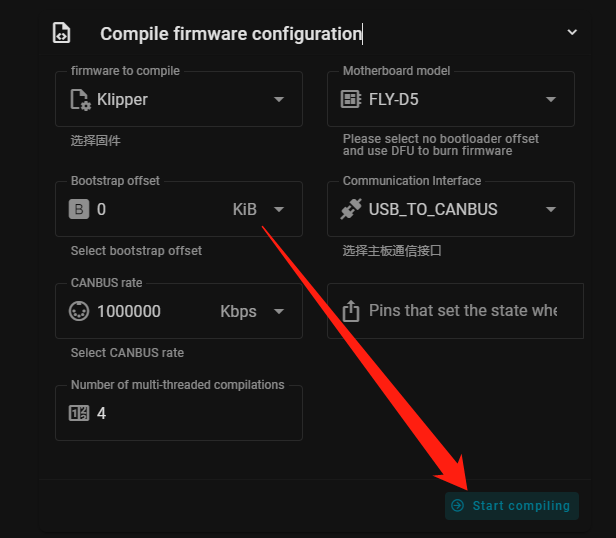
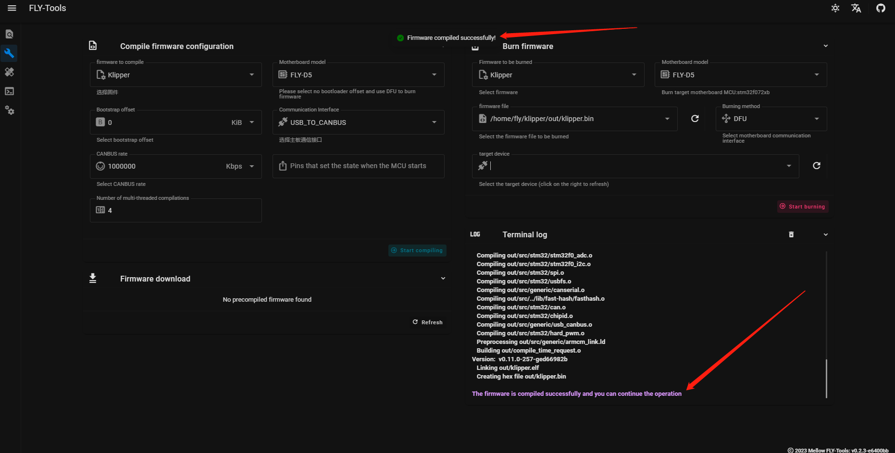
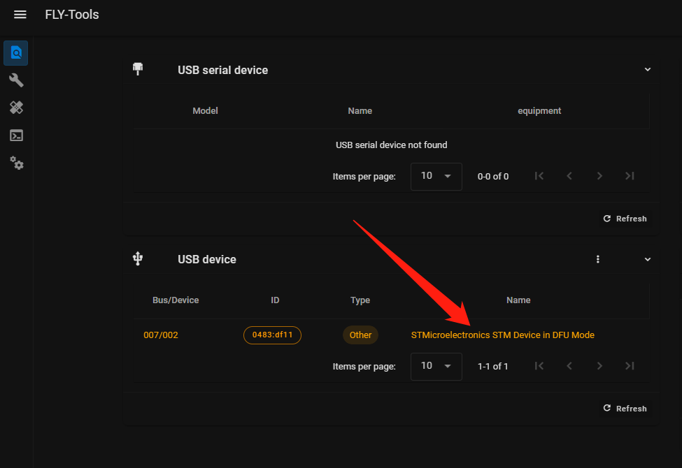
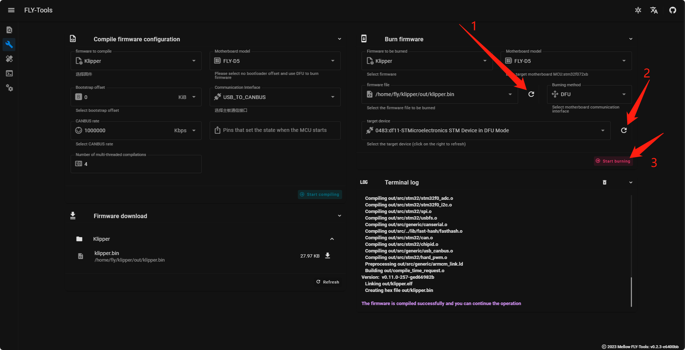
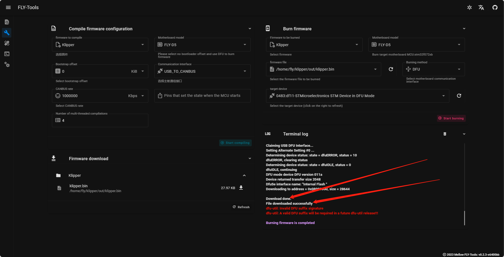

> [!TIP]
> FLY-D5 需在断电状态下按住 **BOOT键** 后，使用Type-C数据线连接上位机，才能烧录固件

# 固件编译

请使用**MobaXterm_Personal**等**SSH工具**连接到您的上位机，并且需要确定以下几点

1. **请确保上位机安装好了Klipper固件**
2. **请确保登录的用户必须是安装好Klipper的用户**
3. **请确保你的输入法是英文**
4. **请确保你的上位机可以正常搜索到设备**
5. **请确保以上注意事项都做到，否则无法进行下一步**

# 1. BOOT按键

>[!TIP]
>
>方法一：按住boot，将D5主板接到上位机，然后松开BOOT
>
>方法二：按住boot，再按下reset按键，松开reset按键，最后松开boot按键

# 2. 固件配置方法

* 请使用**MobaXterm_Personal**等**SSH工具**连接到您的上位机
* 访问[FLY-Tools](http://mellow.klipper.cn/#/board/fly_tools/Installation)此链接并且安装[FLY-Tools](http://mellow.klipper.cn/#/board/fly_tools/Installation)

<!-- tabs:start -->

### ****USB固件配置****
* 安装好FLY-Tools后请通过浏览器访问 **你的上位机IP+:9999**
* 选择**固件编译**然后选择**FLY-D5**
* USB固件编译配置如下
 

### ****USB桥接CAN固件配置****

* 安装好FLY-Tools后请通过浏览器访问 **你的上位机IP+:9999**
* 选择**固件编译**然后选择**FLY-D5**
* USB桥接CAN工具板编译配置如下
* 如果需要修改CAN速率请修改**CANBUS rate**
* 此方法是桥接工具板的配置，请确保**工具板CAN速率**与**上位机的CAN配置**一致

<!-- tabs:end -->

* 点击下方**Start compiling**进行固件编译

* 当显示下方提示时，则表示**固件编译成功**

# 3. Klipper上位机烧录

1. 确保D5连接到上位机时是DFU模式可以通过查询ID界面确定

2. 烧录固件(烧录前确保已经编译过固件)

3. 烧录成功

>[!Warning]
>
>烧录完成后，需要给D5主板彻底断电一次
