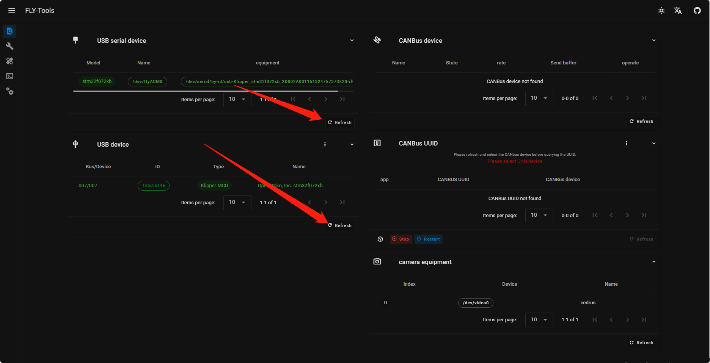
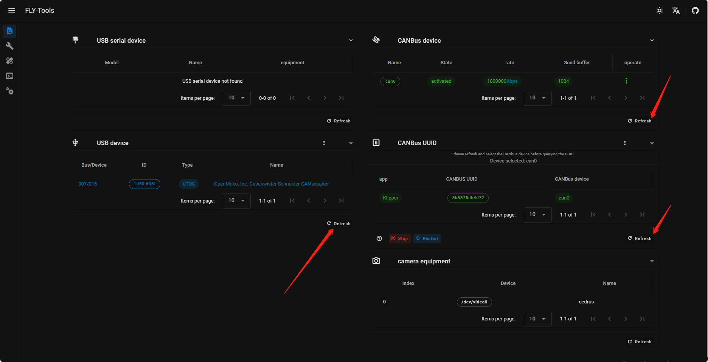

# 读取ID

<!-- tabs:start -->

### **USB ID读取方法**

1.请确保[FLY-Tools](http://mellow.klipper.cn/#/board/fly_tools/Installation)安装完成然后请通过浏览器访问 **你的上位机IP+:9999**并且找到**搜索ID**界面

* 可以直接点击id，这可以让FLY-Tools帮你把复制ID

### **CAN ID读取方法**

1.请确保[FLY-Tools](http://mellow.klipper.cn/#/board/fly_tools/Installation)安装完成然后请通过浏览器访问 **你的上位机IP+:9999**并且找到**搜索ID**界面

* 可以直接点击id，这可以让FLY-Tools帮你把复制ID

<!-- tabs:end -->
