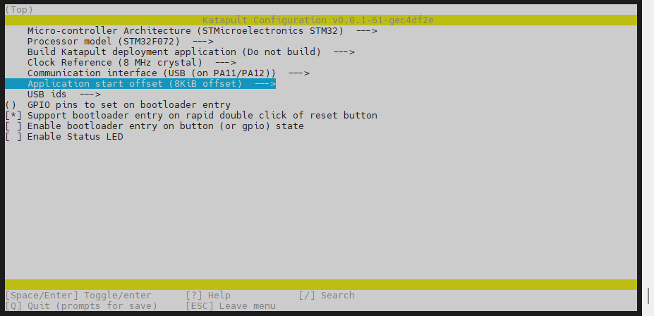
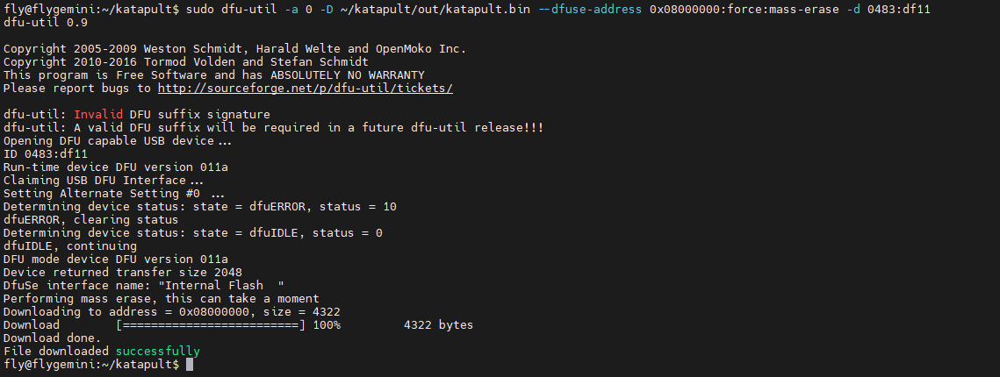
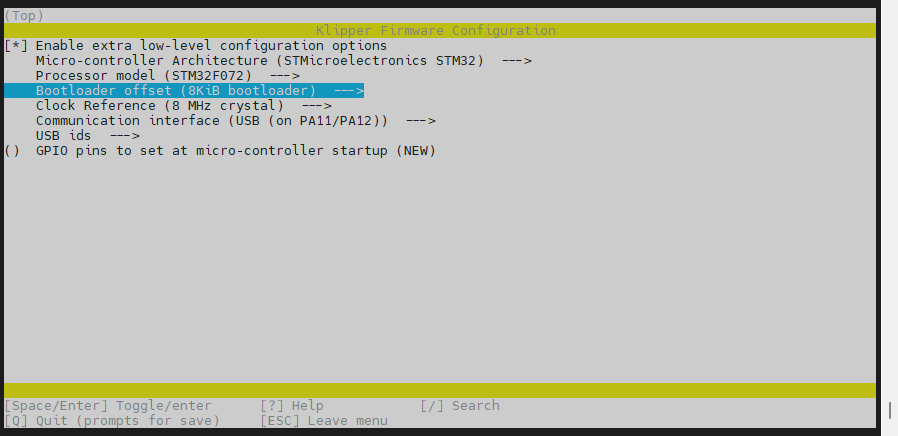
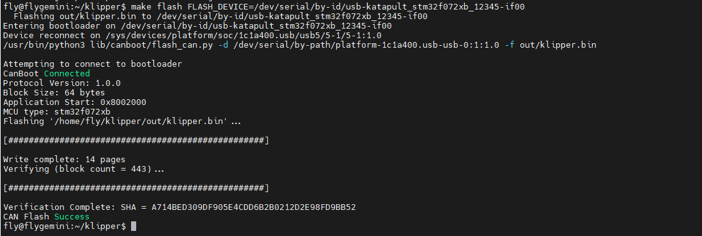
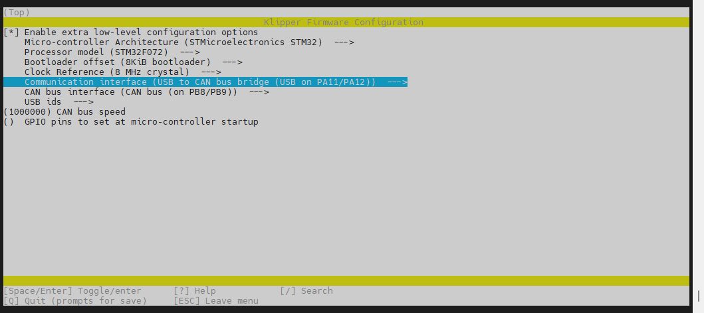

# **使用Katapult更新主板固件**

* **Katapult（以前称为 CanBoot）可用与固件烧录**
* **本次教程主要用于固件更新，以后无需按着`BOOT`键进入DFU**

请使用**MobaXterm_Personal**等**SSH工具**连接通过**WIFI**到您的上位机，并且需要确定以下几点

1. **请确保上位机安装好了Klipper服务**
2. **请确保登录的用户必须是安装好Klipper的用户**
3. **请确保你的输入法是英文**
4. **请确保你的上位机可以正常搜索到设备**
5. **请确保以上注意事项都做到，否则无法进行下一步**

* 连接SSH后最新的`Katapult`(原Canboot)

```
cd ~/ && git clone https://github.com/Arksine/katapult 
```

* 如果已安装`Katapult`(原Canboot)需要执行更新

```
cd ~/katapult && git pull
```

## 1. 固件编译

```
cd && cd ~/katapult && rm -rf .config && make clean && make menuconfig  && make
```

**请按提供的参数配置**



* 这里提供**编译好的katapult**

```
https://cdn.mellow.klipper.cn/BL/FLY_D5_Katapult_USB.bin
```


## 2. 烧录katapult

* 烧录**编译好的katapult**，**请确保主板处于DFU状态下！！！！**

```
sudo dfu-util -a 0 -D ~/katapult/out/katapult.bin --dfuse-address 0x08000000:force:mass-erase -d 0483:df11
```

（PS：本次指令需要输入上位机密码，并且密码不可见，输入完成回车即可）



> [!Warning]
>
> 烧录完成后需要给主板彻底断电一次！！！！！

* **搜索设备确定是否烧录成功**

```
ls /dev/serial/by-id/*
```


出现`/dev/serial/by-id/usb-katapult_stm32f072xb_12345-if00`代表**烧录成功！！！**

### 2.1. 无法进去DFU烧录解决方法

* 如果进不去DFU可以使用在编译好**katapult于klipper**固件后执行下方方法进行**烧录katapult**！！！
* 将katapult.bin 替换klipper.bin

```
sudo rm ~/klipper/out/klipper.bin && cp ~/katapult/out/katapult.bin ~/klipper/out/klipper.bin
```

* 烧录固件
* USB ID需要自己查询替换

```
make flash FLASH_DEVICE=/dev/serial/by-id/usb-klipper_stm32f072xb_12345-if00
```


## 3. 烧录USB klipper固件

* 编译klipper固件

```
cd && cd klipper && rm -rf .config && make menuconfig && make -j4
```



* **请注意`Bootloader offset`要选择`8KiB bootloader`**

* 出现下图则编译成功


* 烧录固件

```
make flash FLASH_DEVICE=/dev/serial/by-id/usb-katapult_stm32f072xb_12345-if00
```



* 出现`CAN Flash Success`代表烧录成功
* 如果需要更新KLIPPER固件可在`Klipper`目录下执行`make flash FLASH_DEVICE=<MCU ID>`，此命令可以让主板**进入katapult固件下**只需要**重新执行烧录klipper固件命令即可**

## 4.  烧录CAN klipper固件

* 编译klipper固件

```
cd && cd klipper && rm -rf .config && make menuconfig && make -j4
```



* **请注意`Bootloader offset`要选择`8KiB bootloader`**

* 出现下图则编译成功


* 烧录klipper固件

```
make flash FLASH_DEVICE=/dev/serial/by-id/usb-katapult_stm32f072xb_12345-if00
```


* 出现`CAN Flash Success`代表烧录成功
* 如果需要更新KLIPPER固件可在`Klipper`目录下执行`~/klippy-env/bin/python3  ~/katapult/scripts/flashtool.py -i can0 -u <MCU ID> -r`，此命令可以让主板**进入katapult固件下**只需要**重新执行烧录klipper固件命令即可**

