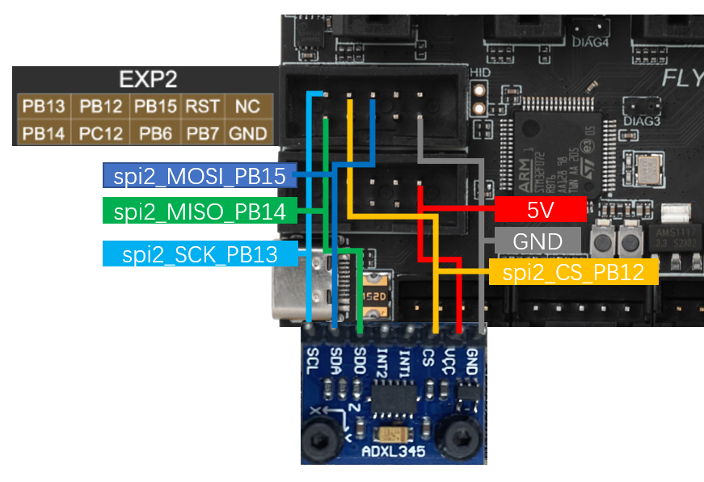

# 7. 连接加速度计

## 1. 接线

加速度计的链接方式如下图所示




## 2. 配置

```cfg

[adxl345]
cs_pin: PB12
spi_bus: spi2 # 硬spi，硬spi和软spi二选一。默认硬spi
# spi_software_mosi_pin: PB15 # 软spi，硬spi和软spi二选一。默认硬spi
# spi_software_miso_pin: PB14
# spi_software_sclk_pin: PB13

[resonance_tester]
accel_chip: adxl345
#accel_chip_y: adxl345 bed
probe_points:
    100, 100, 20  # 一般为热床的正中间，请根据您机器的实际情况修改
```

## 3. 使用

测试请前往：[加速度计的使用](/advanced/Accelerometer?id=测试 "点击即可跳转")
