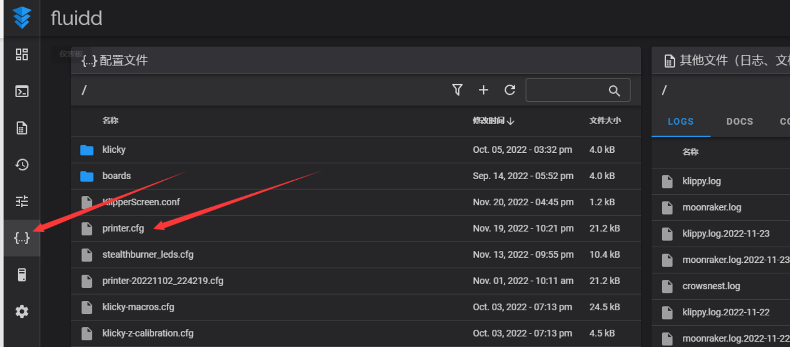
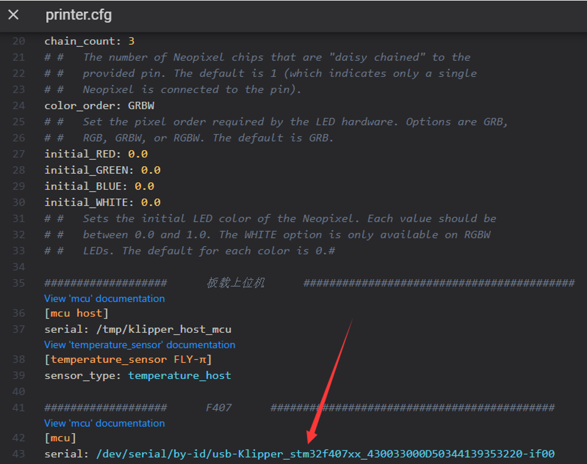

# 读取ID

<!-- tabs:start -->

### **USB ID读取方法**

> [!TIP] 
>
> 如果使用USB固件则无需搜索ID,系统默认把USBID转换成    **/dev/ttyACM0**

1.[连接到SSH](/board/fly_C8/ssh "点击即可跳转")，然后输入 ``ls /dev/serial/by-id/*`` 回车。如果一切正常，则会出现下面一行蓝色的ID。


2.在左侧边栏的配置选项里找到：fluidd为：``{…}`` ；mainsail为：``机器``，点击进去，即可找到``printer.cfg``



3.将蓝色的ID复制，填写到``printer.cfg``里。保存重启后即可连上主板。若Klipper提示 ``ADC out of range``为正常现象，将热床和热敏连接好，配置好喷头、热床的热敏引脚和输出引脚，再保存重启即可。



### **CAN ID读取方法**

> [!TIP]
> 已经识别到的CAN ID是不会被查找到的（即已经写入配置文件printer.cfg中的ID，连接成功并正常运行的，是不会被查找到的）


> [!Tip]
>
> 请确保上位机的can0、桥接主板的CAN速率、CAN工具板的速率完全一致

```bash
[mcu]
canbus_uuid: b7c79ec3f948     #将读取到的uuid填写到此处
```

也可以在SSH中输入下面的命令查找uuid

```bash
~/klippy-env/bin/python ~/klipper/scripts/canbus_query.py can0
```


出现``Found canbus_uuid=b7c79ec3f948``则查找到设备ID，其中``b7c79ec3f948``为设备UUID。

> [!TIP]
> 如果找不到CAN ID，请检查：

* 是否正确供电
* 您的镜像内核是否支持CAN
* 固件编译是否正确

<!-- tabs:end -->
