# 5. FLY-D5接线

> [!TIP]
> 此教程以Voron 0.1为例介绍接线方法，请结合自己的实际使用情况接线

> [!Warning]
>
> 请注意驱动LED是非常亮的使用时候请不要直视驱动LED
>
> 请注意驱动LED是非常亮的使用时候请不要直视驱动LED
>
> 请注意驱动LED是非常亮的使用时候请不要直视驱动LED

## 1.  接口图


## 2. 电源接线

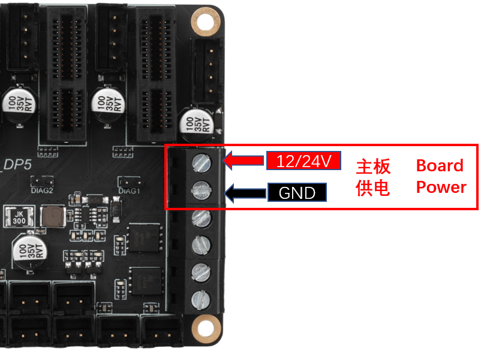

## 3. 驱动口选择

* DP5的驱动不需要任何跳线配置！
* 请注意驱动有防呆接口，安装时候请注意方向
* DP5有五个驱动口，可以按自己喜欢的方式选择接线
* 请注意DP5靠近CAN接口的驱动位是没有无限位功能
* 请注意CS与UART是同一个引脚

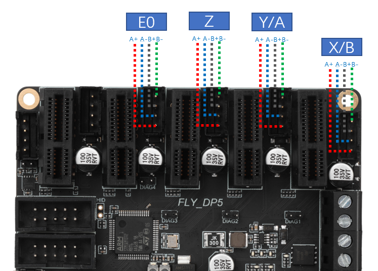

Driv0驱动位

```
step_pin: PC15
dir_pin: PC14        # 电机运行引脚设置，加感叹号会让运行方向反转
enable_pin: !PC2
uart_pin: PC13
diag_pin: ^PB4
```

Driv1驱动位

```
step_pin: PA1
dir_pin: PA0        # 电机运行引脚设置，加感叹号会让运行方向反转
enable_pin: !PA2
uart_pin: PC3
diag_pin: ^PB3
```
Driv2驱动位

```
step_pin: PA5
dir_pin: !PA4        # 电机运行引脚设置，加感叹号会让运行方向反转
enable_pin: !PA6
uart_pin: PA3
diag_pin: ^PD2
```
Driv3驱动位

```
step_pin:PC5
dir_pin:PC4        # 电机运行引脚设置，加感叹号会让运行方向反转
enable_pin: !PB0
uart_pin: PA7
diag_pin: ^PB5
```
Driv4驱动位

```
step_pin: PB10
#dir_pin: PB2        # 电机运行引脚设置，加感叹号会让运行方向反转
#enable_pin: !PB11
uart_pin: PB1

```


### 步进电机接线

在3D打印机中，最常用的是两相四线步进电机，其原理如图所示。鉴别步进电机线序有两种方法：

1. 短接步进电机四根线中任意两根线，用手转动电机轴，如果转动阻力很大，则这两根线为同一组线圈，即1A和1B或者2A和2B。如果和没有短接一样转起来很轻松，说明这两根线不是同一组线圈。

2. 使用万用表的蜂鸣器档，测量四根线中任意两根，如果蜂鸣器响，则说明这两根线为同一组。反之，则不是同一组，需要更换其中一根线再次测量。

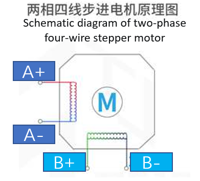


## 5.4  加热棒接线

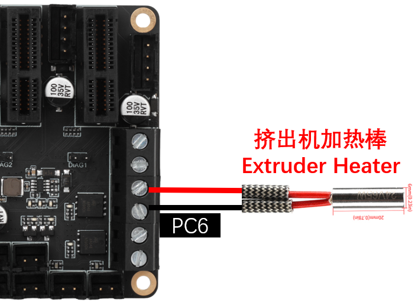

## 5.5  热床接线

**交流热床：**固态继电器在接线时，请注意输入和输出别接错了。

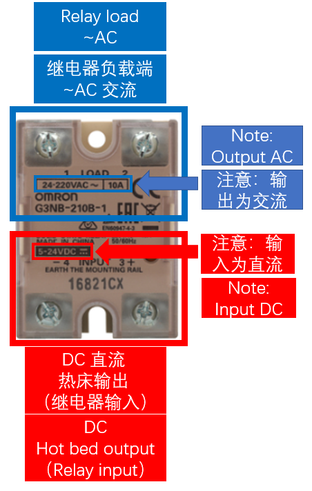

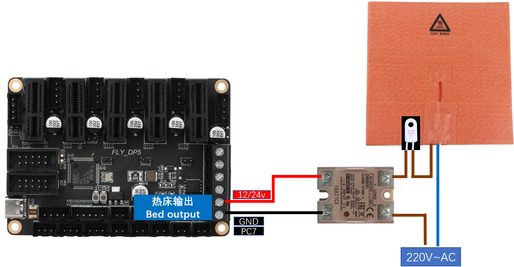

**直流热床：**板载MOS接直流热床时请注意使用功率，直流热床最大电流不能超过10A。如果超过10A，建议使用外接MOS模块来使用热床，否则可能会对主板造成不可逆的损伤。

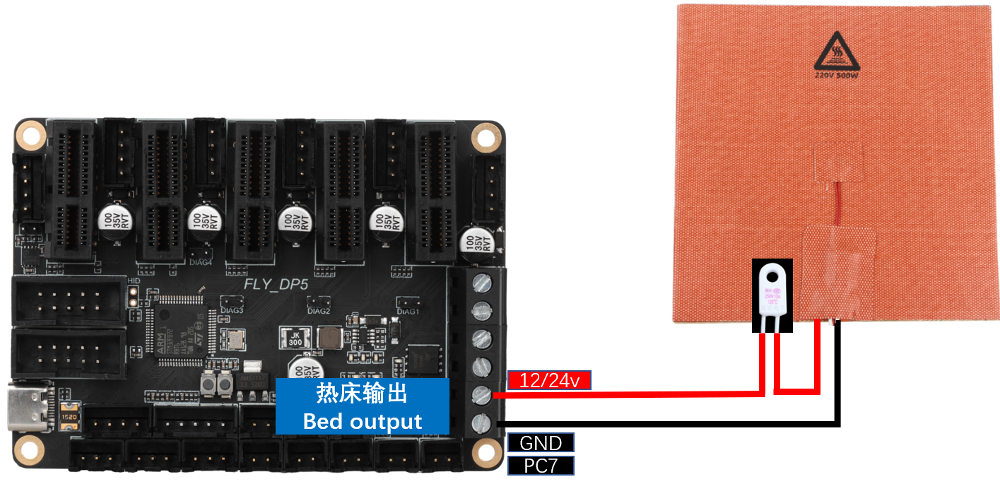

## 5.6  热敏电阻接线

热敏的接线方法如下图。热敏电阻的类型请咨询购买商家。

如果为fly购买的（如下图所示），请将sensor_type 配置为：**ATC Semitec 104GT-2**。

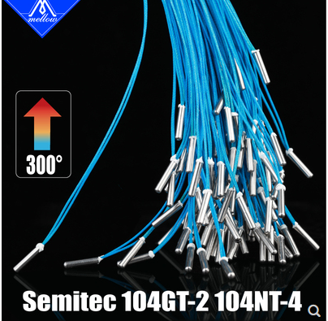

如果为常规的NTC 100K（如下图所示），请将sensor_type 配置为：**Generic 3950**

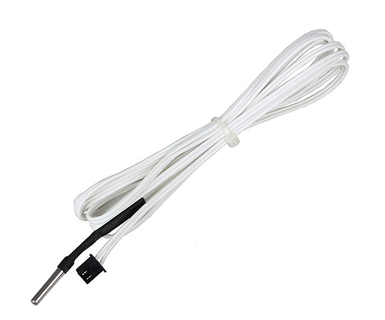

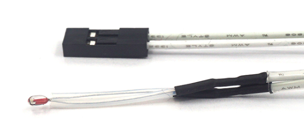

**喷头热敏、热床热敏：**

****

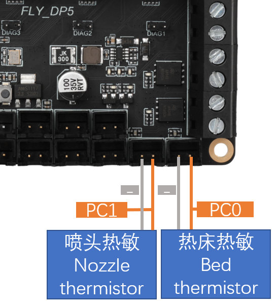

## 5.7 风扇接线

**风扇接线。**

> [!TIP]
>
> 下图红色框图框出来的接口，上下接口为同一个引脚控制的可控风扇，即一拖二

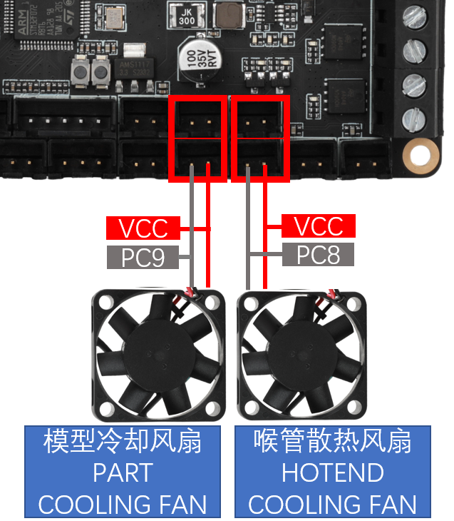

## 5.8  限位开关接线

限位开关有常开（NO）和常闭（NC）两种。一般在3D打印机上，建议使用**常闭（NC）**，这样在限位开关线路出现问题时，系统会及时报错，可以避免一些不必要的撞车，避免损坏打印机。

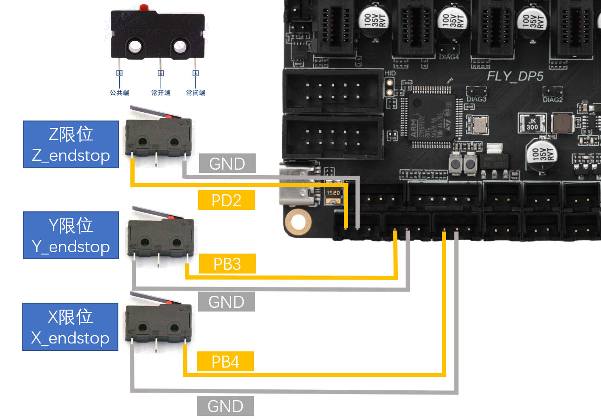

## 5.9 调平传感器接线

### 5.9.1 接近开关接线

VORON官方建议是使用欧姆龙Omron TL-Q5MC（之前官方推荐的是PL08N，两者原理一样，只是探测距离不一样）传感器来进行热床调平。接线方式如下图所示。

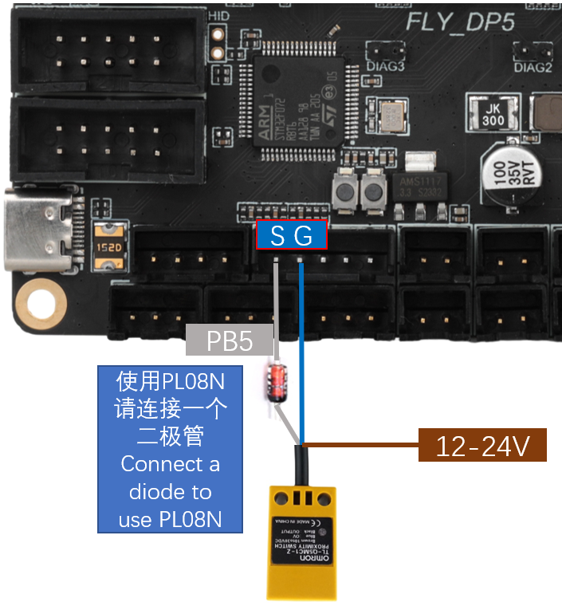

### 5.9.2 BL-Touch接线

BL-touch一共有五根线，三根为第一组，负责传感器的供电和探针的收放，第二组为地线和信号线，输出限位信号。BL-touch接线时请仔细核对线序，错误的接线可能会永久性损坏传感器和主板！！！接线方法如下图所示。


### 5.9.3 Klicky接线

Klicky为第三方的调平传感器，能够用极低的成本自己在家制作，且性能稳定，性价比高，推荐使用。接线方法如下图所示。

项目地址：[jlas1/Klicky-Probe: ](https://github.com/jlas1/Klicky-Probe "项目地址，点击即可跳转")

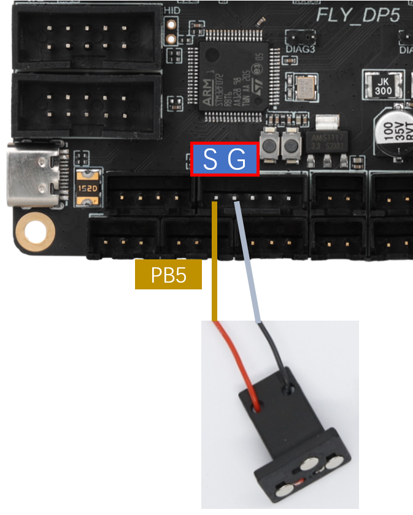

### 5.9.4 Voron Tap接线

Tap是一种基于喷嘴的z探针，适用于V2和Trident打印机设计。整个工具头移动以触发光开关，精度比常规限位开关更好，可以使用几乎市面上所有的打印平台。

> [!TIP]
> Voron Tap不建议接 **24V** ，某些版本使用 **24V** 有一定概率会导致Tap传感器烧坏，这并非Fly产品的问题，是Voron Tap的设计缺陷，请悉知！！！

**注意！！！5V和GND不能接反，否则会损坏Tap传感器甚至主板！！！**


## 5.10 FLY-Mini12864接线

下图为FLY的mini12864的接线方式，其他厂家的屏幕请咨询相应厂家。Mini12864屏幕接接反，接错可能会导致上位机连不上MCU。如果使用mini12864屏幕之前可以正常连上主板的MCU，而使用mini12864后就连不上MCU了，请尝试拔出mini12864的接线！！！

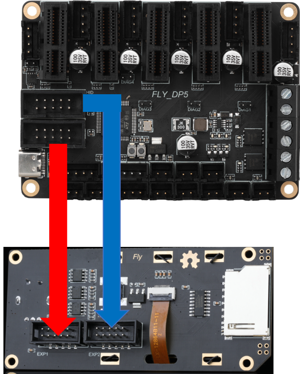

## 5.11 连接到上位机

主板通过TypeC接口连接到上位机的USB口，也可以用过串口连接到上位机。这里只对前者做介绍。

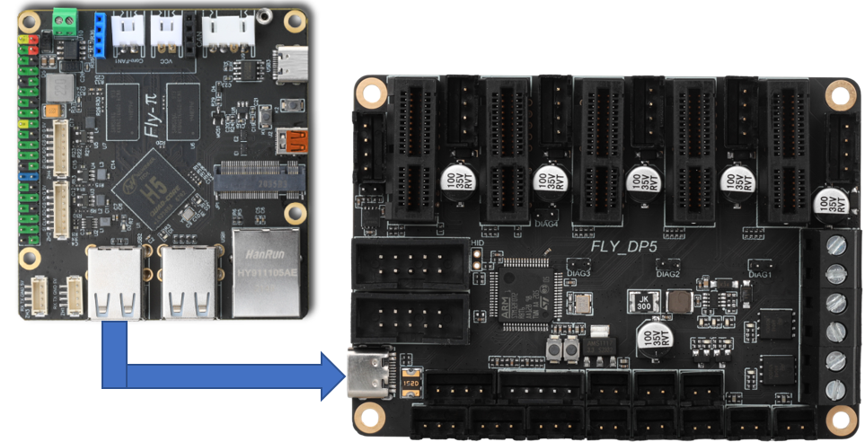

