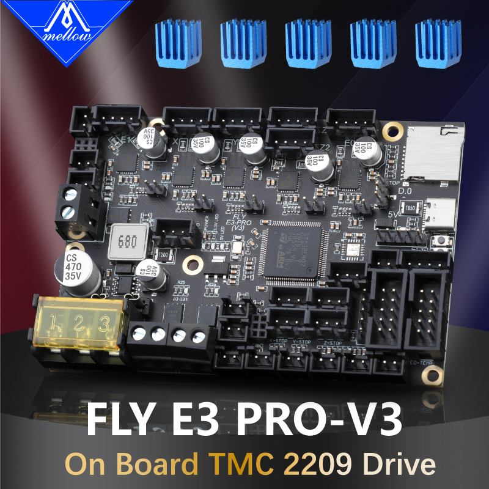

# 1. 产品简介

Mellow Fly E3- pro是广州镁伦电子科技有限公司Fly3D主板研发团队推出的一款高性能3D打印机主板，最多支持5路步进电机。

- 32位ARM Cortex-M4系列168 MHz，STM32F407ZGT6芯片
- 支持CAN总线连接，数据传输更稳定，延迟更小，连接更稳定
- 固件：Reprap/Klipper
- 板载五个TMC2209驱动
- 驱动模式支持：TMC：UART/SPI
- 显示：串行触摸屏、mini12864 LCD、12864 LCD、2004 LCD、FLY 4.3/7.0 V1
- 1个高压IN口，支持自动平床传感器：BLTouch、Klicky、Voron Tap等
- 使用repap固件，可以使用扩展ESP32 WiFi模块，支持1.6m/s
- 独特的PWM Fan MOS板设计，损坏可直接更换，降低客户维修难度，四个2pin风扇接口
- PCB采用2OZ铜厚，能够支持更大的电流
- 2个ADC接口，最多支持两路热敏
- 4个IO接口，可以用于调平和限位
- 1个加热棒接口

## 1.1 FLY-E3 pro

## 1.2 E3 pro升级说明

FLY-E3 pro总共有三个版本：E3 pro、E3 pro v2、E3 pro v3

其中，E3 pro v2和E3 pro v3基本相同，配置文件可通用。E3 pro则与v2、v3有部分引脚不相同，在配置时请仔细检查。
