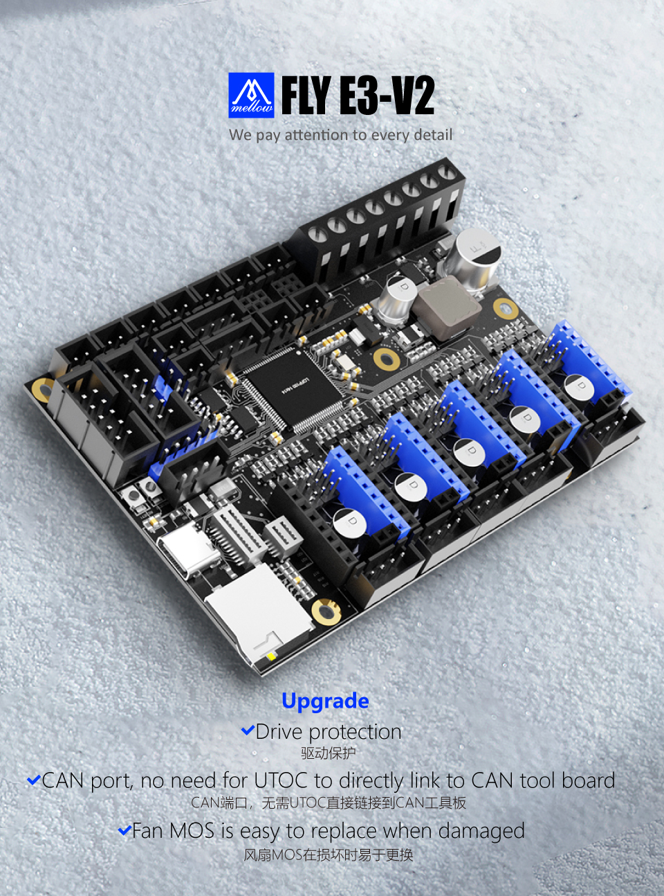

# 1. 产品简介

Mellow Fly E3-V2是广州镁伦电子科技有限公司Fly3D主板研发团队推出的一款高性能3D打印机主板，最多支持5路步进电机。

- 32位ARM Cortex-M4系列168 MHz，STM32F407ZGT6芯片
- 支持CAN总线连接，数据传输更稳定，延迟更小，连接更稳定
- 固件：Reprap/Klipper
- 驱动支持：A4988、LV8729、DRV8225、TMC2208/2209/5160等
- 驱动模式支持：TMC：UART/SPI
- 显示：串行触摸屏、mini12864 LCD、12864 LCD、2004 LCD、FLY 4.3/7.0 V1
- 1个高压IN口，支持自动平床传感器：BLTouch、PL08N等接近传感器、Klicky、Voron Tap等
- 使用repap固件，可以使用扩展ESP32 WiFi模块，支持1.6m/s
- 独特的PWM Fan MOS板设计，损坏可直接更换，降低客户维修难度，四个2pin风扇接口
- PCB采用2OZ铜厚，能够支持更大的电流
- 板载ADXL345加速度传感器
- 5个ADC接口，最多支持五路热敏
- 4个IO接口，可以用于调平和限位
- 3个加热棒接口，最多支持三路加热棒

----

?> 重要

* 非FLY上位机请按[CAN使用](/advanced/can_rpi.md)文档配置好CAN
* 使用CanBoot请查看[CanBoot使用](/advanced/canboot.md)

## 1.1 FLY-E3 v2

