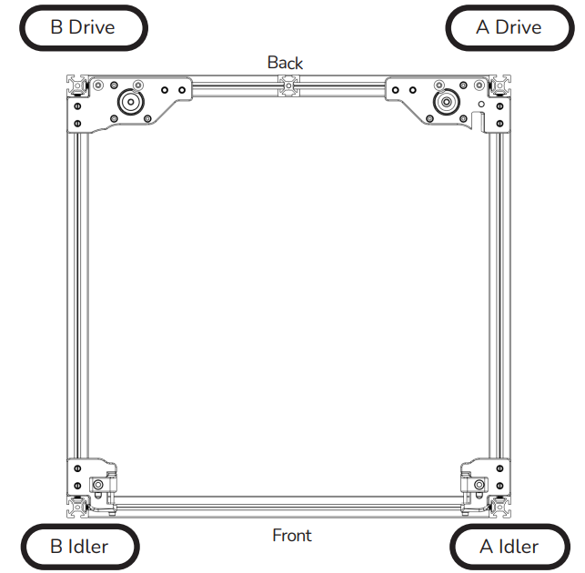

# 9. Klipper配置检查

?> 这一步至关重要，在调试过程中错误的配置可能导致打印机的损坏！！！

## 9.1 XYZ限位开关的检查

1. .确保X、Y、Z的限位开关都没有被按下，这里借助klipper终端控制界面来检查。点击到如图所示界面，在右下角会有限位开关的一栏，点击旁边的刷新按钮，如果X、Y、Z都显示未触发，则正确；如果其中任何一个限位开关显示触发，请检查限位开关是否被按下，检查限位开关接线和相应的配置是否正确。


2. 手动按其中一个限位开关，使其触发。再次点击刷新按钮，如果限位开关显示触发，则正确；如果未显示触发，请检查限位开关是否被正确的按下，检查接线和配置是否正确。接下来按照上面的步骤依次检查剩下的限位开关，直至所有限位开关都能被正确的触发。
3. 如果在上述的测试中，某一个限位开关的状态是反的（按下时显示``未触发``，不按时显示 ``触发``）， 请进入打印机的配置文件，找到对应轴的配置，在``endstop_pin: ``的设置值前添加或删除``！`` 来达到状态取反的目的。

```
[stepper_x]
...
endstop_pin: PG12       # 修改前
endstop_pin: !PG12      # 修改后
...
```

## 9.2 步进电机检查

在归位前，应检查每个电机是否能够正常转动，请将打印头移动到中间，然后分别发送以下命令，并观察相应的电机是否以微小的幅度正反转动（大致只有1-2mm的移动幅度）。

```
STEPPER_BUZZ STEPPER=stepper_x       # 测试 X 轴电机，电机会左右微转 
STEPPER_BUZZ STEPPER=stepper_y       # 测试 Y 轴电机，电机会左右微转 
STEPPER_BUZZ STEPPER=stepper_z       # 测试 Z0 轴电机，该轴应先降后升往复运动 
STEPPER_BUZZ STEPPER=stepper_z1      # 测试 Z1 轴电机，该轴应先降后升往复运动
STEPPER_BUZZ STEPPER=stepper_z2      # 测试 Z2 轴电机，该轴应先降后升往复运动

```

**注意**：测试中，X Y轴电机的转动方向没有要求。在测试 Z轴电机时，对应电机带动的轴应该先降后升，否则请修改电机转向。 如果步进电机不转动，请检查配置、接线是否有错误或松动。

如果出现测试时电机可以随意用手转动，但是关闭电机后则不能移动，，此时应考虑反转电机使能信号``enable_pin:``

```
[stepper_x]
...
enable_pin: PG7         # 修改前
enable_pin: !PG7        # 修改后
...
```

如果需要改变电机的转动方向，则需要先找到对应轴的配置，在``dir_pin: ``的设置值前添加或删除``！``来达到反向的目的。

```
[stepper_x]
...
dir_pin: PG6          # 修改前
dir_pin: !PG6         # 修改后
...
```

电机的位置如下图：




## 9.3 XY归位检查

经过前面的测试，在确认所有步进电机都能正确工作后，就可以开始测试X和Y的归位测试了。在测试过程中，为了防止因电机方向错误导致的碰撞，可能需要使用紧急停止功能。紧急停止有以下几种方法：

* 使用mini12864下方的复位按钮，达到紧急停止的目的。按下按钮后，主板会与klipper断开连接，需要在终端控制界面点击左上角的“重启firmware”，如果未连接成功，则多尝试几次即可。


* 将电脑摆放在打印机旁边，使用web终端控制界面的紧急停止按钮来重启。


* 关闭整个打印机电源，达到紧急停止的效果，但是这种方法不建议，极大概率会损坏上位机SD卡或者eMMC中的系统文件，导致您必须重新写入镜像才能正常使用！！！

在测试归位的过程中，如果打印头的运动方向和归位方向相反，可以使用以上的方法紧急停止当前正在执行的动作，保护打印机。

首先对X轴归位进行测试，点击归位X，正视打印机，即从正前方看，打印头应该向右移动，直到触发X轴的限位开关，然后回退几毫米再次触发X限位开关。

然后是对Y归位进行测试，点击归位Y，正式打印机，即从正前方看，打印头应该向前移动，直到触发Y轴的限位开关，然后回退几毫米再次触发Y限位开关


Voron Trident使用的是CoreXY结构，因此打印头在做横向或者纵向运动时，两个步进电机都会转动，如果打印头移动方向不正确，请参考下图进行修改（图中的“inverted”意思为反转电机转向，“swapped”意思为交换A、B电机的接线。


如果需要改变电机的转动方向，则需要先找到对应轴的配置，在``dir_pin: ``的设置值前添加或删除``！``来达到反向的目的。

```
[stepper_x]
...
dir_pin: PG6          # 修改前
dir_pin: !PG6         # 修改后
...
```

## 9.4 Z轴归位检查

执行``G28 X Y``或者在web终端控制界面上一次点击``归位X``、``归位Y``，然后利用控制台移动喷嘴的X或Y位置，直到喷嘴位于Z轴限位开关的正上方。发送``M114``命令并记录下X轴和Y轴的坐标值。打开``printer.cfg``文件，更新回原点宏``[homing_overrided]``。如下图，然后保存文件并重启klipper。


保存重启完成后，可以尝试点击控制台的“全部归位”，或者使用G28命令来归位所有轴。如果在z归位结束时，您的喷嘴没有超过热床的平面，请降低Z高度，避免撞击喷头，导致喷头或者其他部件损坏。


## 9.5 调平传感器的配置与检查

首次使用热床自动调平功能之前，请确认Probe传感器工作是否正常。

可以通过发送命令：QUERY_PROBE 来测试传感器。

### 9.5.1 接近开关

***PL08N***：PL08N或者TL-Q5MC2为非接触式磁性金属传感器，当喷嘴下降时，PL08N检测面与PEI弹簧钢板的距离小于8mm时，PL08N应被触发，并且PL08N自身的触发灯应被点亮（如果是未触发时点亮，则触发时状态灯应熄灭），此时发送``QUERY_PROBE``应返回``triggered``触发。当喷嘴原理PEI弹簧钢板时，PL08自身的状态指示灯应熄灭，此时发送``QUERY_PROBE``应返回``open``断开。如果需要反转信号，请在probe传感器引脚定义前增加或者删除 ``!``

### 9.5.2 Klicky

Klicky的配置教程，请自行前往哔哩哔哩查找教程

### 9.5.3 Voron Tap

Voron Tap的配置教程可以查看：[Voron Tap的配置](https://www.bilibili.com/video/BV1UD4y1L7jX?vd_source=8a1517dea7f810886a480f8c9f0fd417 "点击即可跳转")

### 9.5.4 调平传感器的精度检查

首次测试probe传感器，不需要加热喷头和热床，所有轴全部归位后将打印头移到热床的中心，然后发送命令：``PROBE_ACCURACY``

此时喷头会自动下降，直至probe被触发，然后再抬升。触发动作会连续执行十次。命令执行完成后，控制台会返回一个标准偏差值，标准偏差值应小于0.003mm。如果每次的探测值不稳定或者是呈趋势性的变化，需要检查Z 轴安装是否安装牢固，丝杆是否固定好。此外，劣质的传感器也会影响重复探测的精度。


