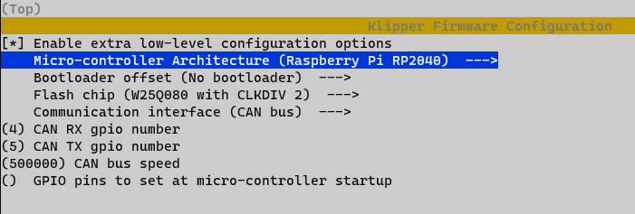

# 固件烧录

## 配置固件

1. ERCF的Klipper固件配置
   * 推荐·使用CAN连接如下图配置
   * 注意·如果使用Canboot请将``Bootloader offset``选项选择为``16KiB bootloader``
   
    ----
   * USB连接如下图配置
   

* 如何编译固件参考[固件烧录](/introduction/firmware)

## 编译并烧录固件

* RP2040的固件烧录通用，请参考SB2040板的[固件烧录](/board/fly_sb2040/flash.md)

## CanBoot

* 使用CanBoot请查看[CanBoot使用](/advanced/canboot.md)