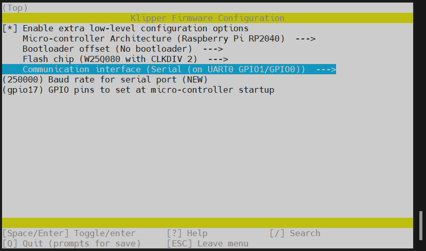
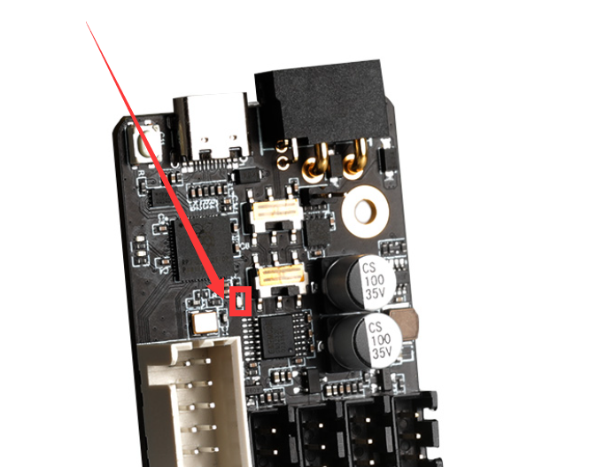

# 4. 固件烧录

> [!TIP]
> 已经识别到的CAN ID是不会被查找到的（即已经写入配置文件printer.cfg中的ID，连接成功并正常运行的，是不会被查找到的）

> [!TIP]
>
> x ## Enraged Rabbit : Carrot Feeder V1.1 hardware config file​# This configuration file is only applicable to FLY ERCF Board​[mcu ercf]canbus_uuid:  *3251a329e6e3*​# Carrot Feeder 5mm D-cut shaft[manual_stepper gear_stepper]step_pin: ercf:gpio7dir_pin: ercf:gpio8enable_pin: !ercf:gpio6rotation_distance: 22.6789511   #Bondtech 5mm Drive Gearsgear_ratio: 80:20microsteps: 16  # Please do not go higher than 16, this can cause 'MCU Timer too close' issues under Klipperfull_steps_per_rotation: 200    #200 for 1.8 degree, 400 for 0.9 degreevelocity: 35accel: 150#Right now no pin is used for the endstop, but we need to define one for klipper. So just use a random, not used pinendstop_pin: ercf:gpio13​[tmc2209 manual_stepper gear_stepper]# Adapt accordingly to your setup and desires# The default values are tested with the BOM NEMA14 motor# Please adapt those values to the motor you are using# Example : for NEMA17 motors, you'll usually set the stealthchop_threshold to 0# and use higher currentuart_pin: ercf:gpio9interpolate: Truerun_current: 0.40hold_current: 0.1sense_resistor: 0.110stealthchop_threshold: 500# diag_pin: ercf:gpio23​# [tmc5160 manual_stepper gear_stepper]# cs_pin: ercf:gpio9#spi_software_sclk_pin: ercf:gpio19#spi_software_mosi_pin: ercf:gpio18#spi_software_miso_pin: ercf:gpio16# interpolate: True# run_current: 0.40# hold_current: 0.1# stealthchop_threshold: 500# diag0_pin: ercf:gpio23​​​# Carrot Feeder selector[manual_stepper selector_stepper]step_pin: ercf:gpio2dir_pin: ercf:gpio1enable_pin: !ercf:gpio3microsteps: 16    # Please do not go higher than 16, this can cause 'MCU Timer too close' issues under Klipperrotation_distance: 40full_steps_per_rotation: 200    #200 for 1.8 degree, 400 for 0.9 degreevelocity: 200accel: 600# Select the endstop you want depending if you are using sensorless homing for the selector or notendstop_pin: ercf:gpio20#endstop_pin: tmc2209_selector_stepper:virtual_endstop#endstop_pin: tmc5160_selector_stepper:virtual_endstop​[tmc2209 manual_stepper selector_stepper]uart_pin: ercf:gpio0run_current: 0.55interpolate: Truesense_resistor: 0.110stealthchop_threshold: 500# Uncomment the lines below if you want to use sensorless homing for the selector#diag_pin: ^ercf:gpio22      # Set to MCU pin connected to TMC DIAG pin#driver_SGTHRS: 75  # 255 is most sensitive value, 0 is least sensitive​# [tmc5160 manual_stepper selector_stepper]# cs_pin: ercf:gpio0#spi_software_sclk_pin: ercf:gpio19#spi_software_mosi_pin: ercf:gpio18#spi_software_miso_pin: ercf:gpio16# interpolate: True# run_current: 0.40# hold_current: 0.1# stealthchop_threshold: 500# diag_pin: ercf:gpio22# driver_SGT: 75​​# Values are for the MG90S servo[servo ercf_servo]pin: ercf:gpio21maximum_servo_angle: 180minimum_pulse_width: 0.00085maximum_pulse_width: 0.00215​[duplicate_pin_override]pins: ercf:gpio15# Put there the pin used by the encoder and the filament_motion_sensor# It has to be the same pin for those 3​[filament_motion_sensor encoder_sensor]switch_pin: ^ercf:gpio15pause_on_runout: Falsedetection_length: 10.0extruder: extruder# runout_gcode: _ERCF_ENCODER_MOTION_ISSUE​[filament_switch_sensor toolhead_sensor]pause_on_runout: Falseswitch_pin: ^ercf:gpio14cfg

# 编译Klipper固件

请使用**MobaXterm_Personal**等**SSH工具**连接通过**网络**到您的上位机，并且需要确定以下几点

1. **请确保上位机安装好了Klipper服务**
2. **请确保登录的用户必须是安装好Klipper的用户**
3. **请确保你的输入法是英文**
4. **请确保你的上位机可以正常搜索到设备**
5. **请确保以上注意事项都做到，否则无法进行下一步**


* 连接到SSH后输入下面的命令并回车：

     ```
     cd  && cd ~/klipper  && make clean && rm -rf .config && make menuconfig
     ```

* 现在应该出现了Klipper编译配置界面，**↑ ↓ 键**选择菜单，**回车键**确认或进入菜单

<!-- tabs:start -->

### ****CAN 固件配置****
>[!TIP]
>请确保工具板拨码拨到正确位置
>
>**烧录时候请确保工具板已经正常连接到UTOC或者刷好桥接固件的工具板上**


* 选择`[ ] Enable extra low-level configuration options`然后回车


* 选择`    Micro-controller Architecture (Atmega AVR)  --->`回车进去找到`( ) Raspberry Pi RP2040`然后回车


* 选择`    Bootloader offset (No bootloader)  --->`回车然后选择`( ) 16KiB bootloader`在回车


* 选择`    Communication interface (USB)  --->`回车然后选择`( ) CAN bus`回车


* 选择`(4) CAN RX gpio number (NEW)`将**4**改成**1**
* 选择`(5) CAN TX gpio number (NEW)`将**5**改成**0**


* `(1000000) CAN bus speed`为can速率默认为1M，不建议自己修改
* 选择`()  GPIO pins to set at micro-controller startup (NEW)`输入`gpio17`然后回车


* 输入`Q`保存然后输入`Y`退出即可编译固件
* 输入`make`即可编译固件
* 出现`  Creating bin file out/klipper.bin`代表本次编译固件成功


**CAN烧录方法**

> [!TIP]
> 请使用UTOC或者其他支持klipper USB桥接CAN的主板将SB2040-V3与上位机通过CAN总线连接

> [!TIP]
>
> 请先看[Id读取](http://mellow.klipper.cn/#/board/fly_sb2040_v3_pro/uuid?id=can-id读取)接好线与上位机连接后在搜索CAN ID

> [!TIP]
> 如果已经烧录过klipper并且在正常运行，可跳过查找uuid，使用配置文件中的uuid进行烧录

首先进入ssh，然后依次输入以下指令

```
~/klippy-env/bin/python ~/klipper/scripts/canbus_query.py can0
```


1. 将下面命令中的``c5d882v0d121``替换为[查找uuid](#_2-查找uuid "点击即可跳转")中查找到的uuid

```bash
python3 ~/klipper/lib/canboot/flash_can.py -u c5d882v0d121
```

2. 如下图，出现``CAN Flash Success``则烧录成功


### ****RS232 固件配置****

>[!TIP]
>请确保工具板拨码拨到正确位置
>
>请注意因为RS232连接无法使用直接通过命令行重新进入SSH，只能通过USB更新固件



* 选择`[ ] Enable extra low-level configuration options`然后回车


* 选择`    Micro-controller Architecture (Atmega AVR)  --->`回车进去找到`( ) Raspberry Pi RP2040`然后回车


* 这一项`    Bootloader offset (No bootloader)  --->`不动
* 这一项`    Flash chip (W25Q080 with CLKDIV 2)  --->`不动

* 选择`    Communication interface (USB)  --->`回车然后选择`( ) Serial (on UART0 GPIO1/GPIO0)`回车


* 这一项为串口波特率。默认250K`(250000) Baud rate for serial port`不动
* 选择`()  GPIO pins to set at micro-controller startup (NEW)`输入`gpio17`然后回车


* 输入`Q`保存然后输入`Y`退出即可编译固件
* 输入`make`即可编译固件
* 出现`  Creating uf2 file out/klipper.uf2`代表本次编译固件成功


**USB烧录方法**

1. 按住ERCF_V2板的BOOT键，然后将usb连接到上位机


```bash
lsusb
```

执行上面的命令查看是否有 ``ID 2e8a:0003 Raspberry Pi RP2 Boot``这行，如没有请检查USB线(连接前记得按住BOOT键)


2. 烧录
   
    ```bash
    cd ~/klipper/
    make flash FLASH_DEVICE=2e8a:0003
    ```
    

* 执行上面的命令可能会提示输入密码，输入当前用户的密码就好，输密码的时候是不可见的。输完之接按回车

   出现下图则烧录成功


<!-- tabs:end -->

### 确定固件烧录完成

* 如果固件刷完后此led会在微亮情况下变成常亮


