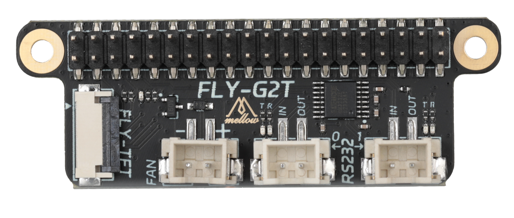

# FLY-G2T

FLY-G2T多功能扩展板是为了扩展树莓派与FLY上位机功能而设计的高性能模块。它支持UART通信，集成了FPC接口可外接TFT-V2，并且还支持5V风扇控制。这使得它成为一个理想的解决方案，用于增强树莓派在各种应用中的互动性和可用性，例如在工业自动化、3D打印机、家庭自动化、机器人控制或任何需要人机界面和外部通信的场合。

## 产品特性

* 兼容性：支持多种版本的树莓派，包括树莓派Zero/3B/3B+/4B等。
* UART转RS232：提供稳定的串行通信，允许树莓派通过RS232接口与其他硬件设备进行数据交换。
* SPI电容触摸屏：通过FPC接口连接的TFT-V2电容屏，提供了直观的触摸操作，适用于需要图形用户界面的应用，例如：klipperscreen等。
* 5V风扇支持：集成5V风扇接口，可连接风扇进行散热，保障上位机在长时间运行或高负载情况下的稳定性。
* 插拔式设计：扩展板设计为易于安装，直接插拔在上位机上，无需额外的接线或复杂配置。
* 紧凑尺寸：扩展板尺寸合理，不会占用过多空间，方便集成到各种项目中。

## 产品规格：

- 通信接口：UART转RS232
- 显示接口：SPI转FPC接口
- 风扇电源：5V
- 兼容性：树莓派Zero/3B/3B+/4B，FLY Pi等

## 注意事项：

- 确保在安装扩展板前，上位机已经关闭电源。
- 避免在潮湿或灰尘环境中使用扩展板。
- **使用RS232连接工具板时候，请一定要与上位机`共地`！！！！！**
- 安装屏幕时，请注意不要带电拔插注意屏线方向，以免造成损坏。
- 安装风扇时，请注意风扇的电流和电压规格，以免造成损坏。
