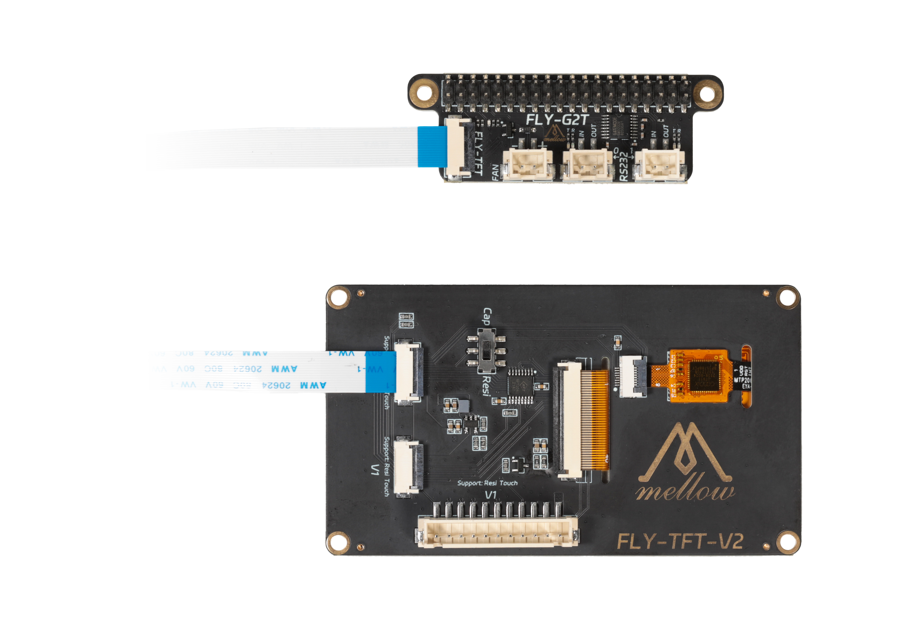

# FLY Pi V2使用说明

本次教程使用**FLY Pi V2**为例

## 注意事项：

- **FLY上位机只能使用带40PIN GPIO扩展的上位机，FLY-π与双子座无法使用！！**
- **FLY上位机只能使用中间的RS232接口，FAN口与FPC屏幕接口！！！**
- **至少需要将系统更新到FLY OS V3.3.2！！！**
- 确保在安装扩展板前，上位机已经关闭电源。
- 避免在潮湿或灰尘环境中使用扩展板。
- 安装屏幕时，请注意不要带电拔插注意屏线方向，以免造成损坏。
- 安装风扇时，请注意风扇的电流和电压规格，以免造成损坏。


## 串口使用方法

* FLY上位机刷好最新系统后需要访问**上位机的IP+:9999**

在系统设置里面找到


选择**UART1**并且保存重启

配置方法

```
[mcu] 
serial: /dev/ttyS1
baud: 250000
restart_method:command
```


### 接线方法

**正在作图**


## FAN使用方法

```
[mcu host]         
serial: /tmp/klipper_host_mcu 

[temperature_sensor FLY Pi]
sensor_type: temperature_host

[temperature_fan core_fan]      # 上位机散热风扇
pin: host:gpiochip1/gpio102                   # 上位机风扇pin脚
max_power: 1.0
sensor_type: temperature_host   # 设置为上位机主控温度
control:watermark                  # 控制方式
target_temp: 48                   # 上位机散热风扇启动温度
min_temp: 0                     # 最低温度，低于此温度将会报错
max_temp: 90                    # 最高温度，高于此温度将会报错
off_below: 0.10
kick_start_time: 0.50
max_speed: 0.8                   # 最大转速，为满功率运转时的80%
min_speed: 0.3                    # 最小转速，为满功率运转时的30%

```

### 接线方法

**正在作图**

## 屏幕使用方法

### 接线方法




