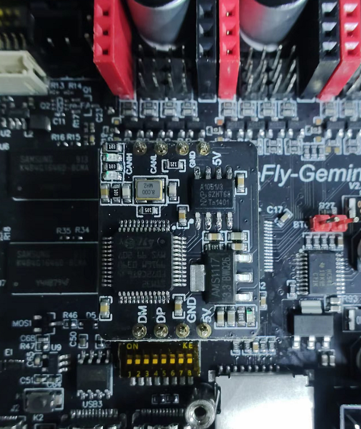

# CAN HAT使用

## CANHAT安装

1. CANHat的红色排针对应FLY-Gemini的红色排母，黑色对应黑色（插反会烧毁设备）

2. Gemini使用CANHat需要调整拨码开关

    * 拨码开关的**1**和**2**打开(ON),其余的全部关闭

## 使用

1. FLY CANhat自带120ohm终端电阻
2. FLY-Gemini使用CANHat且使用FLYOS的话系统无需做任何修改，直接使用
3. FLY-Gemini需要为MCU烧录CANBOOT或者使用SD卡烧录支持CAN的klipper固件(CANBUS PA11 PA12)
4. 将FLY-Gemini的CANH和CANL连接到FLY-SHT的CANH和CANL即可（多个CAN设备之间并联）