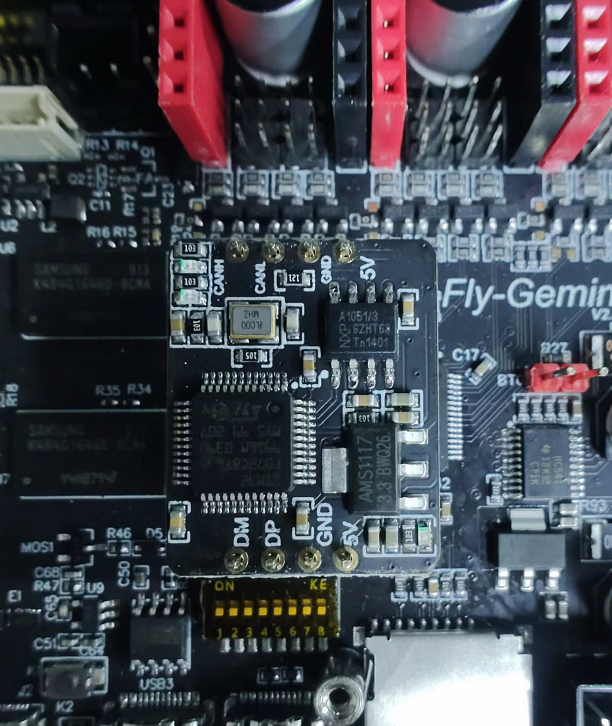
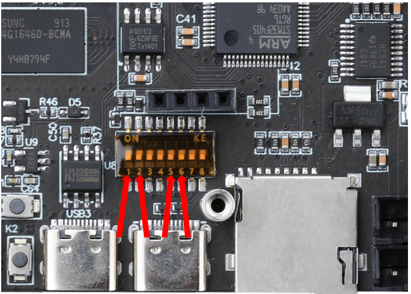
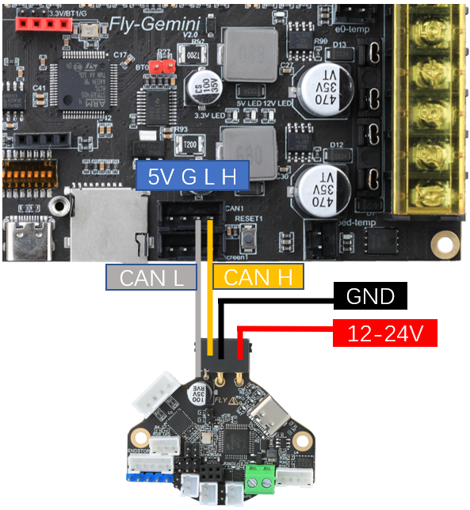

# 15. CAN HAT使用

CAN总线是一种用于实时应用的串行通讯协议总线，它可以使用双绞线来传输信号，是世界上应用最广泛的现场总线之一。CAN协议用于汽车中各种不同元件之间的通信，以此取代昂贵而笨重的配电线束。该协议的健壮性使其用途延伸到其他自动化和工业应用。CAN协议的特性包括完整性的串行数据通讯、提供实时支持、传输速率高达1Mb/s、同时具有11位的寻址以及检错能力。

3D打印机上使用CAN总线来减少打印头连接到主板的走线数量，原来需要十几根线，使用CAN后只需要使用四根线即可，大大减少走线数量，降低布线难度。

Gemini-V2需要搭配CAN Hat才能使用桥接CAN。

本章只简要概述桥接CAN的使用，具体使用教程请查看本网站上：ST36/42使用教程、SHT36 V2使用教程、SB2040使用教程。

## 15.1  CANHAT安装

1. CANHat的红色排针对应FLY-Gemini的红色排母，黑色对应黑色（插反会烧毁设备）



2. Gemini使用CANHat需要调整拨码开关

    拨码开关的 **1**、**2**、**5**、**6**  打开(ON)，其余的全部关闭
    
    

## 15.2 CAN接线

以SHT36V2为例，接线如下图所示



## 15.3 主板固件参数配置

Klipper固件配置界面如下图。编译固件后，按照 [固件编译和烧录](/board/fly_super8/firmware "点击即可跳转") 给出的方法，将固件刷入主板中。


## 15.4 查看CAN uuid

固件刷好后，先不连接SHT36V2工具板，使用下面的命令读取Gemini-V2主板的CAN ID。

?> 使用桥接CAN会有两个uuid，请注意区分主板id和CAN板id。在不连接CAN板的情况下读到的就是主板id。

```
~/klippy-env/bin/python ~/klipper/scripts/canbus_query.py can0
```

出现``Found canbus_uuid=11aa22bb33cc``则查找到设备ID。其中``11aa22bb33cc``为设备uuid，可直接填入klipper配置文件。

 ```
[mcu ]
#serial: /dev/serial/by-id/usb-Klipper_stm32f407*******   # 注释掉这一行
canbus_uuid: 3251a329e6e3                                # 在此处填写主板的CAN ID
 ```

在读到主板CAN ID之后，将uuid填写到配置文件保存后，断开主板电源，接好SHT36V2。

## 15.5 SHT36 V2固件刷写

主板桥接CAN固件刷好后，还需要刷写SHT36 V2工具板的固件才能正常使用。

> 由于SHT36 V2是使用CanBoot刷写固件，因此需要先刷好**主板桥接CAN固件**，并正确**连接SHT工具板和主板**才能刷写SHT工具板的固件。

SHT36 V2刷写教程：[SHT36 V2固件编译和烧录](/board/fly_sht_v2/flash "点击即可跳转")

其他型号的CAN工具板，请自行前往本网站的对应产品查看