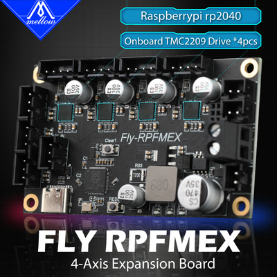

# 2. RPFMEX-4轴扩展板

为了满足客户对Gemini的多轴需求，我们做了4轴扩展板，让原来的Gemini 4轴变成8轴，满足更多3D打印机的需求。 此扩展板不能单独用作 3D 打印机主板，因为它不包含加热和温度测量模块。

## 2.1 产品详情

[Fly3D Fly-RPFMEX 4轴TMC2209拓展板用于3D打印机双子座Voron2.4-淘宝网 (taobao.com)](https://item.taobao.com/item.htm?spm=a1z10.5-c-s.w4002-23066022675.26.2f9d3903LR2K0T&id=676711922374)

## 2.2 使用说明

?>请查看：[Fly-RPFMEX使用说明](/board/fly_rpfmex/ "点击即可跳转")

