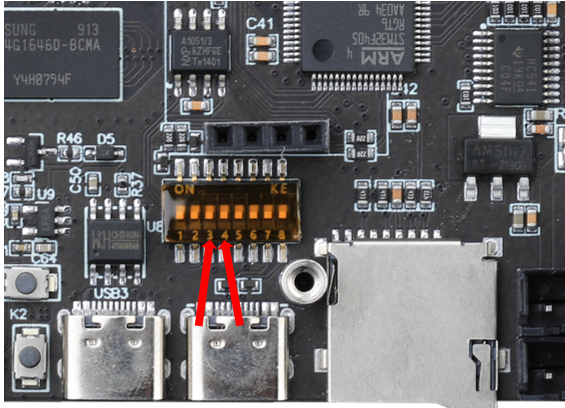
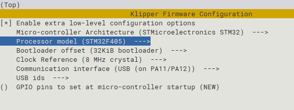
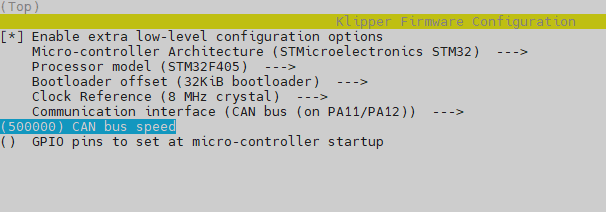

# 5. 固件编译烧录

## 5.1 拨码开关设置

如图所示，需要将第 **3**、**4**  拨码开关向上拨至打开状态，其余保持关闭状态。在这种模式下，可以理解为STM32直接通过内部走线连接到上位机。



## 5.2 固件编译

编译固件前请确保 [连接到SSH](/board/fly_pi/FLY_π_ssh "点击即可跳转")

这里只进行简要说明，完整编译步骤请查看：[编译klipper固件](/board/fly_super8/firmware?id=_1-编译klipper固件 "点击即可跳转")。

* 普通USB固件配置



* CAN固件配置



* 执行命令```make -j4```来编译固件

## 5.3 固件烧录

烧录固件请参考：[烧录固件](/board/fly_super8/firmware?id=_2-烧录固件到主板 "点击即可跳转")