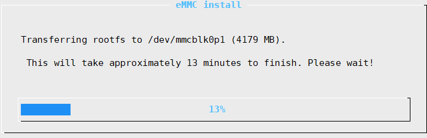
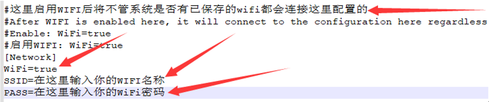
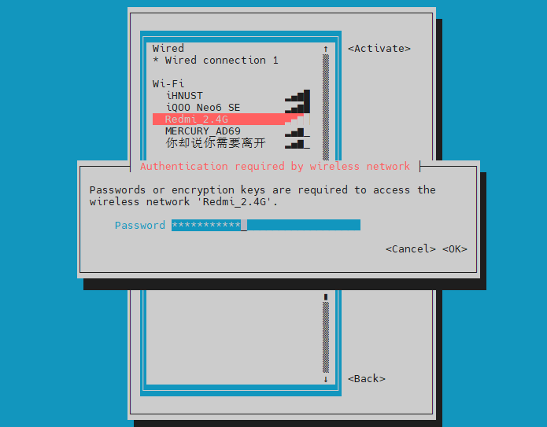

# 系统安装与配置

# 1. 系统镜像烧录

## 1.1 烧录前的准备

**需要准备的东西：**

1. SD卡一张（>8GB）

2. 读卡器

3. 系统镜像

4. 工具软件请前往FLY官方群文件夹下载：Fly-Gemini系列；l 需要用到的软件有：balenaEtcher（fly群中文件名为系统镜像写入工具）、putty、WinSCP

5. [系统镜像](/introduction/downloadimg.md "点击即可跳转") 

**注：其他非FLY的上位机请勿使用FLY的专属镜像，否则会损坏上位机！！！**

**下载需要用到的工具和文件，国内用户请前往QQ群下载**

* [工具](https://drive.google.com/drive/folders/1llH-lq-WsbIdwkmLL51n3OHo5dNNpcPy)

## 1.2 内存卡镜像烧录

1. 先安装好软件“balenaEtcher”，也可以用其他的(Win32DiskImager)等工具
2. SD卡插入读卡器，将读卡器插到电脑USB接口
3. 打开软件，点击“**Flash from file**”选择前面下载的系统镜像文件


4. 点击**“Select target**”选择SD卡，大小和SD卡容量差不多的就是，或进入资源管理器查看SD卡盘符

   

   5. 点击 “**Falsh**” ,出现进度条及“**Falshing…**”时开始写入系统镜像到SD卡。等待大约十多分钟，等待写入完成。

      

   6. 至此已经完成FLY镜像的写入，但是请勿拔出内存卡，还需要修改boot盘中的FLY_config文件，具体修改方法请查看：[FLY_Config](/board/fly_pi/FLY_π_fly_config.md "点击即可跳转")
   

## 1.3  eMMC WiFi模块烧录

?> FLY-M2WE只适用于FLY-π，FLY-Gemini v2，FLY-Gemini v3

?> 不要带电插拔模块，此模块不支持热插拔

### 1.3.1 产品详情

[FLY3D打印机M2WE板16G eMMC 5g wifi用于KlIpper双子座V2.0PI主板-淘宝网 (taobao.com)](https://item.taobao.com/item.htm?spm=a230r.1.14.6.1a4840a8a8t04w&id=685372879431&ns=1&abbucket=16#detail "点击即可跳转")


### 1.3.2 1迁移SD卡镜像

   FLY-M2WE提供了16G的eMMC和5G WiFi，能够提供更稳定的系统运行和更快的网络传输。（建议使用2.4GWiFi，虽然速度稍慢，但是距离远，连接也更稳定）

?> FLY-M2WE只适用于FLY-π和FLY-Gemini v2,FLY-Gemini v3 不要带电插拔模块，此模块不支持热插拔

?>  FLY-M2WE只适用于FLY-π和FLY-Gemini v2,FLY-Gemini v3

?> **使用SD卡烧录给M2WE镜像需要提前把镜像烧录到SD卡中**

**[FLY_M2WE eMMC购买地址](https://item.taobao.com/item.htm?spm=a1z10.5-c-s.w4002-23066022675.38.25636b45lpxmgF&id=685372879431 "点击即可跳转")**

      1. FLYOS v2.9.6开始已经完全支持M2WE
      2. WiFi驱动已经预装，直接插上并固定好即可


?> 如果同时有SD卡和emmc，并且两个都有系统，会优先启动SD卡系统

   首先请安装好M2WE模块及天线，准备烧录系统。烧录镜像系统有两种方法，一种是将现有的SD卡系统迁移至eMMC模块，下面将对着两种使用方法做介绍。

1. 给Gemini 或 π 安装好M2WE模块并上电启动
2. 连接到SSH
3. 执行下面的命令, 可能会提示输入密码，输入``mellow``回车
   ```bash
   sudo nand-sata-install
   ```


   4. 选择``Boot from eMMC - system on eMMC``选项后按回车键（一般默认选项就是，直接按回车键）

      

   5. 出现``This script will erase your eMMC. Continue?``时选择``Yes``按回车键（一般默认选项就是，直接按回车键）

      

   6. 选择文件系统类型为``ext4``按回车键（一般默认选项就是，直接按回车键）

   7. 耐心等待直到出现进度条（如果等待超过2分钟仍未出现下图进度条请按``CTRL+C``来终止操作，然后重启设备后重试）

      

   8. 系统迁移过程中请勿断电及进行其他操作，直到迁移完成

      

   9. 迁移完成，直接按回车键，等待设备完全关机

   10. 关机后取下SD卡，重新上电开机，此时已经可以通过eMMC中的系统来启动

### 1.3.3 使用USB烧录M2WE

**通过USB为eMMC烧录系统镜像**

1. 先下载安装需要的软件

   [USB驱动安装工具 Zadig-2.7](https://cdn.mellow.klipper.cn/Utils/zadig-2.7.exe)

   [FLY-BOOT安装程序](https://cdn.mellow.klipper.cn/Utils/FLY-BOOT-Setup.msi)

   [系统镜像烧录工具 Win32diskimager-1.0](https://cdn.mellow.klipper.cn/Utils/win32diskimager-1.0.0-install.exe)

2. 除了第一个Zadig不需要安装可直接运行，另外两个需要安装。安装过程全都点``下一步``或者``Next``就可以了

3. 打开Zadig，顶部菜单栏``Options``里勾选``List All Devices``

   

4. 按着BOOT键并且将双头USB接入电脑


4. 将附赠的双公头USB线一端连接到电脑，然后长按上图中的按钮，将双公头USB线另一端连接到Gemini或Pi的下图中的USB接口


?> 确保是在按键按下状态时将设备连接到电脑的


5. 如果一切正常，此时zadig中会多出一个``Unknow Device #x``或者``USB Device(VID_1f3a_PID_efe8)``，选择它


6. 选择设备后检查一下USB ID是否与上图一致，如果不是请重新选择其他设备
7. 上图中的第二处只能选择``WinUSB(vxxxxxxx)``版本号无所谓
8. 点击``Install Driver``安装驱动


9. USB驱动安装成功 (驱动只安装一次，如果以后再次烧录不用再安装驱动)

10. 打开安装好的FLY-BOOT，点击``检查设备``


11. 如果前面的步骤操作无误，则会提示发现可用设备（如果没有发现可用设备请仔细查看第4步）


12. 点击``启动BOOT``，如果正常则会提示已成功启用BOOT


13. 现在可以打开文件资源管理器，多出一个14.5G的U盘（16G eMMC显示大小为14.5G）
14. 这样就可以直接用Win32diskimager或balenaEtcher来烧录系统镜像，盘符选择为这个14.5GU盘的盘符
15. 镜像烧录完成后，请配置 [FLY_Config](/board/fly_pi/FLY_π_fly_config.md "点击即可跳转")

# 2. FLY_Config 的使用

* FLY-Config用来简化系统配置等，适用于Klipper全家桶，免去进入ssh写命令的麻烦
* 只能在FLY定制Armbian系统运行
* 对初学者友好
* 直接配置Klipper及周边

## 2.1 打开 FLY_Config

1. 如果您已经制作好SD卡，请使用读卡器连接到电脑。此时电脑应该会弹出资源管理器并且有一个“**可移动磁盘BOOT**” .如果未出现，请重新拔下 sd 卡，再插入电脑

   eMMc进入BOOT盘方法，请参考：[通过usb为emmc烧录系统镜像](/board/fly_pi/FLY_π_description1?id=_2-通过usb为emmc烧录系统镜像)

   

   

2. 打开BOOT盘下的FLY-Config.conf

   

## 2.2 可用配置

* 配置主板型号（仅限Gemini系列，其他系列默认即可）
* 指定Klipper的控制网页
* 配置WIFI
* 配置Klipperscreen

## 2.3 连接WiFi

   找到WIFI配置，将WIFI处的flase改成true，并将WiFi名称和密码填写上，保存，插回上位机。等待几分钟后，进入路由器后台管理界面查看IP地址。


## 2.4 其他可用配置

### 2.4.1 选择Klipper的控制网页

找到下图所示选项，将``UI=fluidd``修改为``UI=mainsail``，则可将控制网页由``fluidd``切换为``mainsail``。


### 2.4.2 Klipperscreen的配置

找到下图所示选项，将``klipperscreen=flase``修改为``klipperscreen=true``，则可启用klipperscreen屏幕。


另外还需要指定使用的屏幕类型才能够正常使用！！！按下图中的提示修改为对应的配置即可。


# 3. SSH连接

* 请提前准备好Putty或其他SSH终端工具

## 3.1 串口连接

* 使用USB Type-c线材将FLY-π与电脑连接


* 如果主板与电脑连接正常，打开设备管理器，就可以看到CH340的端口了

  

* 打开Putty，进行如下设置,端口填写前面在设备管理器看到的端口


* 一切正常的话就可以看到启动画面了

  

* 等待片刻，出现这个画面就是启动了


* 查看IP，如果配置了FLY-Config中的WIFI则开机后就会自动连接
* 在终端中输入命令```ip a|grep inet```回车
* 在返回内容中找到与你路由器同段的IP即可访问

> 如果是主板启动很久后才连接的SSH那么请连接后按几下回车键
>

?> 使用typec连接到ssh时，登录的为root账户，建议切换到普通账户后再进行操作！！！输入`su fly`命令，切换到普通用户

* 此时会提示输入用户名，在新窗口终端中输入```fly```后回车


* 提示输入密码，输入```mellow```后回车


## 3.2 远程连接

* 如果主板已经启动且已经连接到网络，可以使用IP连接到SSH
* 打开Putty，进行如下设置，IP填写前面查看的，也可以在路由器后台查看
* 注意，Putty选择SSH而不是Serial


* 第一次连接回弹出这个窗口，点击“是”即可


* 会提示输入用户名，在新窗口终端中输入```fly```后回车


* 提示输入密码，输入```mellow```后回车


* 登录成功

* 至此，您已经完成FLY-Gemini的SSH登陆

# 4. WiFi连接

?> 请打开FLY_config配置文件，打开方式请参照[打开fly_Config](/board/fly_gemini/host/FLY_π_fly_config.md "点击即可跳转")

连接WiFi一共有两种方式

## 4.1 通过FLY_Config连接WiFi

找到WIFI配置，将WIFI处的flase改成true，并将WiFi名称和密码填写上，保存，插回上位机。等待几分钟后，进入路由器后台管理界面查看IP地址。


## 4.2 通过SSH软件连接

使用 [串口连接](/board/fly_gemini/host/FLY_π_ssh.md "点击即可跳转") 到SSH软件后使用nmtui命令连接WiFi

1. 在SSH软件输入`sudo nmtui`命令后回车，再输入`mellow`，会出现下图所示界面


2. 选择`Activate a connection`后回车


3. 进入如下界面，通过键盘上的`↑``↓`键选择要连接的WiFi后，回车，输入密码后等待连接成功




4.连接成功后如图所示


5. 按`ESC`键退出，返回命令行界面，输入`ifconfig`，图中`192.168.2.126`即为上位机的IP地址


