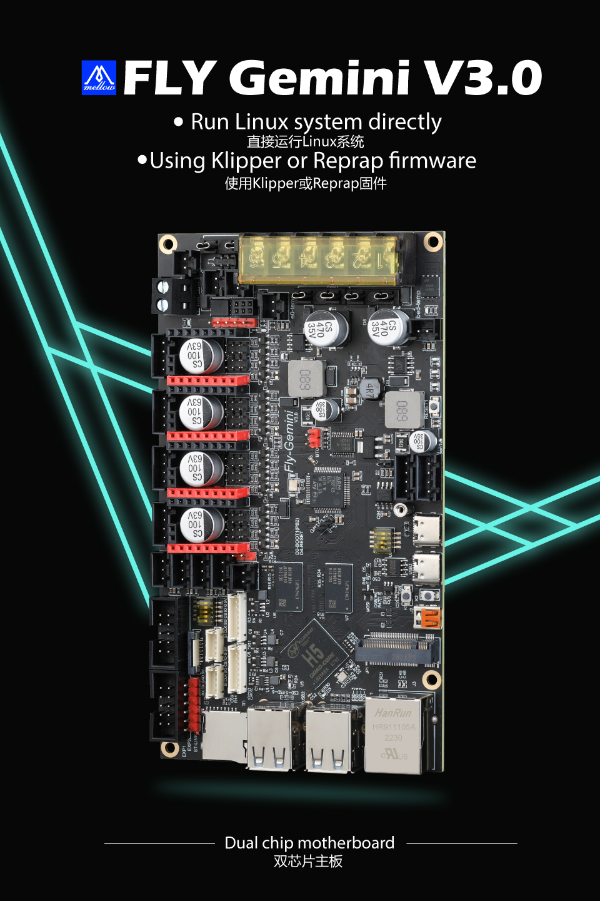
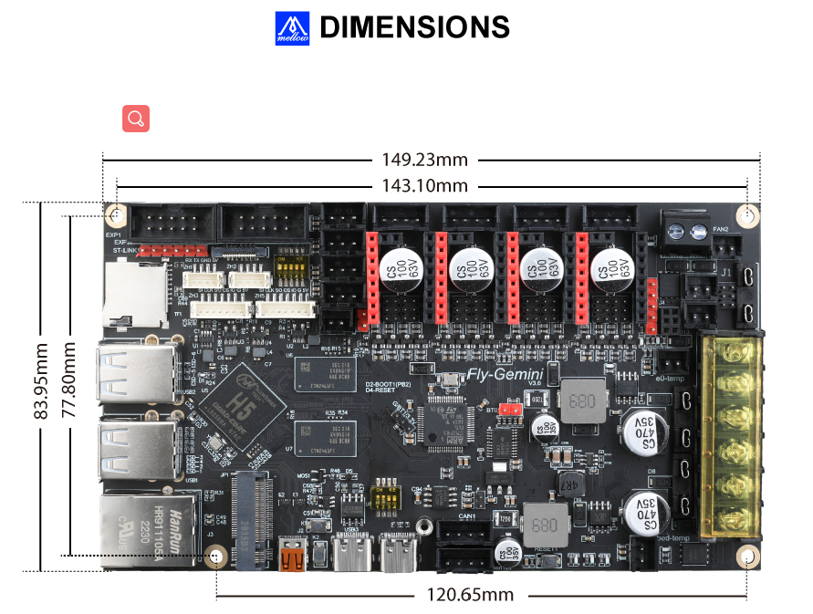
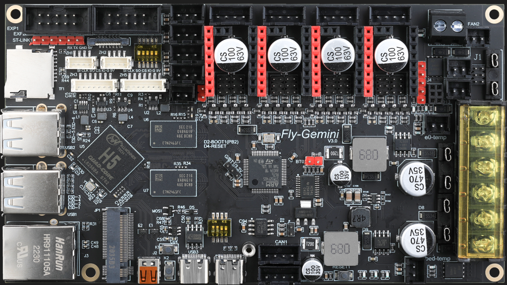

# 产品简介

我们很高兴地发布全新的FLY-Gemini主板。此板可替代树莓派作为上位机运行，它拥有有1GB的板载DDR3内存，允许运行完整的LINUX桌面（基于 Armbian定制优化）。该板可与Klipper和RRF固件一起使用，甚至可以在使用SHT工具板时运行Klipper屏幕。

由于Gemini v3在一个软件包中同时具有控制板（STM32）和linux板，因此不需要树莓派（目前非价格仍然昂贵）。增强5v电源保护，降低芯片损坏的可能性。取消了MCU芯片的存储卡设置，更容易安装固件。无需使用Can Hat即可与工具板通信。EMMc+SDIO扩展支持主板的wifi和32G存储功能。

设计这款上位机的目的是让客户更容易使用Klipper固件或RRF固件。我们对LINUX系统镜像进行优化，更适合3D打印机使用，操作安装也更简单，小白稍有基础也能很快的学习使用。相对于其他上位机板子节省了学习成本，让你可以更专注于享受3D打印带来的快乐(购买带SD卡的套餐预装Klipper固件，上电就能用省时又省事)。

**特点**

* CPU：高性能全志H5芯片，4核64位Cortex-A53
* GPU：高性能6核Mali 450，像素填充率大于2.7gpixel/s
* RAM：1GB DDR3（与GPU共享）
* ROM：支持最大128GB SDCARD
* 外设：Spi x2，UART x2，USB x4（USB 2.0 x3，OTG x1），Micro HDMI x1，Eth x1（100M），CAN x1
* 接口：板载M.2接口，可扩展WIFI，eMMC等。（私有协议，切勿连接非FLY π专用的M.2设备）
* 40Pin接口，兼容树莓派
* 支持12-24V直流供电，供电更稳定，省去降压模块
* 预留了一个5V可控风扇接口，可用于上位机散热
* 预留CAN扩展接口
* 为Klipper定制的系统，无需安装系统等复杂的操作，小白更容易上手
* 系统与FLY-Gemini互相兼容
* 驱动: 高压驱动位*4
* MCU: STM32F405

## 产品详情

[Fly3D Gemini双子座4轴3D打印机主板klipper/RRF固件运行linux-淘宝网 (taobao.com)](https://item.taobao.com/item.htm?spm=a230r.1.14.1.1a4840a8a8t04w&id=661670024975&ns=1&abbucket=16#detail "点击即可跳转")

----

?> 重要

* 使用CanBoot请查看：[CanBoot使用](/advanced/canboot.md "点击即可跳转")

## Gemini系列升级说明

* Gemini V1.1：修复can芯片供电，以及打印偏移问题
* Gemini V2.0：RAM升级至1G，可同时使用CAN和Klipperscreen
* Gemini V3.0：分开芯片5V供电和板载上位机端口5V供电，主板5V端子短路时不会影响到系统使用；删除主板sd卡接口，改用hid烧录固件；板载CAN收发芯片，无需使用CAN Hat

## Gemini V3

